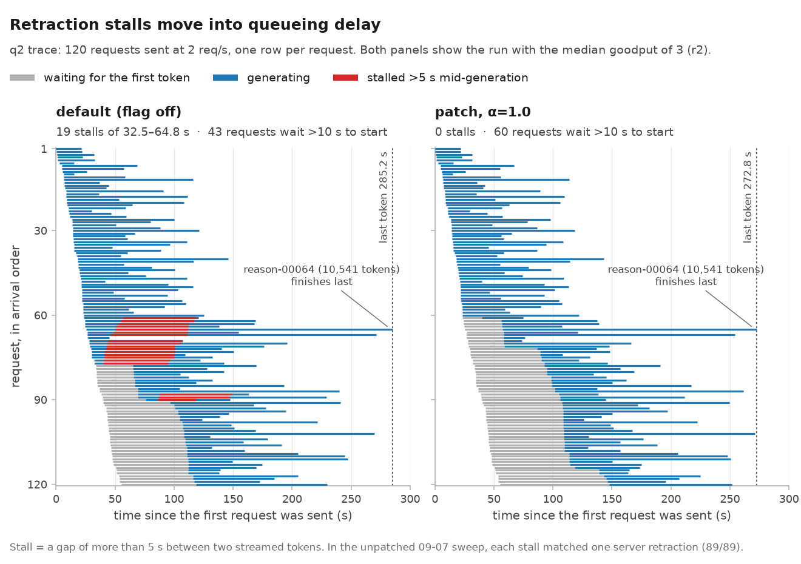
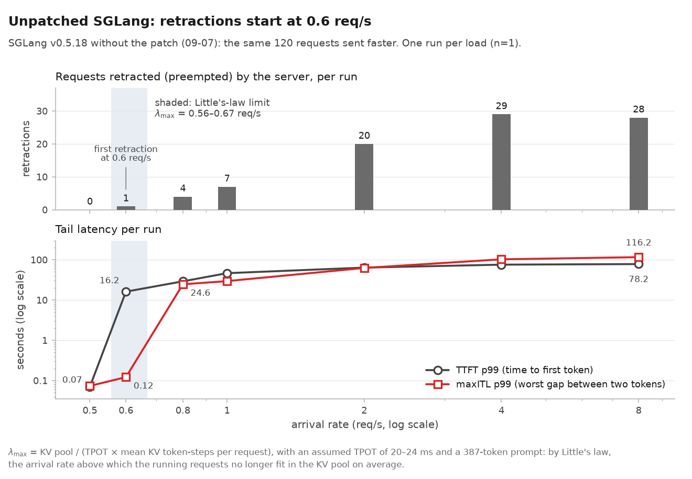
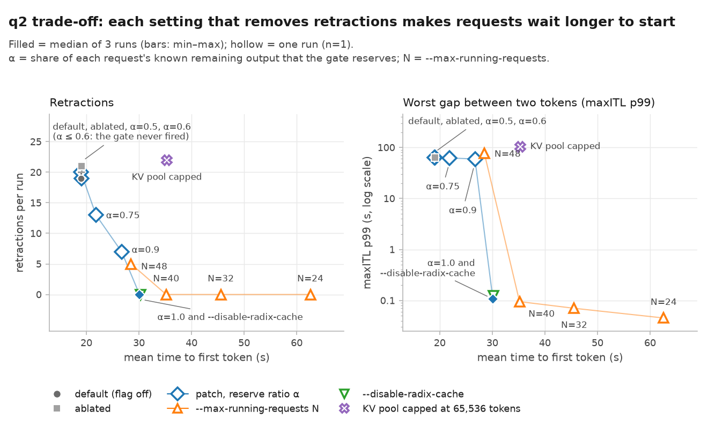

[English](README.md) · 한국어

# SGLang peak-KV admission: 장문 출력 서빙의 선점(retraction) 정지 진단과 제거

초당 2요청 부하에서 SGLang 0.5.18은 긴 답변 <!--n:trace.n_requests-->120<!--/n-->개 중 <!--n:q2.default.stall5-->19<!--/n-->개를 생성 도중 <!--n:q2.default.stall_range_s-->30.8–64.8<!--/n-->초씩 멈췄다. 이 저장소는 그 정지가 기본(radix cache) 입장(admission) 경로에서 생기는 KV 선점(retraction) 때문임을 밝힌다. 그리고 SGLang에 이미 있던 정확 길이 입장 시뮬레이션을 재사용하는 플래그형 스케줄러 게이트로 정지를 없앤 뒤, 그 대가와 기존 플래그만으로 얻을 수 있는 몫까지 측정한다. 환경은 RTX 4090 한 장 위의 Qwen3-4B와 합성 장문 추론 trace이고, 측정은 <!--n:budget.runs-->53<!--/n-->회다. 이 README의 결과 수치는 모두 저장소 안 데이터에서 계산했고, 인용한 숫자 하나하나를 스크립트로 대조한다.

SGLang 0.5.18 + patch (+<!--n:patch.lines_added-->102<!--/n-->/−<!--n:patch.lines_removed-->0<!--/n-->) · Qwen3-4B bf16 · RTX 4090 24GB · CPU-tested · Apache-2.0 / CC BY 4.0

> 제출했던 과정 보고서를 정정하고 보강한 판이다. 정정 내역은 [ERRATA.md](ERRATA.md)(영문)에 있다. 이 작업은 5주짜리 LLM 추론 엔진 스터디의 개인 과제로 시작했다. [크레딧과 출처](#크레딧과-출처)를 참고한다.

## 요약

- **진단.** 패치하지 않은 SGLang으로 7개 부하를 스윕하자, KV 선점 하나하나가 생성 도중 5초 넘는 정지 하나와 짝지어졌고 그 반대도 성립했다(<!--n:diag.stall_match-->89/89<!--/n-->). 선점된 요청은 KV를 잃고 대기열 맨 뒤로 간다. 정지의 본체는 이 대기이며, 재계산은 처리 토큰의 <!--n:diag.recompute_pct_range-->0.22–8.41<!--/n-->%뿐이다.
- **변경.** 게이트는 SGLang에 이미 있는 정확 길이 입장 시뮬레이션(`add_one_req_ignore_eos`, radix cache를 끈 경우에만 동작)을 radix cache 경로로 옮긴 것이고, 플래그로 켠다(+<!--n:patch.lines_added-->102<!--/n-->/−<!--n:patch.lines_removed-->0<!--/n-->줄). 합성 `ignore_eos` trace에 들어 있는 알려진 출력 길이를 그대로 예약한다. 즉 오라클 예약이며, 길이를 추정하는 기능은 없다.
- **결과(초당 2요청, 3회 중앙값).** 선점 <!--n:q2.default.retractions-->19<!--/n--> → <!--n:q2.mine.retractions-->0<!--/n-->. 요청별 최대 토큰 간격 p99 <!--n:q2.default.maxitl_p99_s-->63.1<!--/n--> s → <!--n:q2.mine.maxitl_p99_s-->0.11<!--/n--> s. goodput <!--n:q2.default.goodput-->0.403<!--/n--> → <!--n:q2.mine.goodput-->0.440<!--/n--> req/s(<!--n:q2.gain.goodput_pct-->+9.1<!--/n-->%)이고, 이는 SLO 충족 <!--n:q2.default.slo_met-->115<!--/n--> → <!--n:q2.mine.slo_met-->120<!--/n-->(×<!--n:q2.gain.slo_factor-->1.043<!--/n-->)과 wall time <!--n:q2.default.wall_s-->285.2<!--/n--> → <!--n:q2.mine.wall_s-->272.8<!--/n--> s(×<!--n:q2.gain.wall_factor-->1.045<!--/n-->)의 곱이다. wall 쪽 몫은 요청 하나(<!--n:q2.longest.rid-->reason-00064<!--/n-->)의 <!--n:q2.longest.default_stall_s-->61.7<!--/n-->초 정지가 사라진 효과이고, 이 요청을 빼면 이득은 <!--n:q2.excl_longest.gain_pct-->+4.4<!--/n-->%다. 출력 토큰/s가 <!--n:q2.gain.out_tok_s_pct-->+4.5<!--/n-->% 달라진 것도 같은 wall 효과이며, 처리 자체가 빨라진 것은 아니다.
- **대가.** TTFT p99 <!--n:q2.default.ttft_p99_s-->64.2<!--/n--> → <!--n:q2.mine.ttft_p99_s-->92.3<!--/n--> s(<!--n:q2.gain.ttft_p99_pct-->+43.6<!--/n-->%), TTFT 평균 <!--n:q2.default.ttft_mean_s-->19.0<!--/n--> → <!--n:q2.mine.ttft_mean_s-->30.1<!--/n--> s, 첫 토큰까지 10초 넘게 기다린 요청 <!--n:q2.default.wait10-->43<!--/n--> → <!--n:q2.mine.wait10-->60<!--/n-->건. 멈춤이 생성 도중에서 첫 토큰 이전으로 옮겨 갔다.
- **기존 플래그로 대부분 얻는다.** `--disable-radix-cache`가 goodput 이득의 <!--n:q2.share_of_gain.noradix_pct-->88.0<!--/n-->%를, `--max-running-requests 40`이 <!--n:q2.share_of_gain.tuned_n40_pct-->78.1<!--/n-->%를 재현한다(각 1회). 아래 q2 세 bar 밖의 비교는 모두 1회 실행에 기대며 n=1로 표시했다.

### 결과: 초당 2요청

trace `reasoning_q2`: 요청 120개, 초당 2요청 포아송 도착, 실행마다 서버를 새로 띄웠다. ★ = 3회 중앙값과 반복 간 [최소–최대]이고, 나머지 행은 1회 실행이다.

| 구성 | goodput (req/s) | SLO 충족 | 선점 | 요청별 최대 토큰 간격 p99 (s) | TTFT p99 (s) | TTFT 평균 (s) | 10초 초과 대기 |
|---|---|---|---|---|---|---|---|
| default ★ (패치 빌드, 플래그 OFF) | <!--n:q2.default.goodput-->0.403<!--/n--> [<!--n:q2.default.goodput_range-->0.4025–0.4035<!--/n-->] | <!--n:q2.default.slo_ratio-->115/120<!--/n--> | <!--n:q2.default.retractions-->19<!--/n--> [<!--n:q2.default.retractions_min-->19<!--/n-->–<!--n:q2.default.retractions_max-->20<!--/n-->] | <!--n:q2.default.maxitl_p99_s-->63.1<!--/n--> [<!--n:q2.default.maxitl_p99_range_s-->62.8–63.1<!--/n-->] | <!--n:q2.default.ttft_p99_s-->64.2<!--/n--> [<!--n:q2.default.ttft_p99_range_s-->64.1–64.3<!--/n-->] | <!--n:q2.default.ttft_mean_s-->19.0<!--/n--> | <!--n:q2.default.wait10-->43<!--/n--> |
| ablated ★ (`--chunked-prefill-size -1`) | <!--n:q2.ablated.goodput-->0.407<!--/n--> [<!--n:q2.ablated.goodput_range-->0.4016–0.4067<!--/n-->] | <!--n:q2.ablated.slo_ratio-->116/120<!--/n--> | <!--n:q2.ablated.retractions-->21<!--/n--> [<!--n:q2.ablated.retractions_min-->20<!--/n-->–<!--n:q2.ablated.retractions_max-->21<!--/n-->] | <!--n:q2.ablated.maxitl_p99_s-->63.2<!--/n--> [<!--n:q2.ablated.maxitl_p99_range_s-->62.3–63.6<!--/n-->] | <!--n:q2.ablated.ttft_p99_s-->64.5<!--/n--> [<!--n:q2.ablated.ttft_p99_range_s-->63.6–65.0<!--/n-->] | <!--n:q2.ablated.ttft_mean_s-->19.1<!--/n--> | <!--n:q2.ablated.wait10-->43<!--/n--> |
| **패치 ★** (`--enable-peak-kv-reservation`, α = 1) | **<!--n:q2.mine.goodput-->0.440<!--/n-->** [<!--n:q2.mine.goodput_range-->0.4396–0.4399<!--/n-->] | **<!--n:q2.mine.slo_ratio-->120/120<!--/n-->** | **<!--n:q2.mine.retractions-->0<!--/n-->** [<!--n:q2.mine.retractions_min-->0<!--/n-->–<!--n:q2.mine.retractions_max-->0<!--/n-->] | **<!--n:q2.mine.maxitl_p99_s-->0.11<!--/n-->** [<!--n:q2.mine.maxitl_p99_range_s-->0.11–0.11<!--/n-->] | <!--n:q2.mine.ttft_p99_s-->92.3<!--/n--> [<!--n:q2.mine.ttft_p99_range_s-->92.2–92.4<!--/n-->] | <!--n:q2.mine.ttft_mean_s-->30.1<!--/n--> | <!--n:q2.mine.wait10-->60<!--/n--> |
| 기존 `--disable-radix-cache` (n=1) | <!--n:q2.noradix.goodput-->0.435<!--/n--> | <!--n:q2.noradix.slo_ratio-->120/120<!--/n--> | <!--n:q2.noradix.retractions-->0<!--/n--> | <!--n:q2.noradix.maxitl_p99_s-->0.12<!--/n--> | <!--n:q2.noradix.ttft_p99_s-->89.9<!--/n--> | <!--n:q2.noradix.ttft_mean_s-->30.3<!--/n--> | <!--n:q2.noradix.wait10-->60<!--/n--> |
| 기존 `--max-running-requests 40` (n=1) | <!--n:q2.tuned_n40.goodput-->0.432<!--/n--> | <!--n:q2.tuned_n40.slo_ratio-->120/120<!--/n--> | <!--n:q2.tuned_n40.retractions-->0<!--/n--> | <!--n:q2.tuned_n40.maxitl_p99_s-->0.09<!--/n--> | <!--n:q2.tuned_n40.ttft_p99_s-->93.5<!--/n--> | <!--n:q2.tuned_n40.ttft_mean_s-->35.2<!--/n--> | <!--n:q2.tuned_n40.wait10-->71<!--/n--> |

SLO는 요청별 평균 TPOT(출력 토큰당 시간) ≤ <!--n:trace.tpot_slo_ms-->60<!--/n--> ms이고, trace에 TTFT SLO는 없다. goodput = SLO를 지킨 요청 수 / wall time. 요청별 최대 토큰 간격 p99 = 각 요청에서 스트리밍 청크 사이 가장 긴 공백의, 요청들에 대한 p99(maxITL p99). SLO 충족, TTFT 평균, 10초 초과 대기는 중앙값이며, 세 번의 반복 사이에서 많아야 요청 1건 또는 0.4초 움직인다([`data/derived/w3_q2_grouped.csv`](data/derived/w3_q2_grouped.csv)). "default"는 패치를 넣고 플래그를 끈 빌드다. 같은 부하에서 패치하지 않은 SGLang(n=1)은 <!--n:q2.upstream.goodput-->0.403<!--/n--> req/s, 선점 <!--n:q2.upstream.retractions-->19<!--/n-->회였다.



*초당 2요청에서 각 구성의 실행 한 번: 세 번 중 goodput이 중앙값인 실행(r2), 패널마다 n=1. 한 줄이 요청 하나이고 도착 순서로 그렸다. 첫 토큰 전 대기, 생성, 생성 도중 5초 넘는 멈춤을 보여 준다. default: <!--n:hero.default.stalled-->19<!--/n-->개 요청이 답변을 시작한 뒤 <!--n:hero.default.stall_range_s-->32.5–64.8<!--/n-->초 멈춘다. 패치: 멈춤은 <!--n:hero.mine.stalled-->0<!--/n-->건이지만, 첫 토큰까지 10초 넘게 기다린 요청이 <!--n:hero.default.wait10-->43<!--/n-->건에서 <!--n:hero.mine.wait10-->60<!--/n-->건으로 는다. 데이터: `data/derived/per_request.csv.gz`, 스크립트: `w3/figures.py`.*

### 숫자를 읽는 법

1. **<!--n:q2.gain.goodput_pct-->+9.1<!--/n-->%가 어디서 오는가.** goodput은 SLO를 지킨 요청 수를 wall time으로 나눈 값이고, wall time은 마지막 요청이 끝날 때 끝난다. SLO 충족은 <!--n:q2.default.slo_met-->115<!--/n--> → <!--n:q2.mine.slo_met-->120<!--/n-->(×<!--n:q2.gain.slo_factor-->1.043<!--/n-->)으로 늘고, wall time은 <!--n:q2.default.wall_s-->285.2<!--/n--> → <!--n:q2.mine.wall_s-->272.8<!--/n--> s(×<!--n:q2.gain.wall_factor-->1.045<!--/n-->)로 준다. wall 쪽은 요청 하나다. 가장 긴 답변인 <!--n:q2.longest.rid-->reason-00064<!--/n-->(<!--n:q2.longest.out_tokens-->10,541<!--/n-->토큰)는 default 실행 <!--n:q2.longest.last_to_finish_default-->3/3<!--/n-->에서 생성 도중 <!--n:q2.longest.default_stall_s-->61.7<!--/n-->초 멈춘 뒤 맨 마지막에 끝난다. 패치에서는 입장까지 <!--n:q2.longest.mine_ttft_s-->32.1<!--/n-->초를 기다린 뒤 멈춤 없이 생성한다. 이 요청을 빼면 이득은 <!--n:q2.excl_longest.gain_pct-->+4.4<!--/n-->%(<!--n:q2.excl_longest.default_goodput-->0.420<!--/n--> → <!--n:q2.excl_longest.mine_goodput-->0.439<!--/n--> req/s)다. 출력 토큰/s가 <!--n:q2.gain.out_tok_s_pct-->+4.5<!--/n-->% 달라진 이유도 같다. 출력 총량이 <!--n:trace.out_total-->337,433<!--/n-->토큰으로 고정이라 토큰/s는 그 총량을 wall time으로 나눈 값이다. 전체 출력의 절반이 도착하는 시각은 패치에서 오히려 <!--n:q2.cum.t50_mine_minus_default_s-->5.6<!--/n-->초 *늦다*(<!--n:q2.cum.default_t50_s-->96.3<!--/n--> → <!--n:q2.cum.mine_t50_s-->101.9<!--/n--> s). [`fig05_goodput_decomposition.png`](docs/figures/fig05_goodput_decomposition.png) 참고.
2. **기존 플래그가 이득의 대부분을 재현한다.** `--disable-radix-cache`는 게이트가 옮겨 온 정확 길이 경로를 SGLang이 직접 쓰게 하며, <!--n:q2.noradix.goodput-->0.435<!--/n--> req/s(이득의 <!--n:q2.share_of_gain.noradix_pct-->88.0<!--/n-->%, n=1)에 이른다. `--max-running-requests 40`은 <!--n:q2.tuned_n40.goodput-->0.432<!--/n-->(<!--n:q2.share_of_gain.tuned_n40_pct-->78.1<!--/n-->%, n=1)이다. 세 설정 모두 요청 120개가 전부 SLO를 지키므로 남은 goodput 차이는 wall time 차이이고, 1회 실행끼리의 비교다. 게이트가 더하는 것은 두 가지다. radix cache를 켠 채 정확 길이 입장을 쓴다는 점, 그리고 시험한 모든 부하에서 선점이 0이라는 점이다. N = 40은 초당 1요청, 초당 4요청, σ = 1.0에서 다시 선점했다(각각 <!--n:reretract.tuned_n40.q1-->1<!--/n-->, <!--n:reretract.tuned_n40.q4-->4<!--/n-->, <!--n:reretract.tuned_n40.s1.0-->3<!--/n-->회, 모두 n=1). 이 trace의 공유 prefix는 <!--n:trace.shared_prefix_tokens-->36<!--/n-->토큰뿐이라 radix cache를 켜 두는 이득이 작다. 공유 prefix가 큰 워크로드에서 게이트가 유리한지는 측정하지 않았다.
3. **오라클 길이.** 모든 trace가 `ignore_eos=True`라서 `max_new_tokens`가 곧 실제 출력 길이이고, 게이트는 각 요청이 쓸 만큼을 정확히 예약한다. 이 결과는 길이를 짐작해야 하는 방식이 낼 수 있는 상한으로 읽어야 한다. 출력 길이를 모르는 트래픽이나 TTFT SLO가 있는 서비스에는 그대로 쓸 수 없다([대가](#대가와-쓰지-말아야-할-때) 참고).

[보고서 (한국어)](docs/REPORT.ko.md) · [Report (English)](docs/REPORT.md) · [패치](patch/README.md) · [SGLang fork의 패치 커밋](https://github.com/HwaminJung00/sglang/commit/5157a47e8649c6b3cc43705114fa8ec41d8d733d) · [CPU 테스트](tests/README.md) · [어려운 질문](#faq) · [정오표](ERRATA.md) · [실험 기록](docs/EXPERIMENTS.md) · [데이터](data/README.md)

## 문제와 실험 환경

대상은 과정의 장문 추론 워크로드(파일 이름에서는 W3)다. 프롬프트는 짧고 답변은 길게 스트리밍된다.

| 항목 | 값 |
|---|---|
| 요청 | 서로 독립인 요청 <!--n:trace.n_requests-->120<!--/n-->개, 포아송 도착. 기본 trace는 초당 0.35요청, 본 실험은 초당 2요청(`q2`), 부하 스윕은 초당 0.5–8요청 |
| 프롬프트 | <!--n:trace.prompt_tokens_range-->386–387<!--/n-->토큰. 그중 <!--n:trace.shared_prefix_tokens-->36<!--/n-->토큰이 radix cache로 공유되는 prefix다(cache hit <!--n:trace.cache_hit_pct-->11.5<!--/n-->%, 워밍업 프롬프트 3개를 빼면 <!--n:trace.cache_hit_excl_warmup_pct-->9.3<!--/n-->%) |
| 출력 | p50 <!--n:trace.out_p50-->2,338<!--/n-->, p90 <!--n:trace.out_p90-->4,744.7<!--/n-->, p99 <!--n:trace.out_p99-->8,927.2<!--/n-->, 최대 <!--n:trace.out_max-->10,541<!--/n-->토큰, 합계 <!--n:trace.out_total-->337,433<!--/n-->. `ignore_eos=True`라서 요청마다 정확히 `max_new_tokens`만큼 생성한다 |
| SLO | 요청별 평균 TPOT ≤ <!--n:trace.tpot_slo_ms-->60<!--/n--> ms. TTFT SLO 없음 |
| goodput | SLO를 지킨 요청 수 / wall time. wall time은 첫 제출부터 마지막 완료까지 |
| KV 풀 | <!--n:kv.pool_tokens-->87,552<!--/n-->토큰 ≈ <!--n:kv.pool_gib-->12.0<!--/n--> GiB(토큰당 <!--n:kv.bytes_per_token-->147,456<!--/n-->바이트) |
| 스택 | SGLang 0.5.18(`71de97b`), Qwen/Qwen3-4B bf16(리비전 `1cfa9a72`), RTX 4090 24 GB 한 장 |
| 서버 플래그 | `--context-length 32768 --mem-fraction-static 0.85 --random-seed 42 --log-level info --enable-metrics`. 결정된 값: FlashInfer attention, chunked prefill 2,048, FCFS, page size 1, 배치 24 이하에서만 decode CUDA graph |

요청의 KV는 토큰을 하나 만들 때마다 커지고, 가장 긴 답변은 몇 분 동안 KV를 쥐고 있다. Little 법칙으로 이 풀이 선점 없이 감당할 수 있는 도착률을 구하면 초당 약 <!--n:diag.little_lambda_max-->0.56–0.67<!--/n-->요청이다(토큰당 20–24 ms 가정). 아래에서 쓰는 조건 이름은 다음과 같다. `qX` = 초당 X요청, `σ` = 생성기의 출력 길이 분산(`out_sigma`; 0.3은 기본 trace보다 좁고 1.0은 넓다), `m1000` = 평균 출력 3,000 대신 1,000토큰.

## 진단: 긴 답변이 멈추는 이유

**메커니즘.** SGLang은 대기 중인 요청의 프롬프트가 실행 중 요청들의 예약분과 함께 풀에 들어가면 그 요청을 입장시킨다. radix cache를 켠 기본 경로에서 실행 중 요청 하나의 예약분은 `min(남은 토큰, 4096) × new_token_ratio`다([`schedule_policy.py:654`](third_party/sglang_v0_5_18/schedule_policy.py#L654)). 이 비율은 0.7에서 하한 0.098까지 줄어들므로, 앞으로 1만 토큰을 더 만들 요청도 약 400토큰만 예약된다. 풀이 바닥나면 SGLang은 출력 토큰이 가장 적은 실행 중 요청을 선점한다. 그 요청의 KV는 해제되고 요청은 대기열 맨 뒤로 가며, 다시 입장할 때까지 스트림이 멈춘다. SGLang에는 정확한 시뮬레이션인 `add_one_req_ignore_eos`([`:1065`](third_party/sglang_v0_5_18/schedule_policy.py#L1065))도 있다. 이 함수는 `ignore_eos` 요청의 남은 길이 전부를 끝나는 순서대로 따져 예약하지만, radix cache를 끈 경우에만 쓰인다([`:1213`](third_party/sglang_v0_5_18/schedule_policy.py#L1213)).

**증거**: 패치하지 않은 SGLang의 부하 스윕(2026-09-07, 부하마다 n=1; [`data/derived/sweep_0907.csv`](data/derived/sweep_0907.csv), [`fig02_sweep_0907.png`](docs/figures/fig02_sweep_0907.png)).

| 부하 (req/s) | 0.5 | 0.6 | 0.8 | 1 | 2 | 4 | 8 |
|---|---|---|---|---|---|---|---|
| 선점 | <!--n:sweep0907.retractions.q0.5-->0<!--/n--> | <!--n:sweep0907.retractions.q0.6-->1<!--/n--> | <!--n:sweep0907.retractions.q0.8-->4<!--/n--> | <!--n:sweep0907.retractions.q1-->7<!--/n--> | <!--n:sweep0907.retractions.q2-->20<!--/n--> | <!--n:sweep0907.retractions.q4-->29<!--/n--> | <!--n:sweep0907.retractions.q8-->28<!--/n--> |
| 5초 넘게 멈춘 요청 | <!--n:sweep0907.stall5.q0.5-->0<!--/n--> | <!--n:sweep0907.stall5.q0.6-->1<!--/n--> | <!--n:sweep0907.stall5.q0.8-->4<!--/n--> | <!--n:sweep0907.stall5.q1-->7<!--/n--> | <!--n:sweep0907.stall5.q2-->20<!--/n--> | <!--n:sweep0907.stall5.q4-->29<!--/n--> | <!--n:sweep0907.stall5.q8-->28<!--/n--> |
| KV 사용률 최대 | <!--n:sweep0907.max_usage.q0.5-->0.82<!--/n--> | <!--n:sweep0907.max_usage.q0.6-->0.99<!--/n--> | <!--n:sweep0907.max_usage.q0.8-->1.00<!--/n--> | <!--n:sweep0907.max_usage.q1-->1.00<!--/n--> | <!--n:sweep0907.max_usage.q2-->1.00<!--/n--> | <!--n:sweep0907.max_usage.q4-->1.00<!--/n--> | <!--n:sweep0907.max_usage.q8-->1.00<!--/n--> |
| 요청별 최대 토큰 간격 p99 (s) | <!--n:sweep0907.maxitl_p99_s.q0.5-->0.07<!--/n--> | <!--n:sweep0907.maxitl_p99_s.q0.6-->0.12<!--/n--> | <!--n:sweep0907.maxitl_p99_s.q0.8-->24.6<!--/n--> | <!--n:sweep0907.maxitl_p99_s.q1-->29.5<!--/n--> | <!--n:sweep0907.maxitl_p99_s.q2-->62.6<!--/n--> | <!--n:sweep0907.maxitl_p99_s.q4-->102.5<!--/n--> | <!--n:sweep0907.maxitl_p99_s.q8-->116.2<!--/n--> |
| TTFT p99 (s) | <!--n:sweep0907.ttft_p99_s.q0.5-->0.07<!--/n--> | <!--n:sweep0907.ttft_p99_s.q0.6-->16.2<!--/n--> | <!--n:sweep0907.ttft_p99_s.q0.8-->29.1<!--/n--> | <!--n:sweep0907.ttft_p99_s.q1-->46.5<!--/n--> | <!--n:sweep0907.ttft_p99_s.q2-->63.9<!--/n--> | <!--n:sweep0907.ttft_p99_s.q4-->75.7<!--/n--> | <!--n:sweep0907.ttft_p99_s.q8-->78.2<!--/n--> |
| TPOT p99 (ms) | <!--n:sweep0907.tpot_p99_ms.q0.5-->21.9<!--/n--> | <!--n:sweep0907.tpot_p99_ms.q0.6-->23.9<!--/n--> | <!--n:sweep0907.tpot_p99_ms.q0.8-->38.6<!--/n--> | <!--n:sweep0907.tpot_p99_ms.q1-->36.4<!--/n--> | <!--n:sweep0907.tpot_p99_ms.q2-->93.2<!--/n--> | <!--n:sweep0907.tpot_p99_ms.q4-->94.9<!--/n--> | <!--n:sweep0907.tpot_p99_ms.q8-->102.3<!--/n--> |
| SLO 충족 (%) | <!--n:sweep0907.slo_pct.q0.5-->100.0<!--/n--> | <!--n:sweep0907.slo_pct.q0.6-->100.0<!--/n--> | <!--n:sweep0907.slo_pct.q0.8-->100.0<!--/n--> | <!--n:sweep0907.slo_pct.q1-->100.0<!--/n--> | <!--n:sweep0907.slo_pct.q2-->96.7<!--/n--> | <!--n:sweep0907.slo_pct.q4-->90.0<!--/n--> | <!--n:sweep0907.slo_pct.q8-->88.3<!--/n--> |
| goodput (req/s) | <!--n:sweep0907.goodput.q0.5-->0.365<!--/n--> | <!--n:sweep0907.goodput.q0.6-->0.390<!--/n--> | <!--n:sweep0907.goodput.q0.8-->0.407<!--/n--> | <!--n:sweep0907.goodput.q1-->0.425<!--/n--> | <!--n:sweep0907.goodput.q2-->0.407<!--/n--> | <!--n:sweep0907.goodput.q4-->0.379<!--/n--> | <!--n:sweep0907.goodput.q8-->0.365<!--/n--> |



1. **시작점이 용량과 맞는다.** Little 법칙의 한계는 초당 <!--n:diag.little_lambda_max-->0.56–0.67<!--/n-->요청이다. 첫 선점은 초당 <!--n:diag.first_retraction_qps-->0.6<!--/n-->요청에서 나오고, 이때 KV 사용률 최대는 <!--n:sweep0907.max_usage.q0.6-->0.99<!--/n-->이다. 초당 0.5요청에서는 사용률 최대가 <!--n:sweep0907.max_usage.q0.5-->0.82<!--/n-->이고 선점이 없다.
2. **선점 하나에 정지 하나.** [`analysis/retract_cost.py`](analysis/retract_cost.py)가 서버 로그의 `Retract requests` 줄을 클라이언트 토큰 스트림과 하나씩 맞춘다. 선점과 5초 넘는 공백이 <!--n:diag.stall_match-->89/89<!--/n-->로 짝지어지고(시각과 토큰 수까지 정확히 맞은 것 <!--n:diag.stall_match_exact-->87<!--/n-->건, 근사 <!--n:diag.stall_match_approx-->2<!--/n-->건), 짝이 없는 공백은 없다. 정지 시간은 <!--n:diag.stall_range_s-->9.1–116.7<!--/n-->초다. 스윕에서 SLO를 놓친 요청은 모두(<!--n:diag.slo_violators_all_victims-->30/30<!--/n-->) 선점 피해 요청이었다.
3. **정지의 본체는 재계산이 아니라 대기다.** 피해 요청의 재prefill을 로그에서 찾을 수 있는 <!--n:diag.reprefill_confirmed-->38<!--/n-->건에서, 선점부터 재prefill까지 걸린 시간이 정지 시간과 <!--n:diag.reprefill_delay_vs_stall_max_s-->0.90<!--/n-->초 안으로 같다. 재계산한 prefill은 실행당 처리 토큰의 <!--n:diag.recompute_pct_range-->0.22–8.41<!--/n-->%다([`data/derived/retract_cost/`](data/derived/retract_cost/)).
4. **초당 2요청에서의 개입 실험(2026-09-13).** 입장을 보수적으로 바꾼 설정은 모두 선점을 없앴다. chunked prefill을 꺼도 달라지지 않았고, KV 풀을 줄이면 꼬리가 나빠졌다.

| q2 대조 (★ = 3회 중앙값, 나머지 n=1) | 선점 | 요청별 최대 토큰 간격 p99 (s) | TTFT p99 (s) | SLO 충족 | goodput (req/s) |
|---|---|---|---|---|---|
| default ★ | <!--n:q2.default.retractions-->19<!--/n--> | <!--n:q2.default.maxitl_p99_s-->63.1<!--/n--> | <!--n:q2.default.ttft_p99_s-->64.2<!--/n--> | <!--n:q2.default.slo_ratio-->115/120<!--/n--> | <!--n:q2.default.goodput-->0.403<!--/n--> |
| KV 풀을 <!--n:kv.cap65k_pool_tokens-->65,536<!--/n-->토큰으로 축소 (`--max-total-tokens 65536`) | <!--n:q2.cap65k.retractions-->22<!--/n--> | <!--n:q2.cap65k.maxitl_p99_s-->103.8<!--/n--> | <!--n:q2.cap65k.ttft_p99_s-->114.0<!--/n--> | <!--n:q2.cap65k.slo_ratio-->117/120<!--/n--> | <!--n:q2.cap65k.goodput-->0.383<!--/n--> |
| chunked prefill OFF (ablated) ★ | <!--n:q2.ablated.retractions-->21<!--/n--> | <!--n:q2.ablated.maxitl_p99_s-->63.2<!--/n--> | <!--n:q2.ablated.ttft_p99_s-->64.5<!--/n--> | <!--n:q2.ablated.slo_ratio-->116/120<!--/n--> | <!--n:q2.ablated.goodput-->0.407<!--/n--> |
| `--disable-radix-cache` | <!--n:q2.noradix.retractions-->0<!--/n--> | <!--n:q2.noradix.maxitl_p99_s-->0.12<!--/n--> | <!--n:q2.noradix.ttft_p99_s-->89.9<!--/n--> | <!--n:q2.noradix.slo_ratio-->120/120<!--/n--> | <!--n:q2.noradix.goodput-->0.435<!--/n--> |
| `--max-running-requests 24` | <!--n:q2.tuned_n24.retractions-->0<!--/n--> | <!--n:q2.tuned_n24.maxitl_p99_s-->0.05<!--/n--> | <!--n:q2.tuned_n24.ttft_p99_s-->156.3<!--/n--> | <!--n:q2.tuned_n24.slo_ratio-->120/120<!--/n--> | <!--n:q2.tuned_n24.goodput-->0.382<!--/n--> |
| `--max-running-requests 32` | <!--n:q2.tuned_n32.retractions-->0<!--/n--> | <!--n:q2.tuned_n32.maxitl_p99_s-->0.07<!--/n--> | <!--n:q2.tuned_n32.ttft_p99_s-->114.6<!--/n--> | <!--n:q2.tuned_n32.slo_ratio-->120/120<!--/n--> | <!--n:q2.tuned_n32.goodput-->0.407<!--/n--> |
| `--max-running-requests 40` | <!--n:q2.tuned_n40.retractions-->0<!--/n--> | <!--n:q2.tuned_n40.maxitl_p99_s-->0.09<!--/n--> | <!--n:q2.tuned_n40.ttft_p99_s-->93.5<!--/n--> | <!--n:q2.tuned_n40.slo_ratio-->120/120<!--/n--> | <!--n:q2.tuned_n40.goodput-->0.432<!--/n--> |
| `--max-running-requests 48` | <!--n:q2.tuned_n48.retractions-->5<!--/n--> | <!--n:q2.tuned_n48.maxitl_p99_s-->76.1<!--/n--> | <!--n:q2.tuned_n48.ttft_p99_s-->72.9<!--/n--> | <!--n:q2.tuned_n48.slo_ratio-->117/120<!--/n--> | <!--n:q2.tuned_n48.goodput-->0.426<!--/n--> |
| 패치, α = 1 ★ | <!--n:q2.mine.retractions-->0<!--/n--> | <!--n:q2.mine.maxitl_p99_s-->0.11<!--/n--> | <!--n:q2.mine.ttft_p99_s-->92.3<!--/n--> | <!--n:q2.mine.slo_ratio-->120/120<!--/n--> | <!--n:q2.mine.goodput-->0.440<!--/n--> |

풀을 줄인 실행은 1회이고, 선점 <!--n:q2.cap65k.retractions-->22<!--/n-->회는 default·ablated 반복 범위(<!--n:q2.default.retractions_min-->19<!--/n-->–<!--n:q2.ablated.retractions_max-->21<!--/n-->)를 겨우 넘는다. 그래서 이 대조는 중간 강도의 증거로만 본다. 더 강한 증거는 위의 1:1 대응과, 선점을 없앤 개입 실험들이다.

## 무엇을 바꿨나

### 누가 무엇을 했나

| SGLang 0.5.18에 이미 있던 것 | 과정이 제공한 것 | 내가 한 것 |
|---|---|---|
| `add_one_req_ignore_eos`: `ignore_eos` 요청의 남은 길이 전부를 끝나는 순서대로 따지는 정확한 입장 검사. radix cache를 끈 경우에만 쓰인다. | 워크로드 정의와 trace 생성기(장문 추론 워크로드, `ignore_eos`, 평균 TPOT SLO). | 진단: 부하 스윕, 선점과 정지의 대응(`analysis/retract_cost.py`), Little 법칙 한계. |
| radix cache 경로: 실행 중 요청마다 `min(남은 길이, 4096) × new_token_ratio`(하한 0.098)만 예약. | open-loop 재생, 지표(goodput 정의 포함), 출력 비교(verify) 도구. | 과정 힌트가 가리킨 계산이 upstream에 이미 있지만 기본 경로에서는 꺼져 있다는 것을 찾아내고, 그것을 radix cache 경로에 거절 전용 게이트로 옮긴 것(+<!--n:patch.lines_added-->102<!--/n-->/−<!--n:patch.lines_removed-->0<!--/n-->, 기본 OFF). 옮기면서 공유 prefix 차감, α, page 크기 여유분, 끝난 요청 제외, 유휴 불변식, 간격을 둔 로그를 더했다. |
| 선점(출력이 가장 적은 요청부터, 대기열 맨 뒤로 재삽입), `--disable-radix-cache`, `--max-running-requests`, `--schedule-conservativeness`. | 프로토콜: bar마다 서버 재시작, 순서를 바꿔 가며 3회 반복, 튜닝한 네 번째 대조군, 결정론 모드 출력 비교. 그리고 입장 시점에 peak KV를 보수적으로 예약해 보라는 힌트. | 실험 자동화(`w3/run_one.sh`, `w3/run_queue.sh`, 큐 파일), 사전에 정한 선택 규칙, <!--n:budget.runs-->53<!--/n-->회 실행, 분석 스크립트, 단위 테스트 `w3/test_peak_kv.py`, 보고서. |

제출 뒤에는 AI 도구의 도움을 받아 결과를 다시 감사했다. [도구 사용](#도구-사용)을 참고한다.

### 게이트 5단계

`PrefillAdder._peak_kv_fits`는 `add_one_req` 안에서 upstream의 검사가 모두 끝난 뒤에 실행된다. hunk별 설명은 [`patch/README.md`](patch/README.md)(영문)에 있다.

1. 끝나지 않은 실행 중 요청, 이번 스케줄링 라운드에서 먼저 입장한 요청, 후보 요청을 한 목록에 모은다.
2. 요청마다 `left = α × (max_new_tokens − 이미 생성한 토큰)`을 구한다. 또 `own`, 즉 보유 KV에서 radix cache로 공유하는 prefix(실행 중 요청은 `cached_tokens`, 새 요청은 `prefix_indices`)를 뺀 값을 page 단위로 올림해 구한다.
3. `left` 순으로 정렬한다. 살아 있는 요청은 decode step마다 한 토큰씩 자라므로, 이것이 곧 끝나는 순서다.
4. 끝나는 시점을 차례로 짚는다. i번째 요청이 끝날 때 여유 KV = 지금 여유 + 먼저 끝난 요청들의 `own` − `left_i` × (아직 살아 있는 요청 수)다. "지금 여유"는 사용 가능 KV와 회수 가능 KV의 합에서 이번 라운드 입장분과 후보의 prefill을 뺀 값이다.
5. 어느 시점이든 여유 KV가 `max(1, page_size)` × (살아 있는 요청 수) 이하이면 `NO_TOKEN`을 돌려준다. 후보는 대기열 자리를 그대로 지키고 다음 라운드에 다시 검사받는다.

### 불변식

- **거절만 한다.** 게이트는 upstream 검사 뒤에 돌고 거절만 할 수 있으므로, upstream이 거절할 요청을 받아들이는 일은 없다.
- **교착이 없다.** 서버가 유휴 상태(끝나지 않은 실행 중 요청도, 이번 라운드 입장도 없음)이면 항상 입장시킨다.
- **끄면 upstream과 같다.** 플래그가 꺼져 있으면 스케줄러가 `None`을 넘기고 upstream 코드 경로가 그대로 돈다. 결정론 모드에서 패치하지 않은 SGLang과 출력이 <!--n:correct.det_q02up_vs_q02off-->120/120<!--/n--> 같고, 초당 2요청에서 플래그 OFF 빌드는 <!--n:q2.default.goodput_range-->0.4025–0.4035<!--/n--> req/s, 패치하지 않은 빌드는 <!--n:q2.upstream.goodput-->0.403<!--/n-->이다.
- **대기열 순서를 지킨다.** `NO_TOKEN`은 FCFS 대기열 순서를 바꾸지 않고 그 라운드의 입장만 끝낸다. 그래서 미뤄진 요청은 앞선 요청들이 끝나면 들어간다.
- **page 정렬.** `--page-size 16` 스모크 실행에서 요청 <!--n:smoke.page16-->120/120<!--/n-->이 선점 <!--n:smoke.page16.retractions-->0<!--/n-->회로 끝났다(n=1).

### 알려진 근사

- **오라클 길이.** 게이트는 `max_new_tokens`를 믿는다. `max_tokens` 없이 EOS로 끝나는 요청이라면 SGLang이 이 값을 컨텍스트 상한(약 32k토큰)으로 채운다. 그러면 이 풀에서 α = 1 게이트는 그런 요청을 동시에 두 개만 받는다(CPU 검사 결과이며, GPU에서는 측정하지 않았다).
- **공유 prefix.** 공유 prefix를 처음 만든 요청이 먼저 끝나면, 다른 요청들이 아직 그 prefix를 잡고 있는데도 모델은 풀린 것으로 센다. 이때 게이트는 prefix 길이만큼, 여기서는 <!--n:trace.shared_prefix_tokens-->36<!--/n-->토큰만큼 낙관적이다.
- **chunked prefill.** 이번 라운드에 입장한 chunked prefill은 끝날 때 프롬프트 전체가 풀리는 것으로 계산되지만, 아직 할당하지 않은 나머지는 증가분으로 모델링하지 않는다. 프롬프트가 2,048토큰보다 길 때만 의미가 있으며, W3 프롬프트는 청킹되지 않는다.
- **로그 카운터.** 서버 로그의 `#delays`는 최대 5초에 한 번 찍히므로, 마지막으로 찍힌 값은 하한이다.

따라서 "α = 1이면 선점 0"은 W3 조건에서 잰 결과이지(α = 1 실행의 서버 로그 <!--n:reretract.mine_a1.0.logs_without_retraction-->13/13<!--/n-->에 선점이 없다) 일반적인 보장이 아니다. upstream의 선점이 안전망으로 남아 있다. 각 근사는 [CPU 테스트](tests/README.md)가 재현한다.

## 평가 방법

- **사전에 정한 선택 규칙.** [계획서](docs/preregistration/plan_2026-09-13.md)는 2026-09-13 13:59:57 UTC에 작성했고, 첫 측정 실행은 15:03:02 UTC에 시작했다([`data/ledger/w3_queue.log`](data/ledger/w3_queue.log)). 규칙은 이렇다. 초당 2요청에서 시험한 α와 N 설정 중 5초 넘게 멈춘 요청이 없는 것(계획서에 고정한 보조 SLO)만 남기고, 그중 TTFT p99가 가장 작은 것을 고른다. 결과는 α* = <!--n:select.alpha_star-->1.0<!--/n-->, N* = <!--n:select.n_star-->40<!--/n-->이다(`python3 -m w3.select_star`). 평균 TPOT SLO만으로는 정지를 대부분 잡지 못한다. default 실행마다 멈춘 요청 <!--n:q2.default.stall5_range-->19–20<!--/n-->건 중 <!--n:q2.default.stalled_tpot_ok_range-->14–15<!--/n-->건이 그래도 SLO를 통과했다. 이 보조 SLO는 정지를 없애도록 만든 게이트에 유리하며, 파일 시각은 기록일 뿐 증명은 아니다.
- **실행마다 새 서버.** [`w3/run_one.sh`](w3/run_one.sh)가 실행마다 서버를 새로 띄운다(워밍업 요청 3개, open-loop 재생, `/metrics` 저장, 종료). 다른 서버나 GPU 프로세스가 떠 있으면 시작하지 않는다.
- **순서를 바꾼 3회 반복.** q2 bar의 r1은 탐색 단계 실행(16:04–16:43 UTC)을 재사용했고, r2와 r3는 18:33부터 19:05까지 연달아 돌렸다. 순서는 ablated → 패치 → default, 이어서 패치 → default → ablated였다. 라운드 안의 위치는 default 1-3-2, 패치 2-2-1, ablated 3-1-3으로, 교대는 했지만 균형 배치는 아니다. 반복 간 goodput 범위는 default <!--n:q2.default.goodput_spread_pct-->0.24<!--/n-->%, ablated <!--n:q2.ablated.goodput_spread_pct-->1.24<!--/n-->%, 패치 <!--n:q2.mine.goodput_spread_pct-->0.05<!--/n-->%로, 모두 <!--n:q2.gain.goodput_pct-->+9.1<!--/n-->% 차이보다 훨씬 작다.
- **결정론 모드로 정확성 확인.** 출력 비교에는 `--enable-deterministic-inference --attention-backend triton`을 쓴다. Triton을 명시해야 하는 이유는, FlashInfer로 결정론 모드를 켜면 radix cache가 꺼져 시험하려는 입장 경로 자체가 바뀌기 때문이다.
- **예산.** <!--n:budget.runs-->53<!--/n-->회 실행(성공 <!--n:budget.runs_ok-->52<!--/n-->회, 클라이언트 오류 <!--n:budget.runs_err-->1<!--/n-->회는 제외 후 재실행). 서버 기동 <!--n:budget.startup_s-->1,571<!--/n-->초와 재생 <!--n:budget.replay_s-->17,430<!--/n-->초를 합쳐 <!--n:budget.gpu_hours-->5.28<!--/n--> GPU-시간이고, 여기에 각 9분쯤 걸린 교차 워크로드 재생 2회가 더해진다. 전체 타임라인은 [docs/EXPERIMENTS.md](docs/EXPERIMENTS.md)(영문)에 있다.

## 대가와 쓰지 말아야 할 때

**대기는 어디로 가나.** 패치를 켜면 TTFT가 두 봉우리로 갈린다. 매 실행에서 <!--n:q2.ttft_bimodal.mine_lt1s-->60<!--/n-->개 요청은 1초 안에 시작하고 <!--n:q2.ttft_bimodal.mine_ge12s-->60<!--/n-->개는 12초 이상 기다린다. 중앙값이 실행마다 크게 흔들리므로(<!--n:q2.mine.ttft_p50_min-->6.1<!--/n-->–<!--n:q2.mine.ttft_p50_max-->8.1<!--/n-->초), 표에는 평균과 10초 넘게 기다린 요청 수를 쓴다([`fig06_ttft_cdf.png`](docs/figures/fig06_ttft_cdf.png)). 짧은 답변이 가장 크게 손해를 본다. 출력이 1,000토큰 미만인 요청 <!--n:q2.short_ttft_p50.n_requests-->9<!--/n-->개의 TTFT p50은 <!--n:q2.short_ttft_p50.default_s-->0.06<!--/n-->초에서 <!--n:q2.short_ttft_p50.mine_s-->31.6<!--/n-->초가 된다(긴 요청 뒤에서 기다리는 head-of-line 대기). 끝까지 걸리는 시간은 거의 그대로다. E2E p50 <!--n:q2.default.e2e_p50_s-->86.8<!--/n--> → <!--n:q2.mine.e2e_p50_s-->91.2<!--/n--> s(<!--n:q2.gain.e2e_p50_pct-->+5.0<!--/n-->%), 평균 <!--n:q2.default.e2e_mean_s-->92.0<!--/n--> → <!--n:q2.mine.e2e_mean_s-->92.3<!--/n--> s(<!--n:q2.gain.e2e_mean_pct-->+0.3<!--/n-->%), p99 <!--n:q2.default.e2e_p99_s-->240.8<!--/n--> → <!--n:q2.mine.e2e_p99_s-->227.3<!--/n--> s(<!--n:q2.gain.e2e_p99_pct-->−5.6<!--/n-->%).



**다른 부하와 출력 분포**(칸마다 default / N = 40 / 패치, "–" = 실행 안 함; [`fig03_load_curve.png`](docs/figures/fig03_load_curve.png)):

| 조건 | goodput (req/s) | 패치 vs default | 선점 | TTFT 평균 (s) | TTFT p99 (s) | 10초 초과 대기 |
|---|---|---|---|---|---|---|
| 초당 0.5요청 (n=1) | <!--n:load.q0.5.default.goodput-->0.365<!--/n--> / – / <!--n:load.q0.5.mine.goodput-->0.364<!--/n--> | <!--n:load.q0.5.gain_pct-->0.0<!--/n-->% | <!--n:load.q0.5.retractions.default-->0<!--/n--> / – / <!--n:load.q0.5.retractions.mine-->0<!--/n--> | <!--n:load.q0.5.ttft_mean_s.default-->0.05<!--/n--> / – / <!--n:load.q0.5.ttft_mean_s.mine-->0.05<!--/n--> | <!--n:load.q0.5.ttft_p99_s.default-->0.08<!--/n--> / – / <!--n:load.q0.5.ttft_p99_s.mine-->0.08<!--/n--> | <!--n:load.q0.5.wait10.default-->0<!--/n--> / – / <!--n:load.q0.5.wait10.mine-->0<!--/n--> |
| 초당 1요청 (n=1) | <!--n:load.q1.default.goodput-->0.425<!--/n--> / <!--n:load.q1.tuned_n40.goodput-->0.416<!--/n--> / <!--n:load.q1.mine.goodput-->0.422<!--/n--> | <!--n:load.q1.gain_pct-->−0.7<!--/n-->% | <!--n:load.q1.retractions.default-->7<!--/n--> / <!--n:load.q1.retractions.tuned_n40-->1<!--/n--> / <!--n:load.q1.retractions.mine-->0<!--/n--> | <!--n:load.q1.ttft_mean_s.default-->13.7<!--/n--> / <!--n:load.q1.ttft_mean_s.tuned_n40-->18.8<!--/n--> / <!--n:load.q1.ttft_mean_s.mine-->16.2<!--/n--> | <!--n:load.q1.ttft_p99_s.default-->46.2<!--/n--> / <!--n:load.q1.ttft_p99_s.tuned_n40-->50.2<!--/n--> / <!--n:load.q1.ttft_p99_s.mine-->53.5<!--/n--> | <!--n:load.q1.wait10.default-->46<!--/n--> / <!--n:load.q1.wait10.tuned_n40-->63<!--/n--> / <!--n:load.q1.wait10.mine-->50<!--/n--> |
| 초당 2요청 (default·패치: 3회 중앙값, N = 40: n=1) | <!--n:q2.default.goodput-->0.403<!--/n--> / <!--n:q2.tuned_n40.goodput-->0.432<!--/n--> / <!--n:q2.mine.goodput-->0.440<!--/n--> | <!--n:q2.gain.goodput_pct-->+9.1<!--/n-->% | <!--n:q2.default.retractions-->19<!--/n--> / <!--n:q2.tuned_n40.retractions-->0<!--/n--> / <!--n:q2.mine.retractions-->0<!--/n--> | <!--n:q2.default.ttft_mean_s-->19.0<!--/n--> / <!--n:q2.tuned_n40.ttft_mean_s-->35.2<!--/n--> / <!--n:q2.mine.ttft_mean_s-->30.1<!--/n--> | <!--n:q2.default.ttft_p99_s-->64.2<!--/n--> / <!--n:q2.tuned_n40.ttft_p99_s-->93.5<!--/n--> / <!--n:q2.mine.ttft_p99_s-->92.3<!--/n--> | <!--n:q2.default.wait10-->43<!--/n--> / <!--n:q2.tuned_n40.wait10-->71<!--/n--> / <!--n:q2.mine.wait10-->60<!--/n--> |
| 초당 4요청 (n=1) | <!--n:load.q4.default.goodput-->0.378<!--/n--> / <!--n:load.q4.tuned_n40.goodput-->0.442<!--/n--> / <!--n:load.q4.mine.goodput-->0.449<!--/n--> | <!--n:load.q4.gain_pct-->+18.7<!--/n-->% | <!--n:load.q4.retractions.default-->29<!--/n--> / <!--n:load.q4.retractions.tuned_n40-->4<!--/n--> / <!--n:load.q4.retractions.mine-->0<!--/n--> | <!--n:load.q4.ttft_mean_s.default-->16.3<!--/n--> / <!--n:load.q4.ttft_mean_s.tuned_n40-->42.4<!--/n--> / <!--n:load.q4.ttft_mean_s.mine-->35.4<!--/n--> | <!--n:load.q4.ttft_p99_s.default-->75.6<!--/n--> / <!--n:load.q4.ttft_p99_s.tuned_n40-->107.1<!--/n--> / <!--n:load.q4.ttft_p99_s.mine-->89.2<!--/n--> | <!--n:load.q4.wait10.default-->34<!--/n--> / <!--n:load.q4.wait10.tuned_n40-->78<!--/n--> / <!--n:load.q4.wait10.mine-->60<!--/n--> |
| 초당 2요청, σ = 0.3 (n=1) | <!--n:harm.s0.3.default.goodput-->0.492<!--/n--> / <!--n:harm.s0.3.tuned_n40.goodput-->0.495<!--/n--> / <!--n:harm.s0.3.mine.goodput-->0.497<!--/n--> | <!--n:harm.s0.3.gain_pct-->+0.9<!--/n-->% | <!--n:harm.s0.3.default.retractions-->27<!--/n--> / <!--n:harm.s0.3.tuned_n40.retractions-->0<!--/n--> / <!--n:harm.s0.3.mine.retractions-->0<!--/n--> | <!--n:harm.s0.3.default.ttft_mean_s-->27.7<!--/n--> / <!--n:harm.s0.3.tuned_n40.ttft_mean_s-->43.9<!--/n--> / <!--n:harm.s0.3.mine.ttft_mean_s-->42.0<!--/n--> | <!--n:harm.s0.3.default.ttft_p99_s-->97.0<!--/n--> / <!--n:harm.s0.3.tuned_n40.ttft_p99_s-->112.4<!--/n--> / <!--n:harm.s0.3.mine.ttft_p99_s-->101.6<!--/n--> | <!--n:harm.s0.3.default.wait10-->53<!--/n--> / <!--n:harm.s0.3.tuned_n40.wait10-->80<!--/n--> / <!--n:harm.s0.3.mine.wait10-->74<!--/n--> |
| 초당 2요청, σ = 1.0 (n=1) | <!--n:harm.s1.0.default.goodput-->0.338<!--/n--> / <!--n:harm.s1.0.tuned_n40.goodput-->0.336<!--/n--> / <!--n:harm.s1.0.mine.goodput-->0.341<!--/n--> | <!--n:harm.s1.0.gain_pct-->+0.9<!--/n-->% | <!--n:harm.s1.0.default.retractions-->9<!--/n--> / <!--n:harm.s1.0.tuned_n40.retractions-->3<!--/n--> / <!--n:harm.s1.0.mine.retractions-->0<!--/n--> | <!--n:harm.s1.0.default.ttft_mean_s-->8.4<!--/n--> / <!--n:harm.s1.0.tuned_n40.ttft_mean_s-->19.0<!--/n--> / <!--n:harm.s1.0.mine.ttft_mean_s-->14.9<!--/n--> | <!--n:harm.s1.0.default.ttft_p99_s-->48.5<!--/n--> / <!--n:harm.s1.0.tuned_n40.ttft_p99_s-->59.6<!--/n--> / <!--n:harm.s1.0.mine.ttft_p99_s-->56.2<!--/n--> | <!--n:harm.s1.0.default.wait10-->23<!--/n--> / <!--n:harm.s1.0.tuned_n40.wait10-->59<!--/n--> / <!--n:harm.s1.0.mine.wait10-->36<!--/n--> |
| 초당 2요청, 평균 출력 1,000 (n=1) | <!--n:harm.m1000.default.goodput-->1.451<!--/n--> / <!--n:harm.m1000.tuned_n40.goodput-->1.452<!--/n--> / <!--n:harm.m1000.mine.goodput-->1.452<!--/n--> | <!--n:harm.m1000.gain_pct-->0.0<!--/n-->% | <!--n:harm.m1000.default.retractions-->0<!--/n--> / <!--n:harm.m1000.tuned_n40.retractions-->0<!--/n--> / <!--n:harm.m1000.mine.retractions-->0<!--/n--> | <!--n:harm.m1000.default.ttft_mean_s-->0.05<!--/n--> / <!--n:harm.m1000.tuned_n40.ttft_mean_s-->0.05<!--/n--> / <!--n:harm.m1000.mine.ttft_mean_s-->0.05<!--/n--> | <!--n:harm.m1000.default.ttft_p99_s-->0.07<!--/n--> / <!--n:harm.m1000.tuned_n40.ttft_p99_s-->0.07<!--/n--> / <!--n:harm.m1000.mine.ttft_p99_s-->0.07<!--/n--> | <!--n:harm.m1000.default.wait10-->0<!--/n--> / <!--n:harm.m1000.tuned_n40.wait10-->0<!--/n--> / <!--n:harm.m1000.mine.wait10-->0<!--/n--> |

- **goodput은 선점이 SLO 위반을 만드는 곳에서만 오른다.** 초당 4요청(n=1)의 <!--n:load.q4.gain_pct-->+18.7<!--/n-->%는 SLO 충족 <!--n:load.q4.slo_met.default-->108<!--/n--> → <!--n:load.q4.slo_met.mine-->120<!--/n-->(×<!--n:load.q4.slo_factor-->1.111<!--/n-->)과 wall time <!--n:load.q4.wall_s.default-->285.5<!--/n--> → <!--n:load.q4.wall_s.mine-->267.2<!--/n--> s(×<!--n:load.q4.wall_factor-->1.068<!--/n-->)의 곱이고, <!--n:q2.longest.rid-->reason-00064<!--/n-->를 빼면 <!--n:load.q4.excl_longest_gain_pct-->+12.5<!--/n-->%다. 다른 조건에서는 goodput 변화가 1% 안팎으로, 1회 실행의 편차 범위다.
- **TTFT 비용은 게이트가 발동하는 곳마다 생긴다.** 초당 1요청의 <!--n:load.q1.gain_pct-->−0.7<!--/n-->%는 전부 wall time 차이다. 마지막 요청 <!--n:load.q1.last_rid-->reason-00101<!--/n-->의 입장이 늦어졌기 때문이다(TTFT <!--n:load.q1.last_ttft_s.default-->27.6<!--/n--> → <!--n:load.q1.last_ttft_s.mine-->34.2<!--/n--> s). 같은 부하에서 default와 ablated도 <!--n:load.q1.ablated_vs_default_pct-->−0.5<!--/n-->% 차이가 나므로 이 goodput 변화는 잡음이다. 반면 TTFT p99 변화(<!--n:load.q1.ttft_p99_pct-->+15.9<!--/n-->%)는 실제 비용이다.
- **고정 상한은 다시 맞춰야 한다.** 초당 2요청에서 고른 N = 40은 초당 1요청, 초당 4요청, σ = 1.0에서 다시 선점한다. α = 1 서버 로그에는 선점이 하나도 없다(<!--n:reretract.mine_a1.0.logs_without_retraction-->13/13<!--/n-->). 선점이 있던 다섯 조건 모두에서 패치의 TTFT 평균이 N = 40보다 낮다. 다만 초당 1요청에서는 N = 40의 TTFT p99가 더 낮다.
- **사후 점검(trace의 SLO에는 없는 조건).** 요청이 10초 안에 시작해야 한다는 조건을 더하면 default가 이긴다. 초당 2요청에서 goodput은 default <!--n:slo_ttft10.q2.default_range-->0.252–0.256<!--/n-->(3회) 대 패치 <!--n:slo_ttft10.q2.mine-->0.220<!--/n-->, 초당 4요청에서는 <!--n:slo_ttft10.q4.default-->0.270<!--/n--> 대 <!--n:slo_ttft10.q4.mine-->0.225<!--/n-->(n=1)이다. 이 SLO는 결과를 본 뒤에 더한 것이다.

**쓸 때와 쓰지 말아야 할 때.**

- *고려할 만한 경우*: 길이를 알거나 좁게 묶을 수 있는 긴 생성이 KV 압박을 받고, 답변이 1분 멈추는 것이 시작이 늦는 것보다 나쁜 서비스.
- *그대로 쓰면 안 되는 경우*: TTFT SLO가 있는 대화형 서비스. 초당 2요청에서 TTFT p99 변화는 <!--n:q2.gain.ttft_p99_pct-->+43.6<!--/n-->%였다.
- *그대로 쓰면 안 되는 경우*: 출력 길이를 모르는 EOS 종료 트래픽. 이때 `max_new_tokens`는 상한일 뿐이라 게이트가 과하게 예약하고, `max_tokens`가 없으면 동시 실행이 두 개까지 줄어든다.
- *저부하에서는 얻을 것이 없다*: 이 환경에서 초당 약 <!--n:diag.first_retraction_qps-->0.6<!--/n-->요청 아래에서는 선점이 없고 게이트도 발동하지 않는다.
- *공유 prefix가 짧을 때*: 여기처럼 <!--n:trace.shared_prefix_tokens-->36<!--/n-->토큰 정도라면 `--disable-radix-cache`가 패치 없이 이득의 대부분을 준다.

## 정확성

결정론 모드(`--enable-deterministic-inference --attention-backend triton`, 실행마다 n=1)에서 출력을 비교했다. 아래에서 '순정'은 패치하지 않은 SGLang을 뜻한다. 과정의 verify 도구는 출력이 95% 이상 같으면 통과로 본다.

| 비교한 실행 | 같은 출력 | 의미 |
|---|---|---|
| 초당 0.2요청 순정(선점 없음) vs 초당 2요청 패치 | <!--n:correct.det_q02up_vs_q2mine-->120/120<!--/n--> | 게이트가 어떤 출력도 바꾸지 않는다 |
| 초당 0.2요청 순정 vs 같은 부하의 패치 빌드(플래그 OFF) | <!--n:correct.det_q02up_vs_q02off-->120/120<!--/n--> | 플래그 OFF = upstream |
| 초당 2요청 순정 r1 vs r2 | <!--n:correct.det_q2up_r1_vs_r2-->115/120<!--/n--> | 선점은 같은 순정 실행끼리도 출력을 흔든다. 다른 출력은 모두(<!--n:correct.det_q2up_r1_vs_r2_mismatches_in_victims-->5/5<!--/n-->) 선점 피해 요청이다 |
| 초당 2요청 순정 vs 패치 | <!--n:correct.det_q2up_vs_q2mine-->98/120<!--/n--> (<!--n:correct.det_q2up_vs_q2mine_pct-->81.7<!--/n-->%) | 다른 출력은 모두(<!--n:correct.mismatches_in_victims-->22/22<!--/n-->) 순정 실행에서 선점된 요청 <!--n:correct.det_q2up_victims-->30<!--/n-->개 안에 있다 |

일반(비결정론) 모드에서는 같은 플래그 OFF 빌드를 같은 부하로 두 번 돌려도 출력이 <!--n:correct.nondet_q2default_r1_vs_r2-->20/120<!--/n-->만 같으므로, 정확성 기준으로 쓸 수 없다. verify 출력은 [`data/verify/`](data/verify/)에, 요청별 출력 해시는 `data/derived/per_request.csv.gz`(`output_sha16`)에 있다.

[CPU 테스트](tests/README.md)는 [`third_party/`](third_party/sglang_v0_5_18/)에 둔 수정하지 않은 SGLang 0.5.18 파일을 기준으로 게이트의 논리를 검사한다. 두 경로가 같아야 하는 영역에서, 게이트의 판정은 upstream `add_one_req_ignore_eos`(원문 그대로 실행)와 무작위 상태 <!--n:patch.equiv_upstream-->19,907/19,907<!--/n-->에서 같다. 토큰 단위 brute-force 시뮬레이션과는 <!--n:patch.equiv_bruteforce-->20,000/20,000<!--/n-->에서 같다. 입장시킨 상태는 시뮬레이션한 paged 풀에서 <!--n:patch.equiv_paged_physical-->18,277/18,277<!--/n--> 모두 page 할당 실패 없이 끝난다. 이 테스트는 게이트의 논리만 다루며, GPU 동작이나 스케줄러 통합은 검증하지 않는다.

## FAQ

**1. SGLang에 이미 있는 기능 아닌가?**
절반은 맞다. 끝나는 순서로 따지는 같은 시뮬레이션이 `add_one_req_ignore_eos`로 있지만, SGLang은 radix cache를 끈 경우에만 이것을 쓴다. 기본 경로는 실행 중 요청마다 `min(남은 길이, 4096) × new_token_ratio`만 예약하며, 비율이 하한 0.098에 닿으면 약 400토큰이다. 이 워크로드에서는 `--disable-radix-cache`만으로 이득의 <!--n:q2.share_of_gain.noradix_pct-->88.0<!--/n-->%가 나온다(n=1). 이 프로젝트가 더한 것은 네 가지다. 기본 경로에서 정확 경로가 꺼져 있고 그 때문에 1분짜리 정지가 생긴다는 진단, radix cache를 켠 채 동작하는 이식, 이식이 upstream과 같게 판정한다는 확인(<!--n:patch.equiv_upstream-->19,907/19,907<!--/n-->), 그리고 이득과 대가의 측정이다.

**2. 오라클 아닌가?**
맞다. 모든 trace가 `ignore_eos=True`라서 `max_new_tokens`가 실제 출력 길이이고, 게이트는 정확히 그만큼 예약한다. 그래서 결과는 길이를 짐작해야 하는 방식의 상한으로 읽어야 한다. 길이를 모르면 `max_new_tokens`가 약 32k가 되고, α = 1 게이트는 그런 요청을 동시에 두 개만 받는다(CPU 검사이며 GPU에서는 측정하지 않았다). α도 오차 모델이 아니다. α < 1은 모든 요청이 그 비율만큼 짧은 세계를 시뮬레이션할 뿐이다. 초당 2요청에서 α = 0.5와 α = 0.6은 입장을 한 번도 미루지 않았고(기록된 지연 <!--n:q2.mine_a0.5.peak_delays-->0<!--/n-->회, <!--n:q2.mine_a0.6.peak_delays-->0<!--/n-->회) default처럼 움직였다(선점 <!--n:q2.mine_a0.5.retractions-->19<!--/n-->회, <!--n:q2.mine_a0.6.retractions-->20<!--/n-->회, n=1).

**3. 왜 <!--n:q2.gain.goodput_pct-->+9.1<!--/n-->%의 절반이 요청 하나에서 나오나?**
goodput은 SLO를 지킨 요청 수를 wall time으로 나누고, wall time은 마지막 요청이 끝날 때 끝난다. default 세 번 모두 마지막 요청은 가장 긴 답변인 <!--n:q2.longest.rid-->reason-00064<!--/n-->(<!--n:q2.longest.out_tokens-->10,541<!--/n-->토큰)다. 이 요청은 선점되어 <!--n:q2.longest.default_stall_range_s-->61.6–61.8<!--/n-->초 멈춘다. 패치에서는 시작 전에 <!--n:q2.longest.mine_ttft_s-->32.1<!--/n-->초를 기다린 뒤 멈춤 없이 생성하고, wall time은 <!--n:q2.default.wall_s-->285.2<!--/n-->초에서 <!--n:q2.mine.wall_s-->272.8<!--/n-->초로 준다. 이 요청을 빼면 이득은 <!--n:q2.excl_longest.gain_pct-->+4.4<!--/n-->%다. 흔들리지 않는 결과는 선점(<!--n:q2.default.retractions-->19<!--/n--> → <!--n:q2.mine.retractions-->0<!--/n-->)과 요청별 최대 토큰 간격 p99(<!--n:q2.default.maxitl_p99_s-->63.1<!--/n--> s → <!--n:q2.mine.maxitl_p99_s-->0.11<!--/n--> s)다.

**4. 그냥 `--max-running-requests`나 `--schedule-conservativeness`를 쓰면 되지 않나?**
고정 상한은 부하와 길이 분포가 바뀔 때마다 다시 맞춰야 한다. 사전 규칙으로 초당 2요청에서 고른 N = 40은 초당 1요청, 초당 4요청, σ = 1.0에서 다시 선점한다(각각 <!--n:reretract.tuned_n40.q1-->1<!--/n-->, <!--n:reretract.tuned_n40.q4-->4<!--/n-->, <!--n:reretract.tuned_n40.s1.0-->3<!--/n-->회). 또 N = 24는 초당 2요청에서 TTFT p99가 <!--n:q2.tuned_n24.ttft_p99_s-->156.3<!--/n-->초다(모두 n=1). `--schedule-conservativeness`와 환경변수 `SGLANG_INIT_NEW_TOKEN_RATIO`, `SGLANG_MIN_NEW_TOKEN_RATIO_FACTOR`, `SGLANG_CLIP_MAX_NEW_TOKENS_ESTIMATION`은 **측정하지 않았다**. 코드로 보면 conservativeness는 초기 비율만 키우고(최대 1.0), 하한(초기 비율 × 0.14)과 4,096토큰 상한은 그대로라서 긴 요청은 여전히 덜 예약될 것이다. 이 측정이 GPU 후속 실험의 첫 번째 항목이다.

**5. 병목이 KV 용량이라는 인과 증거는?**
네 가지다. 5초 넘는 정지와 선점이 일대일로 맞는다(<!--n:diag.stall_match-->89/89<!--/n-->). 정지 시간이 선점부터 재prefill까지의 대기와 같다(<!--n:diag.reprefill_delay_vs_stall_max_s-->0.90<!--/n-->초 이내). Little 법칙 한계(초당 <!--n:diag.little_lambda_max-->0.56–0.67<!--/n-->요청)가 선점 시작점(초당 <!--n:diag.first_retraction_qps-->0.6<!--/n-->요청)과 맞는다. 그리고 초당 2요청에서 입장을 보수적으로 만든 방법(패치, `--disable-radix-cache`, N ≤ 40)은 모두 선점을 없앴고, chunked prefill을 끈 것은 아무것도 바꾸지 않았다. 풀을 줄이면 꼬리가 나빠졌지만 1회 실행이라 중간 강도의 증거로만 본다.

**6. 정확성 검사의 81.7% FAIL은 무엇인가?**
그 행은 같은 부하에서 순정 SGLang과 패치를 결정론 모드로 비교한 것으로, 출력 <!--n:correct.det_q2up_vs_q2mine-->98/120<!--/n-->이 같다. 다른 출력은 모두(<!--n:correct.mismatches_in_victims-->22/22<!--/n-->) 순정 실행에서 선점된 요청 <!--n:correct.det_q2up_victims-->30<!--/n-->개 안에 있다. 선점과 재prefill이 수치 계산을 바꾸기 때문이다. 선점이 없는 순정 실행(초당 0.2요청)과 비교하면 패치의 출력은 <!--n:correct.det_q02up_vs_q2mine-->120/120<!--/n--> 같다.

**7. 누구의 아이디어인가?**
입장 시점에 peak KV를 보수적으로 예약한다는 방향은 과정 힌트에서 왔다. 나머지는 과정 중에 내가 했다. SGLang이 `ignore_eos` 요청에 대해 이 계산을 이미 정확히 하지만 radix cache를 끈 경우에만 한다는 것을 찾아낸 일, 그것을 radix cache 경로로 옮긴 일, 진단, 실험, 분석이다. 동치 테스트와 이번 제출 후 감사는 AI 도구의 도움을 받았다([도구 사용](#도구-사용)). 과정 저장소의 강사 전용 풀이 폴더(`bp/step3/`)는 참고하지 않았고, 사전 계획서 머리말에 그렇게 적어 두었다.

## 재현

A–D는 Python 3.12만 있는 CPU 머신에서 돌아간다. E에는 GPU가 필요하다.

**A. 패치 적용** (SGLang v0.5.18). 이미 적용된 코드를 받으려면 fork `HwaminJung00/sglang`의 [`peak-kv-admission`](https://github.com/HwaminJung00/sglang/tree/peak-kv-admission) 브랜치를 쓰면 된다(태그 `v0.5.18` 위의 커밋 [`5157a47`](https://github.com/HwaminJung00/sglang/commit/5157a47e8649c6b3cc43705114fa8ec41d8d733d)). 설치된 wheel에 적용하는 방법(`patch -p2`)과 되돌리는 방법은 [`patch/README.md`](patch/README.md)에 있다.

```bash
git clone https://github.com/sgl-project/sglang.git && cd sglang
git checkout v0.5.18                       # commit 71de97b
git apply /path/to/sglang-peak-kv-admission/patch/peak_kv_reservation.diff
# 평소 쓰는 실행 명령에 다음 플래그를 더한다:
#   --enable-peak-kv-reservation --peak-kv-reserve-ratio 1.0
```

**B. CPU 테스트** (표준 라이브러리만, 1분 이내; [`tests/README.md`](tests/README.md)):

```bash
python3 tests/run_cpu_tests.py                 # "all peak-KV unit tests passed" 출력
python3 tests/test_upstream_equivalence.py     # --full이면 검사마다 20,000개 상태(약 40초)
```

**C. `data/derived/`에서 수치·표·그림 재생성** (git에 포함; numpy 필요, 그림은 matplotlib도 필요):

```bash
python3 -m w3.select_star               # 마지막 줄: ASTAR=1.0 NSTAR=40
python3 -m analysis.headline --check    # artifacts/numbers.json이 data/derived/와 맞는지 확인
python3 -m w3.figures                   # docs/figures/*.png 다시 그림
python3 tools/check_numbers.py          # 문서의 수치 마커가 artifacts/*.json과 모두 같은지 확인
```

**D. 원시 데이터** (GitHub Release `data-v1`, 내려받기 61 MB, 풀면 428 MB; [`data/RAW.md`](data/RAW.md) 참고):

```bash
bash tools/fetch_raw.sh                 # 내려받고 검증한 뒤 results/와 logs/에 푼다
python3 -m w3.export_per_request        # 원시 파일에서 data/derived/ 재생성
python3 -m analysis.retract_cost --sweep-0907 --out data/derived/retract_cost --force
python3 -m analysis.headline            # artifacts/numbers.json 다시 쓰기
```

CSV 표까지 바이트 단위로 다시 만드는 전체 순서는 [docs/EXPERIMENTS.md](docs/EXPERIMENTS.md#regenerating-the-derived-data)에 있다.

**E. GPU에서 다시 측정** (RTX 4090 같은 24 GB급 GPU, A처럼 패치한 `sglang==0.5.18`). 과정 하니스는 공개 저장소에서 받아 쓰며 이 저장소에 다시 배포하지 않는다:

```bash
bash tools/fetch_course_harness.sh      # 802a164의 과정 하니스를 .course/에 받고 검증(gitignore 대상)
export PYTHONPATH=$PWD/.course/project
python -m workloads.generators reasoning --out traces/ --model Qwen/Qwen3-4B --set qps=2 --suffix _q2
sha256sum -c --ignore-missing data/traces.sha256
bash w3/run_one.sh traces/reasoning_q2.jsonl results mine_a1.0_r1 \
     --enable-peak-kv-reservation --peak-kv-reserve-ratio 1.0
bash w3/run_queue.sh w3/queues/p4_final.txt   # 최종 3-bar 반복 r2·r3(6회)
```

`w3/run_one.sh`는 git에 있는 실행 당시 기록 `w3/runs.tsv`에 한 줄을 덧붙인다. trace마다 생성 명령은 [`data/traces.sha256`](data/traces.sha256)에 있다. 서버 로그의 KV 풀이 87,552토큰이 아니라면(다른 GPU나 드라이버) knee 위치가 달라진다.

관리용: `git config core.hooksPath .githooks`로 pre-push 훅을 켜고, `bash tools/prepublish_check.sh`로 공개 전 점검을 돌린다([`tools/README.md`](tools/README.md)).

## 한계

- **오라클 길이.** 모든 trace가 `ignore_eos=True`다. 출력 길이를 모를 때의 동작은 측정하지 않았다.
- **적은 반복.** q2 세 bar(와 초당 0.35요청 순정 기준선)만 3회이고 나머지는 모두 n=1이며, trace seed도 하나다. 1회 실행끼리의 1–2% 차이, 예컨대 패치와 N = 40과 `--disable-radix-cache` 사이의 차이는 근거가 되지 않는다.
- **한 가지 환경.** GPU 한 종류(RTX 4090), 모델 하나(Qwen3-4B), SGLang 한 버전(0.5.18)이다. KV 용량이 다르면 knee가 움직인다.
- **측정하지 않은 것.** `--schedule-conservativeness`, new-token-ratio 환경변수, FP8 KV cache, EOS로 끝나는 트래픽.
- **교차 워크로드 검사.** 다섯 워크로드 재생은 저부하였고 게이트가 한 번만 발동했다(기록된 지연 <!--n:cross.gate_fired-->1<!--/n-->회). 그래서 결론을 낼 수 없으며, 다른 워크로드에 영향이 없다는 뜻도 아니다.
- **짧은 공유 prefix.** <!--n:trace.shared_prefix_tokens-->36<!--/n-->토큰이라, radix cache를 켜 두는 가치가 이 워크로드로는 드러나지 않는다.
- **교란 요인.** decode CUDA graph는 배치 24 이하에서만 잡힌다. graph로 돈 decode step 비율은 default <!--n:q2.default.graph_pct-->55.3<!--/n-->%, 패치 <!--n:q2.mine.graph_pct-->50.9<!--/n-->%라서 패치의 이득은 graph 효과가 아니다. N = 24는 <!--n:q2.tuned_n24.graph_pct-->100.0<!--/n-->% graph로 돌아 TPOT이 실제보다 좋아 보인다. ablated bar는 prefill CUDA graph도 함께 끈다.
- **작업 순서.** 패치는 부하 스윕 진단 뒤, 초당 2요청 대조(풀 축소, chunked prefill OFF)를 돌리기 전에 작성했다. 둘 다 [docs/EXPERIMENTS.md](docs/EXPERIMENTS.md)의 타임라인에 있다.
- **테스트 범위.** CPU 테스트는 게이트의 논리만 검사하며, GPU 동작이나 스케줄러 통합은 다루지 않는다.

## 저장소 구성

```text
patch/         측정에 쓴 diff, SHA256SUMS, README(플래그, 적용·되돌리기, 정오 메모)
third_party/   수정하지 않은 SGLang 0.5.18 파일 하나와 LICENSE(CPU 테스트 전용)
tests/         CPU 테스트: 단위 테스트, upstream 동치, brute force, 변이 검사
w3/            실험 스크립트(run_one.sh, run_queue.sh, queues/), 지표, 요약, 그림
analysis/      선점-정지 대응, 헤드라인 수치
artifacts/     numbers.json, equivalence.json: 문서가 인용하는 모든 수치
data/          파생 표, verify 출력, 실행 기록, 서버 로그 표본, trace 해시(원시 데이터는 Release)
docs/          REPORT.md, REPORT.ko.md, EXPERIMENTS.md, figures/, preregistration/
tools/         수치 대조, 공개 전 점검, 원시 데이터와 과정 하니스 받기
ERRATA.md      제출 보고서의 정정 목록
```

데이터 파일 설명은 [`data/README.md`](data/README.md)(영문)에 있다.

## 크레딧과 출처

- 이 연구는 5주짜리 LLM 추론 엔진 스터디(2026년 8–9월)의 개인 과제로 시작했다. 과정 저장소는 공개되어 있다: [mlleo/inference-engine-study](https://github.com/mlleo/inference-engine-study)(라이선스 파일 없음, 이 연구는 커밋 `802a164`를 썼다).
- 과정은 워크로드 정의, trace 생성기, 재생·지표 하니스, 실험 프로토콜, 그리고 입장 시점의 peak-KV 예약을 탐색해 보라는 힌트를 제공했다.
- 과정 파일은 이 저장소에 하나도 없다. [`tools/fetch_course_harness.sh`](tools/fetch_course_harness.sh)는 GPU 재측정에 필요할 때만 하니스를 받아 온다. [`w3/metrics.py`](w3/metrics.py)는 지표 공식을 명세에서 새로 구현했고, 하니스와는 블랙박스로만 대조했다.
- 과정 저장소의 강사 전용 풀이 폴더(`bp/step3/`)는 참고하지 않았으며, 사전 계획서 머리말에 그렇게 적혀 있다.
- SGLang(Apache-2.0, Copyright SGLang Team)과 Qwen3-4B(Apache-2.0, Copyright Alibaba Cloud)는 [NOTICE](NOTICE)와 [THIRD_PARTY.md](THIRD_PARTY.md)를 참고한다. 이 저장소는 SGLang 프로젝트와 관계가 없다.

## 도구 사용

원래 연구, 곧 패치·실험·분석 스크립트·보고서는 과정 중에 했다. 제출 뒤에는 AI 코딩 도구([Claude Code](https://claude.com/claude-code))로 결과를 감사하고, 클린룸 지표 모듈과 동치 테스트를 작성하고, 그림을 다시 만들고, 이 정정 문서들의 초안을 썼다. 공개는 저자가 승인했다. 이 도구와 함께 만든 커밋에는 `Co-Authored-By: Claude` 줄이 붙어 있다.

## 라이선스

- 코드, 패치, 테스트: Apache License 2.0([LICENSE](LICENSE)).
- 문서, 그림, 파생 데이터: CC BY 4.0([LICENSE-docs](LICENSE-docs)에 적용 경로가 있다).
- 제3자 자료는 각자의 라이선스를 따른다([NOTICE](NOTICE), [THIRD_PARTY.md](THIRD_PARTY.md)). 원시 데이터 Release에는 Qwen3-4B가 생성한 텍스트(Apache-2.0)가 들어 있다.
