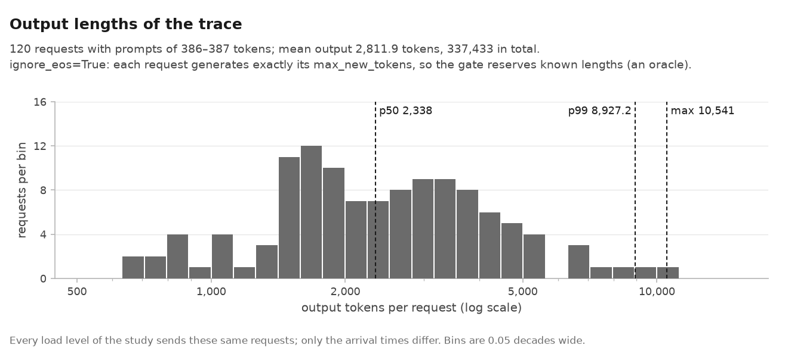
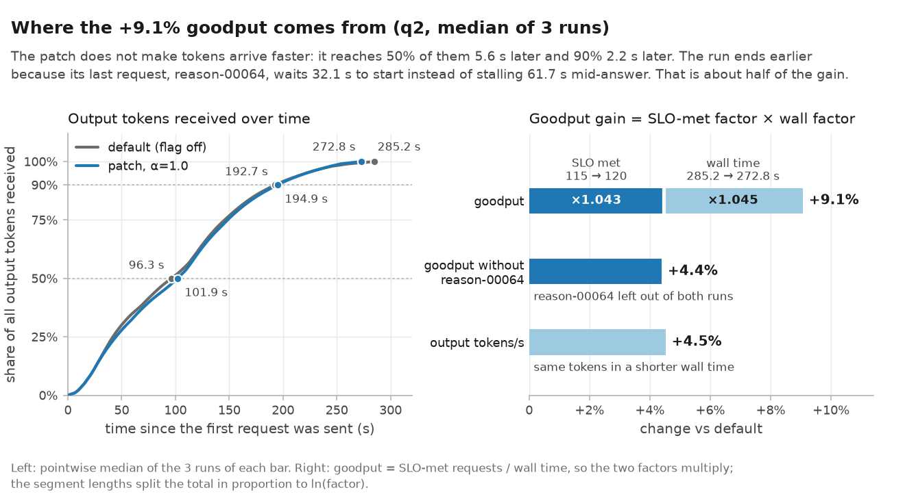
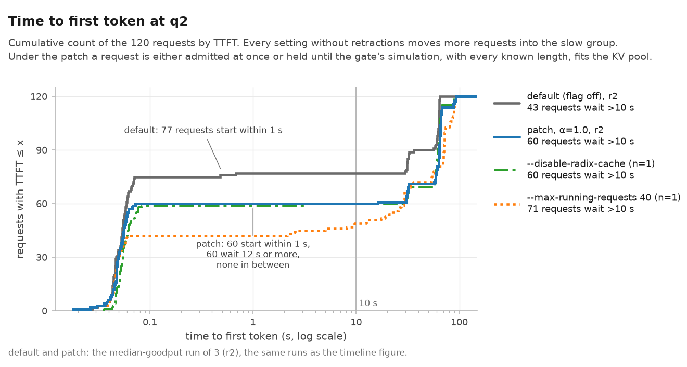
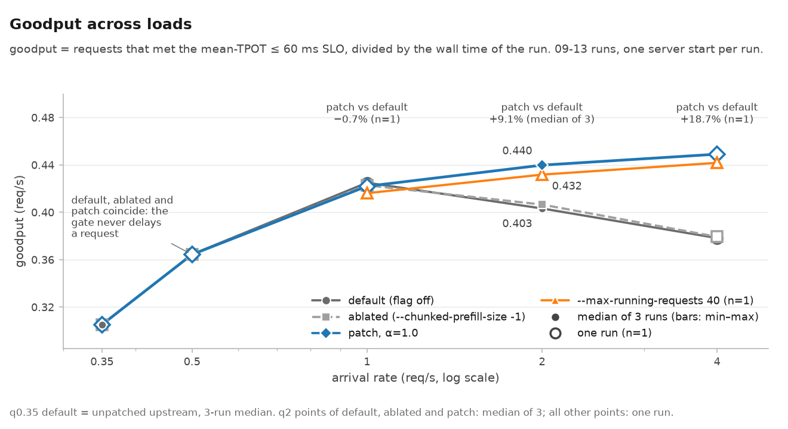

English · [한국어](REPORT.ko.md)

# W3 long-reasoning workload: KV retraction analysis and a peak-KV admission gate (SGLang 0.5.18)

> **Corrected edition.** This document corrects and extends the W3 final report submitted on 2026-09-17. The submitted version (an 11-page PDF) is not published. Every number or interpretation that changed, with its evidence, is listed in [ERRATA.md](../ERRATA.md). This edition also restores material the submission left out: the reduced-pool causal control, the comparison with existing flags (`--disable-radix-cache`, `--max-running-requests`), per-repetition ranges, the interpretation of the correctness results, and Appendices A–D. The Korean version is [REPORT.ko.md](REPORT.ko.md).

| Item | Value |
|---|---|
| Author | HwaminJung00 |
| Workload | W3 long reasoning (long chain of thought) |
| Submitted / corrected | submitted 2026-09-17 / corrected edition 2026-10-02 |
| Engine | SGLang v0.5.18 (`71de97b`) + [`patch/peak_kv_reservation.diff`](../patch/peak_kv_reservation.diff) (+<!--n:patch.lines_added-->102<!--/n-->/−<!--n:patch.lines_removed-->0<!--/n--> lines, flag off by default) |
| Model · GPU | Qwen/Qwen3-4B (bf16) · RTX 4090 24 GB · KV pool <!--n:kv.pool_tokens-->87,552<!--/n--> tokens |

**Provenance and tools.** This work began as an individual assignment in a 5-week LLM inference-engine study (August–September 2026). The course repository [mlleo/inference-engine-study](https://github.com/mlleo/inference-engine-study) provided the workload definition, the trace generator, the replay and metrics harness, and the hint to explore peak-KV reservation. None of its files are included in this repository. The instructor's solution material was not consulted (recorded in the preregistered plan). The bottleneck analysis, the patch, the experiment automation, the verification and the report are my own work. For this corrected edition, an AI coding assistant helped with the recomputation, verification and documentation ([Tools used in the README](../README.md#tools-used)).

**How to read this report.**

- **Load.** `q2` is the trace (`reasoning_q2`) that sends the same 120 requests at 2 QPS; `qps 0.35` is the base trace. Only the QPS differs: prompts and output lengths are identical.
- **Bar names.**
  - `upstream`: unpatched SGLang 0.5.18 (09-13).
  - `default`: the patched build with the flag off (09-13). Section 3.3 gives the evidence that it behaves like upstream.
  - `ablated`: default + `--chunked-prefill-size -1`.
  - `mine`: the patch flag on (`--enable-peak-kv-reservation`), with α = 1.0 unless stated otherwise. The figures and the README call this bar "patch".
  - `tuned N`: `--max-running-requests N`.
  - `noradix`: `--disable-radix-cache`.
  - `cap65k`: `--max-total-tokens 65536`.
  - `09-07 sweep`: a load sweep of unpatched 0.5.18, run before the patch existed (one run per load).
- **Repetitions.** ★ marks the median of 3 runs at q2, with [min–max] in brackets. Every result without ★ is a single run (n=1).
- **Metrics.**
  - Stall: an interval of more than 5 s with no token in a request's stream. maxITL is the largest inter-token gap within a request.
  - Retractions: the sum of `#retracted_reqs` in the server log.
  - goodput: SLO-met requests ÷ wall, where wall runs from the first submit to the last completion.
- **Where the numbers come from.** The main numbers in the text come from [`artifacts/numbers.json`](../artifacts/numbers.json). In the Markdown source each one is wrapped in a `<!--n:KEY-->` comment, and `python3 tools/check_numbers.py` checks that the text and the file agree. Numbers without a marker were computed from the derived data named in the table caption or the text.

## Summary

**Table 1. At a glance**

| Item | Content |
|---|---|
| Why this workload is hard | Prompts are <!--n:trace.prompt_tokens_range-->386–387<!--/n--> tokens, but outputs have a median of <!--n:trace.out_p50-->2,338<!--/n--> and a maximum of <!--n:trace.out_max-->10,541<!--/n--> tokens (lognormal), so a single request's KV keeps growing for minutes. With a <!--n:kv.pool_tokens-->87,552<!--/n-->-token (<!--n:kv.pool_gib-->12.0<!--/n--> GiB) KV pool, Little's law puts the arrival rate that can be served without retraction at about <!--n:diag.little_lambda_max-->0.56–0.67<!--/n--> QPS. |
| Bottleneck identified | Optimistic admission on the default path, with the radix cache on. In the 09-07 unpatched sweep (n=1 per load), the KV pool fills from q<!--n:diag.first_retraction_qps-->0.6<!--/n--> (max token usage <!--n:sweep0907.max_usage.q0.6-->0.99<!--/n-->, and <!--n:sweep0907.max_usage.q0.8-->1.00<!--/n--> from q0.8) and retractions begin. In this sweep, retractions and mid-generation stalls longer than 5 s (<!--n:diag.stalls_gt5s-->89<!--/n-->) pair one to one (<!--n:diag.stall_match-->89/89<!--/n-->). A stall (<!--n:diag.stall_range_s-->9.1–116.7<!--/n--> s) is mostly waiting at the back of the queue, not recomputation (<!--n:diag.recompute_pct_range-->0.22–8.41<!--/n-->% of processed tokens). |
| What I built | A gate that ports SGLang 0.5.18's existing exact-length admission simulation (`add_one_req_ignore_eos`, which runs only when the radix cache is disabled) to the radix-cache path. It sits behind the flag `--enable-peak-kv-reservation` (off by default) and is +<!--n:patch.lines_added-->102<!--/n-->/−<!--n:patch.lines_removed-->0<!--/n--> lines. The synthetic trace uses `ignore_eos=True`, so `max_new_tokens` is the actual output length: the gate is an **oracle reservation that uses known output lengths**. |
| Key result (q2, median of 3) | goodput <!--n:q2.default.goodput-->0.403<!--/n--> → <!--n:q2.mine.goodput-->0.440<!--/n--> req/s (<!--n:q2.gain.goodput_pct-->+9.1<!--/n-->%), SLO met <!--n:q2.default.slo_ratio-->115/120<!--/n--> → <!--n:q2.mine.slo_ratio-->120/120<!--/n-->, retractions <!--n:q2.default.retractions-->19<!--/n--> → <!--n:q2.mine.retractions-->0<!--/n-->, maxITL p99 <!--n:q2.default.maxitl_p99_s-->63.1<!--/n--> → <!--n:q2.mine.maxitl_p99_s-->0.11<!--/n--> s. The <!--n:q2.gain.goodput_pct-->+9.1<!--/n-->% is the product of SLO met ×<!--n:q2.gain.slo_factor-->1.043<!--/n--> and wall <!--n:q2.default.wall_s-->285.2<!--/n--> → <!--n:q2.mine.wall_s-->272.8<!--/n--> s (×<!--n:q2.gain.wall_factor-->1.045<!--/n-->). The wall factor comes from removing a stall of about <!--n:q2.longest.default_stall_s-->61.7<!--/n--> s in the longest request, <!--n:q2.longest.rid-->reason-00064<!--/n-->; without that one request the gain is <!--n:q2.excl_longest.gain_pct-->+4.4<!--/n-->%. Existing flags alone recover most of the gain: `--disable-radix-cache` <!--n:q2.share_of_gain.noradix_pct-->88.0<!--/n-->% and `--max-running-requests 40` <!--n:q2.share_of_gain.tuned_n40_pct-->78.1<!--/n-->% (n=1 each). |
| Cost | The pause moved from mid-generation to before the first token. TTFT p99 <!--n:q2.default.ttft_p99_s-->64.2<!--/n--> → <!--n:q2.mine.ttft_p99_s-->92.3<!--/n--> s (<!--n:q2.gain.ttft_p99_pct-->+43.6<!--/n-->%), mean <!--n:q2.default.ttft_mean_s-->19.0<!--/n--> → <!--n:q2.mine.ttft_mean_s-->30.1<!--/n--> s (<!--n:q2.gain.ttft_mean_pct-->+58.4<!--/n-->%), requests waiting more than 10 s <!--n:q2.default.wait10-->43<!--/n--> → <!--n:q2.mine.wait10-->60<!--/n-->. For the <!--n:q2.short_ttft_p50.n_requests-->9<!--/n--> short requests with fewer than 1k output tokens, TTFT p50 goes from <!--n:q2.short_ttft_p50.default_s-->0.06<!--/n--> to <!--n:q2.short_ttft_p50.mine_s-->31.6<!--/n--> s. Under conditions without retractions (qps 0.35, q0.5, out_mean 1000) and on the cross workloads it had no effect (goodput within ±0.8%, n=1 each). At q1 it raised TTFT p99 by <!--n:load.q1.ttft_p99_pct-->+15.9<!--/n-->% with no goodput gain (n=1). |

**Table 2. Key numbers (q2, median of 3 [min–max])**

| Metric | default★ | mine (α=1.0)★ | Change |
|---|---|---|---|
| goodput (req/s, mean TPOT ≤ 60 ms) | <!--n:q2.default.goodput-->0.403<!--/n--> [<!--n:q2.default.goodput_range-->0.4025–0.4035<!--/n-->] | <!--n:q2.mine.goodput-->0.440<!--/n--> [<!--n:q2.mine.goodput_range-->0.4396–0.4399<!--/n-->] | <!--n:q2.gain.goodput_pct-->+9.1<!--/n-->% |
| SLO met | <!--n:q2.default.slo_ratio-->115/120<!--/n--> | <!--n:q2.mine.slo_ratio-->120/120<!--/n--> | ×<!--n:q2.gain.slo_factor-->1.043<!--/n--> |
| wall (s) | <!--n:q2.default.wall_s-->285.2<!--/n--> | <!--n:q2.mine.wall_s-->272.8<!--/n--> | ×<!--n:q2.gain.wall_factor-->1.045<!--/n--> (default ÷ mine) |
| goodput without <!--n:q2.longest.rid-->reason-00064<!--/n--> | <!--n:q2.excl_longest.default_goodput-->0.420<!--/n--> | <!--n:q2.excl_longest.mine_goodput-->0.439<!--/n--> | <!--n:q2.excl_longest.gain_pct-->+4.4<!--/n-->% |
| Retractions (sum of #retracted_reqs) | <!--n:q2.default.retractions-->19<!--/n--> [<!--n:q2.default.retractions_min-->19<!--/n-->–<!--n:q2.default.retractions_max-->20<!--/n-->] | <!--n:q2.mine.retractions-->0<!--/n--> | |
| Requests stalled > 5 s | <!--n:q2.default.stall5-->19<!--/n--> [<!--n:q2.default.stall5_range-->19–20<!--/n-->] | <!--n:q2.mine.stall5-->0<!--/n--> | |
| maxITL p99 (s) | <!--n:q2.default.maxitl_p99_s-->63.1<!--/n--> [<!--n:q2.default.maxitl_p99_range_s-->62.8–63.1<!--/n-->] | <!--n:q2.mine.maxitl_p99_s-->0.11<!--/n--> [<!--n:q2.mine.maxitl_p99_range_s-->0.11–0.11<!--/n-->] | |
| TTFT p99 (s) | <!--n:q2.default.ttft_p99_s-->64.2<!--/n--> [<!--n:q2.default.ttft_p99_range_s-->64.1–64.3<!--/n-->] | <!--n:q2.mine.ttft_p99_s-->92.3<!--/n--> [<!--n:q2.mine.ttft_p99_range_s-->92.2–92.4<!--/n-->] | <!--n:q2.gain.ttft_p99_pct-->+43.6<!--/n-->% |
| TTFT mean (s) | <!--n:q2.default.ttft_mean_s-->19.0<!--/n--> | <!--n:q2.mine.ttft_mean_s-->30.1<!--/n--> | <!--n:q2.gain.ttft_mean_pct-->+58.4<!--/n-->% |
| Requests waiting > 10 s | <!--n:q2.default.wait10-->43<!--/n--> | <!--n:q2.mine.wait10-->60<!--/n--> | |
| out_tok/s (= <!--n:trace.out_total-->337,433<!--/n--> tokens ÷ wall) | <!--n:q2.default.out_tok_s-->1,183.3<!--/n--> | <!--n:q2.mine.out_tok_s-->1,236.7<!--/n--> | <!--n:q2.gain.out_tok_s_pct-->+4.5<!--/n-->% (a wall effect, unrelated to processing speed) |


*Figure 1. Per-request timelines at q2 for default (r2) and mine (r2). Each of the 120 requests is one row, in arrival order. In default, <!--n:hero.default.stalled-->19<!--/n--> requests stall mid-generation for <!--n:hero.default.stall_range_s-->32.5–64.8<!--/n--> s. mine has <!--n:hero.mine.stalled-->0<!--/n--> mid-generation stalls, but the number of requests that wait more than 10 s for their first token rises from <!--n:hero.default.wait10-->43<!--/n--> to <!--n:hero.mine.wait10-->60<!--/n-->.*

## 1. Workload analysis

### 1.1 Scenario and traffic characteristics

The workload imitates serving a reasoning model (long chain of thought). A user sends a short problem (<!--n:trace.prompt_tokens_range-->386–387<!--/n--> tokens) and the model streams a long reasoning trace. The <!--n:trace.n_requests-->120<!--/n--> requests are independent and arrive as a Poisson process (0.35 QPS in the base trace). All are greedy (temperature 0) with `ignore_eos=True`, so each output is exactly `max_new_tokens` long. Output lengths are lognormal (generator defaults: mean 3,000, σ 0.6, range [256, 16,000]), so a single request's KV keeps growing for minutes.

**Table 3. W3 traffic characteristics**

| Item | Value | Basis |
|---|---|---|
| Prompt tokens | <!--n:trace.prompt_tokens_range-->386–387<!--/n--> (effectively fixed) | `prompt_tokens` in the result files |
| Output tokens p50 / p90 / p99 / max | <!--n:trace.out_p50-->2,338<!--/n--> / <!--n:trace.out_p90-->4,744.7<!--/n--> / <!--n:trace.out_p99-->8,927.2<!--/n--> / <!--n:trace.out_max-->10,541<!--/n--> (mean <!--n:trace.out_mean-->2,811.9<!--/n-->, total <!--n:trace.out_total-->337,433<!--/n-->) | `ignore_eos=True`, so `max_new_tokens` = actual output length |
| Prompt : output | median 1 : 6.0, token totals 1 : 7.3 | first-order approximation of the prefill-to-decode split |
| Arrivals | Poisson. Base 0.35 QPS: nominal gap 1/0.35 = <!--n:trace.nominal_interarrival_s-->2.9<!--/n--> s, measured mean <!--n:trace.mean_interarrival_s-->2.7<!--/n--> s. The final comparison uses q2, which sends the same requests at 2 QPS (arrival span 56.0 s) | Traces that change only the QPS have the same prompts and output lengths; only the arrival times differ (checked against the trace files) |
| Session structure | <!--n:trace.n_requests-->120<!--/n--> independent requests (every `session_id` differs; no `depends_on`) | trace fields |
| Shared prefix | Requests share only the first <!--n:trace.shared_prefix_tokens-->36<!--/n--> tokens: the system instruction and the problem header. The <!--n:trace.cache_hit_pct-->11.5<!--/n-->% cache hit includes the replay warm-up, which pre-caches the first 3 prompts; without those 3 it is <!--n:trace.cache_hit_excl_warmup_pct-->9.3<!--/n-->% | Modal `cached_tokens` is <!--n:trace.shared_prefix_tokens-->36<!--/n-->. The problem text differs per request, so a low hit rate is expected |
| KV size | 144 KiB per token (<!--n:kv.bytes_per_token-->147,456<!--/n--> B). A median request (2,725 prompt + output tokens) ends at 0.37 GiB; the longest (10,928 tokens) at 1.50 GiB | Qwen3-4B: 36 layers × 8 KV heads × head_dim 128 × K and V × bf16 |
| KV pool and concurrency | Pool <!--n:kv.pool_tokens-->87,552<!--/n--> tokens = <!--n:kv.pool_gib-->12.0<!--/n--> GiB ≈ 32 median requests. By Little's law, the arrival rate sustainable without retraction is λmax = pool ÷ (TPOT × E[387·o + o²/2]) ≈ <!--n:diag.little_lambda_max-->0.56–0.67<!--/n--> QPS (o = output length, assuming a TPOT of 20–24 ms) | Computed from time-weighted concurrent KV, not total output. The longest 10% of requests account for 41.2% of KV×time |
| Measured at qps 0.35 | max concurrency <!--n:baseline.q035.upstream.max_running-->26<!--/n-->, max token usage <!--n:baseline.q035.upstream.max_usage-->0.76<!--/n--> (about 67k tokens), retractions <!--n:baseline.q035.upstream.retractions-->0<!--/n--> | 09-13 upstream, 3 runs |



*Figure 2. Output-length distribution of the <!--n:trace.n_requests-->120<!--/n--> requests. `max_new_tokens` is the actual output length.*

### 1.2 SLO definition and rationale

**Table 4. SLO definition**

| Metric | Target | Rationale | Trace field |
|---|---|---|---|
| TPOT (per-request mean) | ≤ <!--n:trace.tpot_slo_ms-->60<!--/n--> ms | Fixed in the trace. 60 ms/token ≈ 16.7 tokens/s, fast enough for a person to follow a streamed reasoning trace. Upstream's TPOT p99 at qps 0.35 is <!--n:baseline.q035.upstream.tpot_p99_ms-->20.2<!--/n--> ms, about 3× headroom. The SLO was not changed. | `tpot_slo_ms` |
| TTFT | none | Fixed in the trace (`ttft_slo_ms = null`). The premise is that the long generation is the main part of the response, so an unbroken stream matters more than the first token. But removing retractions moves the cost into TTFT, so every results table reports TTFT p50, mean and p99 separately. | `ttft_slo_ms` |
| (Auxiliary) max stall within a request ≤ 5 s | reporting only | An auxiliary metric fixed in section 4.2 of the preregistered plan before any result was seen (`aux_slo_%`, plus `stall5_reqs`, the number of requests stalled more than 5 s). It is not part of the goodput verdict. maxITL p99, E2E p50/p99 and wall are also reporting-only. | client chunk arrival times |

A mean-TPOT SLO alone cannot catch long stalls: a request can stop for 60 s and still keep its mean TPOT under 60 ms if its output is long enough. At q2 default, <!--n:q2.default.stalled_tpot_ok_range-->14–15<!--/n--> of the <!--n:q2.default.stall5_range-->19–20<!--/n--> requests that stalled for more than 5 s still met the mean-TPOT SLO (4.2).

### 1.3 What makes it hard

Prompts are fixed at <!--n:trace.prompt_tokens_range-->386–387<!--/n--> tokens, but outputs have a median of <!--n:trace.out_p50-->2,338<!--/n--> and a maximum of <!--n:trace.out_max-->10,541<!--/n--> tokens, so decode is 99.9% of E2E (at qps 0.35, TTFT is 0.1% of E2E at p50). A request's KV grows by 144 KiB per decode step: a median request ends at 0.37 GiB and the longest at 1.50 GiB. With a <!--n:kv.pool_tokens-->87,552<!--/n-->-token (<!--n:kv.pool_gib-->12.0<!--/n--> GiB) pool, Little's law puts the arrival rate sustainable without retraction at about <!--n:diag.little_lambda_max-->0.56–0.67<!--/n--> QPS, and the first retraction does appear at q<!--n:diag.first_retraction_qps-->0.6<!--/n-->.

On the default path, with the radix cache on, the scheduler does not use how long a new request will generate. It reserves only min(remaining length, 4,096) × `new_token_ratio` per running request, and this ratio starts at 0.7 and decays to 0.098. Once the load exceeds λmax, too many long requests are admitted at once and the pool fills. The request with the fewest generated tokens is then retracted and sent to the back of the queue. Its output tokens are kept, but its KV is discarded and re-prefilled. Recomputation is only <!--n:diag.recompute_pct_range-->0.22–8.41<!--/n-->% of the processed tokens, yet the victim stalls for <!--n:diag.stall_range_s-->9.1–116.7<!--/n--> s. On top of that, the longest 10% of requests account for 41.2% of KV×time, so sizing capacity by the mean length gives the wrong answer.

## 2. Identifying the bottleneck

### 2.1 Baseline measurement

**Table 5. Baseline (unpatched 0.5.18, qps 0.35, 09-13, 3 runs)**

| Metric | Unit | r1 | r2 | r3 | Median |
|---|---|---|---|---|---|
| n_ok / n_err | requests | 120 / 0 | 120 / 0 | 120 / 0 | 120 / 0 |
| wall | s | 393.2 | 393.2 | 393.2 | <!--n:baseline.q035.upstream.wall_s-->393.2<!--/n--> |
| TTFT p50 | ms | 51.6 | 50.8 | 49.9 | <!--n:baseline.q035.upstream.ttft_p50_ms-->50.8<!--/n--> |
| TTFT p99 | ms | 69.4 | 66.0 | 70.1 | <!--n:baseline.q035.upstream.ttft_p99_ms-->69.4<!--/n--> |
| TPOT p50 | ms | 16.5 | 16.5 | 16.5 | <!--n:baseline.q035.upstream.tpot_p50_ms-->16.5<!--/n--> |
| TPOT p99 | ms | 20.2 | 20.2 | 20.2 | <!--n:baseline.q035.upstream.tpot_p99_ms-->20.2<!--/n--> |
| maxITL p99 | ms | 59.4 | 60.1 | 59.7 | <!--n:baseline.q035.upstream.maxitl_p99_ms-->59.7<!--/n--> |
| E2E p99 | s | 152.0 | 152.1 | 152.1 | <!--n:baseline.q035.upstream.e2e_p99_s-->152.1<!--/n--> |
| out_tok/s | tok/s | 858.2 | 858.3 | 858.2 | <!--n:baseline.q035.upstream.out_tok_s-->858.2<!--/n--> |
| cache hit | % | 11.5 | 11.5 | 11.5 | <!--n:baseline.q035.upstream.cache_hit_pct-->11.5<!--/n--> |
| SLO met | % | 100.0 | 100.0 | 100.0 | <!--n:baseline.q035.upstream.slo_pct-->100.0<!--/n--> |
| goodput | req/s | 0.305 | 0.305 | 0.305 | <!--n:baseline.q035.upstream.goodput-->0.305<!--/n--> |
| Retractions | count | 0 | 0 | 0 | <!--n:baseline.q035.upstream.retractions-->0<!--/n--> |
| Max token usage | | 0.76 | 0.76 | 0.76 | <!--n:baseline.q035.upstream.max_usage-->0.76<!--/n--> |
| Max concurrent requests | requests | 26 | 26 | 26 | <!--n:baseline.q035.upstream.max_running-->26<!--/n--> |

Per-run values are in `data/derived/w3_runs.csv`. The submitted baseline table copied on-screen values from a 09-06 run. That run's result file was overwritten by a rerun the same day, so no file reproduces those values; the table now uses the three 09-13 upstream runs.

**Table 6. Diagnostic summary (the course harness's diagnostic tool `bench.analyze`, upstream r1)**

| Item | Value | Interpretation |
|---|---|---|
| TTFT share of E2E (p50 / p90) | 0.1% / 0.3% | Decode-dominated. A TTFT p50 of about 51 ms is one 387-token prefill |
| Max concurrent requests | <!--n:baseline.q035.upstream.max_running-->26<!--/n--> (two peaks, near 130 s and 280 s) | Retractions <!--n:baseline.q035.upstream.retractions-->0<!--/n-->, max token usage <!--n:baseline.q035.upstream.max_usage-->0.76<!--/n-->. No sign of the batch growing and then collapsing |
| Outstanding requests | Rises and falls: 2 → 22 → 13 → 22 → 0 (max 22) | Not monotonic, so not saturated. The sawtooth comes from arrival variation, not memory pressure |
| TTFT by prompt-length bucket | a single bucket, 386–387 | No length variation to compare. There is no queueing at this load either |

No bottleneck is visible at qps 0.35 (server log excerpt in Appendix D-5). The wall of <!--n:baseline.q035.upstream.wall_s-->393.2<!--/n--> s is the submit time of the last request to finish, reason-00101 (8,263 tokens), at 257.2 s, plus that request's E2E of 135.9 s. The bottleneck appears at q<!--n:diag.first_retraction_qps-->0.6<!--/n--> and above, beyond λmax (2.3).

### 2.2 The bottleneck and the evidence

**Claim:** admission is optimistic relative to the KV pool (<!--n:kv.pool_tokens-->87,552<!--/n--> tokens). Once the arrival rate exceeds λmax ≈ 0.6 QPS, the KV growth of the running long requests fills the pool and triggers retractions. The victims are pushed to the back of the queue and stall for anywhere from tens of seconds to over a hundred seconds. It is not a prefill or compute-speed problem.

**Source and timing of the evidence.** The prior evidence for the claim is the 09-07 unpatched load sweep (①–③ in Table 7). The patch was written at 15:06 UTC on 09-13. The q2 controls in Table 8 (reduced pool started at 16:31, chunked prefill off at 16:37) ran after that, as experiments E2 and E3 of the P2 exploration phase in the preregistered plan. The submitted section 2.2 instead cited runs at qps 0.35 with chunking, the radix cache and CUDA graphs disabled. That load is below λmax, with 0 retractions and a max token usage of <!--n:baseline.q035.upstream.max_usage-->0.76<!--/n-->, so it carries no information about the bottleneck. The server logs of those 09-07 runs were not kept either.

**Table 7. Evidence for the bottleneck**

| Evidence | Content | Source |
|---|---|---|
| ① A retraction is a long stall (1:1) | In the 09-07 unpatched sweep over 7 loads (q0.5–q8, n=1 each), the retraction counts <!--n:sweep0907.retractions.q0.5-->0<!--/n-->/<!--n:sweep0907.retractions.q0.6-->1<!--/n-->/<!--n:sweep0907.retractions.q0.8-->4<!--/n-->/<!--n:sweep0907.retractions.q1-->7<!--/n-->/<!--n:sweep0907.retractions.q2-->20<!--/n-->/<!--n:sweep0907.retractions.q4-->29<!--/n-->/<!--n:sweep0907.retractions.q8-->28<!--/n--> equal the counts of requests stalled for more than 5 s, <!--n:sweep0907.stall5.q0.5-->0<!--/n-->/<!--n:sweep0907.stall5.q0.6-->1<!--/n-->/<!--n:sweep0907.stall5.q0.8-->4<!--/n-->/<!--n:sweep0907.stall5.q1-->7<!--/n-->/<!--n:sweep0907.stall5.q2-->20<!--/n-->/<!--n:sweep0907.stall5.q4-->29<!--/n-->/<!--n:sweep0907.stall5.q8-->28<!--/n-->, at every load. Each retraction pairs with one stall by time and token position (<!--n:diag.stalls_gt5s-->89<!--/n--> stalls, matched <!--n:diag.stall_match-->89/89<!--/n-->; <!--n:diag.stall_match_exact-->87<!--/n--> exact, <!--n:diag.stall_match_approx-->2<!--/n--> approximate). Every request that violated the SLO in this sweep was a retraction victim (<!--n:diag.slo_violators_all_victims-->30/30<!--/n-->). | [`data/derived/retract_cost/`](../data/derived/retract_cost/), `python3 -m analysis.retract_cost --sweep-0907` |
| ② The stall is waiting | In the <!--n:diag.reprefill_confirmed-->38<!--/n--> cases where the re-prefill line was found, the delay from retraction to re-prefill equals the stall within <!--n:diag.reprefill_delay_vs_stall_max_s-->0.90<!--/n--> s (log timestamps have 1 s resolution). The stall is the time spent waiting in the queue to be admitted again. Excess recomputation is only <!--n:diag.recompute_pct_range-->0.22–8.41<!--/n-->% of the processed tokens. | `events.csv` and `summary.csv` in the same folder |
| ③ The capacity limit matches the first retraction | The Little's-law limit λmax <!--n:diag.little_lambda_max-->0.56–0.67<!--/n--> QPS matches the first retraction at q<!--n:diag.first_retraction_qps-->0.6<!--/n--> (max token usage <!--n:sweep0907.max_usage.q0.6-->0.99<!--/n-->, <!--n:sweep0907.retractions.q0.6-->1<!--/n--> retraction). q0.5 peaks at a usage of <!--n:sweep0907.max_usage.q0.5-->0.82<!--/n--> with <!--n:sweep0907.retractions.q0.5-->0<!--/n--> retractions; from q0.8 on, usage reaches <!--n:sweep0907.max_usage.q0.8-->1.00<!--/n-->. | [`data/derived/sweep_0907.csv`](../data/derived/sweep_0907.csv) |
| ④ q2 controls (Table 8) | Every intervention that made admission more conservative removed the retractions. Shrinking the pool made the stalls and the waiting tail longer. Turning chunked prefill off made no difference. | `data/derived/w3_runs.csv` |

**Table 8. q2 controls (09-13, server restarted for every bar. ★ = median of 3 [min–max], all others n=1)**

| Configuration | KV pool | Retractions | Stalls > 5 s | maxITL p99 (s) | TTFT p99 (s) | TTFT mean (s) | SLO met | wall (s) | goodput |
|---|---|---|---|---|---|---|---|---|---|
| default★ | <!--n:kv.pool_tokens-->87,552<!--/n--> | <!--n:q2.default.retractions-->19<!--/n--> [<!--n:q2.default.retractions_min-->19<!--/n-->–<!--n:q2.default.retractions_max-->20<!--/n-->] | <!--n:q2.default.stall5-->19<!--/n--> [<!--n:q2.default.stall5_range-->19–20<!--/n-->] | <!--n:q2.default.maxitl_p99_s-->63.1<!--/n--> [<!--n:q2.default.maxitl_p99_range_s-->62.8–63.1<!--/n-->] | <!--n:q2.default.ttft_p99_s-->64.2<!--/n--> [<!--n:q2.default.ttft_p99_range_s-->64.1–64.3<!--/n-->] | <!--n:q2.default.ttft_mean_s-->19.0<!--/n--> | <!--n:q2.default.slo_ratio-->115/120<!--/n--> | <!--n:q2.default.wall_s-->285.2<!--/n--> | <!--n:q2.default.goodput-->0.403<!--/n--> [<!--n:q2.default.goodput_range-->0.4025–0.4035<!--/n-->] |
| upstream (unpatched, n=1) | <!--n:kv.pool_tokens-->87,552<!--/n--> | <!--n:q2.upstream.retractions-->19<!--/n--> | <!--n:q2.upstream.stall5-->19<!--/n--> | <!--n:q2.upstream.maxitl_p99_s-->63.2<!--/n--> | <!--n:q2.upstream.ttft_p99_s-->64.3<!--/n--> | <!--n:q2.upstream.ttft_mean_s-->19.0<!--/n--> | <!--n:q2.upstream.slo_ratio-->115/120<!--/n--> | <!--n:q2.upstream.wall_s-->285.7<!--/n--> | <!--n:q2.upstream.goodput-->0.403<!--/n--> |
| **cap65k** reduced pool (n=1) | <!--n:kv.cap65k_pool_tokens-->65,536<!--/n--> | <!--n:q2.cap65k.retractions-->22<!--/n--> | <!--n:q2.cap65k.stall5-->22<!--/n--> | <!--n:q2.cap65k.maxitl_p99_s-->103.8<!--/n--> | <!--n:q2.cap65k.ttft_p99_s-->114.0<!--/n--> | <!--n:q2.cap65k.ttft_mean_s-->35.3<!--/n--> | <!--n:q2.cap65k.slo_ratio-->117/120<!--/n--> | <!--n:q2.cap65k.wall_s-->305.5<!--/n--> | <!--n:q2.cap65k.goodput-->0.383<!--/n--> |
| ablated★ chunked prefill off | <!--n:kv.pool_tokens-->87,552<!--/n--> | <!--n:q2.ablated.retractions-->21<!--/n--> [<!--n:q2.ablated.retractions_min-->20<!--/n-->–<!--n:q2.ablated.retractions_max-->21<!--/n-->] | <!--n:q2.ablated.stall5-->21<!--/n--> | <!--n:q2.ablated.maxitl_p99_s-->63.2<!--/n--> [<!--n:q2.ablated.maxitl_p99_range_s-->62.3–63.6<!--/n-->] | <!--n:q2.ablated.ttft_p99_s-->64.5<!--/n--> [<!--n:q2.ablated.ttft_p99_range_s-->63.6–65.0<!--/n-->] | <!--n:q2.ablated.ttft_mean_s-->19.1<!--/n--> | <!--n:q2.ablated.slo_ratio-->116/120<!--/n--> | <!--n:q2.ablated.wall_s-->285.3<!--/n--> | <!--n:q2.ablated.goodput-->0.407<!--/n--> [<!--n:q2.ablated.goodput_range-->0.4016–0.4067<!--/n-->] |
| noradix exact-length admission (n=1) | <!--n:kv.pool_tokens-->87,552<!--/n--> | <!--n:q2.noradix.retractions-->0<!--/n--> | <!--n:q2.noradix.stall5-->0<!--/n--> | <!--n:q2.noradix.maxitl_p99_s-->0.12<!--/n--> | <!--n:q2.noradix.ttft_p99_s-->89.9<!--/n--> | <!--n:q2.noradix.ttft_mean_s-->30.3<!--/n--> | <!--n:q2.noradix.slo_ratio-->120/120<!--/n--> | <!--n:q2.noradix.wall_s-->275.6<!--/n--> | <!--n:q2.noradix.goodput-->0.435<!--/n--> |
| tuned N=24 (n=1) | <!--n:kv.pool_tokens-->87,552<!--/n--> | <!--n:q2.tuned_n24.retractions-->0<!--/n--> | <!--n:q2.tuned_n24.stall5-->0<!--/n--> | <!--n:q2.tuned_n24.maxitl_p99_s-->0.05<!--/n--> | <!--n:q2.tuned_n24.ttft_p99_s-->156.3<!--/n--> | <!--n:q2.tuned_n24.ttft_mean_s-->62.6<!--/n--> | <!--n:q2.tuned_n24.slo_ratio-->120/120<!--/n--> | <!--n:q2.tuned_n24.wall_s-->313.9<!--/n--> | <!--n:q2.tuned_n24.goodput-->0.382<!--/n--> |
| tuned N=32 (n=1) | <!--n:kv.pool_tokens-->87,552<!--/n--> | <!--n:q2.tuned_n32.retractions-->0<!--/n--> | <!--n:q2.tuned_n32.stall5-->0<!--/n--> | <!--n:q2.tuned_n32.maxitl_p99_s-->0.07<!--/n--> | <!--n:q2.tuned_n32.ttft_p99_s-->114.6<!--/n--> | <!--n:q2.tuned_n32.ttft_mean_s-->45.6<!--/n--> | <!--n:q2.tuned_n32.slo_ratio-->120/120<!--/n--> | <!--n:q2.tuned_n32.wall_s-->294.7<!--/n--> | <!--n:q2.tuned_n32.goodput-->0.407<!--/n--> |
| tuned N=40 (n=1) | <!--n:kv.pool_tokens-->87,552<!--/n--> | <!--n:q2.tuned_n40.retractions-->0<!--/n--> | <!--n:q2.tuned_n40.stall5-->0<!--/n--> | <!--n:q2.tuned_n40.maxitl_p99_s-->0.09<!--/n--> | <!--n:q2.tuned_n40.ttft_p99_s-->93.5<!--/n--> | <!--n:q2.tuned_n40.ttft_mean_s-->35.2<!--/n--> | <!--n:q2.tuned_n40.slo_ratio-->120/120<!--/n--> | <!--n:q2.tuned_n40.wall_s-->277.9<!--/n--> | <!--n:q2.tuned_n40.goodput-->0.432<!--/n--> |
| tuned N=48 (n=1) | <!--n:kv.pool_tokens-->87,552<!--/n--> | <!--n:q2.tuned_n48.retractions-->5<!--/n--> | <!--n:q2.tuned_n48.stall5-->5<!--/n--> | <!--n:q2.tuned_n48.maxitl_p99_s-->76.1<!--/n--> | <!--n:q2.tuned_n48.ttft_p99_s-->72.9<!--/n--> | <!--n:q2.tuned_n48.ttft_mean_s-->28.5<!--/n--> | <!--n:q2.tuned_n48.slo_ratio-->117/120<!--/n--> | <!--n:q2.tuned_n48.wall_s-->274.4<!--/n--> | <!--n:q2.tuned_n48.goodput-->0.426<!--/n--> |

Every intervention that made admission more conservative (exact-length admission, a concurrency cap of N ≤ 40) removed the retractions and the long stalls. Shrinking the pool (cap65k) made the stalls and the waiting tail longer: maxITL p99 <!--n:q2.default.maxitl_p99_s-->63.1<!--/n--> → <!--n:q2.cap65k.maxitl_p99_s-->103.8<!--/n--> s, TTFT p99 <!--n:q2.default.ttft_p99_s-->64.2<!--/n--> → <!--n:q2.cap65k.ttft_p99_s-->114.0<!--/n--> s. But cap65k is a single run, and its <!--n:q2.cap65k.retractions-->22<!--/n--> retractions only just exceed the range seen across repetitions (default and ablated, <!--n:q2.default.retractions_min-->19<!--/n-->–<!--n:q2.ablated.retractions_max-->21<!--/n-->), so it is **medium-strength evidence**. That cap65k met the SLO for more requests than default (<!--n:q2.cap65k.slo_ratio-->117/120<!--/n-->) is also within n=1 noise; its goodput is lower because its wall grew to <!--n:q2.cap65k.wall_s-->305.5<!--/n--> s. With chunked prefill off, the retraction count and goodput both stay within run-to-run variation, so the prefill path is not the cause.

The server log right after a retraction (default r1, [`data/logs_sample/server_reasoning_q2__default_r1.log`](../data/logs_sample/server_reasoning_q2__default_r1.log) lines 268–284, HTTP access lines omitted):

```text
[2026-09-13 16:06:04] Decode batch, #running-req: 67, #token: 81316, token usage: 0.93, cuda graph: False, gen throughput (token/s): 2663.43, #queue-req: 9
[2026-09-13 16:06:05] Decode batch, #running-req: 66, #token: 82002, token usage: 0.94, cuda graph: False, gen throughput (token/s): 2622.21, #queue-req: 10
[2026-09-13 16:06:06] Decode batch, #running-req: 66, #token: 84642, token usage: 0.97, cuda graph: False, gen throughput (token/s): 2574.67, #queue-req: 11
[2026-09-13 16:06:07] Decode batch, #running-req: 66, #token: 87282, token usage: 1.00, cuda graph: False, gen throughput (token/s): 2529.33, #queue-req: 13
[2026-09-13 16:06:07] KV cache pool is full. Retract requests. #retracted_reqs: 1, #new_tokens_gained: 646, #new_token_ratio: 0.0980 -> 0.3487
[2026-09-13 16:06:07] KV cache pool is full. Retract requests. #retracted_reqs: 1, #new_tokens_gained: 657, #new_token_ratio: 0.3397 -> 0.3530
[2026-09-13 16:06:07] KV cache pool is full. Retract requests. #retracted_reqs: 1, #new_tokens_gained: 761, #new_token_ratio: 0.3440 -> 0.3574
[2026-09-13 16:06:08] KV cache pool is full. Retract requests. #retracted_reqs: 1, #new_tokens_gained: 775, #new_token_ratio: 0.3464 -> 0.3607
[2026-09-13 16:06:08] Decode batch, #running-req: 62, #token: 87001, token usage: 0.99, cuda graph: False, gen throughput (token/s): 2467.25, #queue-req: 18
[2026-09-13 16:06:08] KV cache pool is full. Retract requests. #retracted_reqs: 1, #new_tokens_gained: 792, #new_token_ratio: 0.3497 -> 0.3671
[2026-09-13 16:06:09] Decode batch, #running-req: 60, #token: 87429, token usage: 1.00, cuda graph: False, gen throughput (token/s): 2391.98, #queue-req: 20
```

While 66 requests decode concurrently, the pool reaches 1.00 and five requests are retracted within two seconds; the queue grows from 13 to 20. Right after a retraction `new_token_ratio` jumps from 0.098 to about 0.35 and then decays again, tracing a sawtooth. The same pattern appears in unpatched q2 (`logs/server_reasoning_q2__upstream_r1.log`, 15:46:58, raw data).

### 2.3 Load sweep

**Table 9. Load sweep (unpatched 0.5.18. qps 0.35 is the median of the three 09-13 upstream runs; the other rows are the 09-07 sweep, n=1 each)**

| QPS | goodput (req/s) | SLO met (%) | TTFT p99 (s) | TPOT p50 (ms) | TPOT p99 (ms) | maxITL p99 (s) | Retractions | Stalls > 5 s | Max token usage | out_tok/s |
|---|---|---|---|---|---|---|---|---|---|---|
| 0.35★ | <!--n:baseline.q035.upstream.goodput-->0.305<!--/n--> | <!--n:baseline.q035.upstream.slo_pct-->100.0<!--/n--> | <!--n:baseline.q035.upstream.ttft_p99_s-->0.07<!--/n--> | <!--n:baseline.q035.upstream.tpot_p50_ms-->16.5<!--/n--> | <!--n:baseline.q035.upstream.tpot_p99_ms-->20.2<!--/n--> | <!--n:baseline.q035.upstream.maxitl_p99_s-->0.06<!--/n--> | <!--n:baseline.q035.upstream.retractions-->0<!--/n--> | 0 | <!--n:baseline.q035.upstream.max_usage-->0.76<!--/n--> | <!--n:baseline.q035.upstream.out_tok_s-->858.2<!--/n--> |
| 0.5 | <!--n:sweep0907.goodput.q0.5-->0.365<!--/n--> | <!--n:sweep0907.slo_pct.q0.5-->100.0<!--/n--> | <!--n:sweep0907.ttft_p99_s.q0.5-->0.07<!--/n--> | <!--n:sweep0907.tpot_p50_ms.q0.5-->20.4<!--/n--> | <!--n:sweep0907.tpot_p99_ms.q0.5-->21.9<!--/n--> | <!--n:sweep0907.maxitl_p99_s.q0.5-->0.07<!--/n--> | <!--n:sweep0907.retractions.q0.5-->0<!--/n--> | <!--n:sweep0907.stall5.q0.5-->0<!--/n--> | <!--n:sweep0907.max_usage.q0.5-->0.82<!--/n--> | <!--n:sweep0907.out_tok_s.q0.5-->1,026.1<!--/n--> |
| 0.6 | <!--n:sweep0907.goodput.q0.6-->0.390<!--/n--> | <!--n:sweep0907.slo_pct.q0.6-->100.0<!--/n--> | <!--n:sweep0907.ttft_p99_s.q0.6-->16.2<!--/n--> | <!--n:sweep0907.tpot_p50_ms.q0.6-->21.7<!--/n--> | <!--n:sweep0907.tpot_p99_ms.q0.6-->23.9<!--/n--> | <!--n:sweep0907.maxitl_p99_s.q0.6-->0.12<!--/n--> | <!--n:sweep0907.retractions.q0.6-->1<!--/n--> | <!--n:sweep0907.stall5.q0.6-->1<!--/n--> | <!--n:sweep0907.max_usage.q0.6-->0.99<!--/n--> | <!--n:sweep0907.out_tok_s.q0.6-->1,095.4<!--/n--> |
| 0.8 | <!--n:sweep0907.goodput.q0.8-->0.407<!--/n--> | <!--n:sweep0907.slo_pct.q0.8-->100.0<!--/n--> | <!--n:sweep0907.ttft_p99_s.q0.8-->29.1<!--/n--> | <!--n:sweep0907.tpot_p50_ms.q0.8-->23.0<!--/n--> | <!--n:sweep0907.tpot_p99_ms.q0.8-->38.6<!--/n--> | <!--n:sweep0907.maxitl_p99_s.q0.8-->24.6<!--/n--> | <!--n:sweep0907.retractions.q0.8-->4<!--/n--> | <!--n:sweep0907.stall5.q0.8-->4<!--/n--> | <!--n:sweep0907.max_usage.q0.8-->1.00<!--/n--> | <!--n:sweep0907.out_tok_s.q0.8-->1,143.8<!--/n--> |
| 1 | <!--n:sweep0907.goodput.q1-->0.425<!--/n--> | <!--n:sweep0907.slo_pct.q1-->100.0<!--/n--> | <!--n:sweep0907.ttft_p99_s.q1-->46.5<!--/n--> | <!--n:sweep0907.tpot_p50_ms.q1-->23.6<!--/n--> | <!--n:sweep0907.tpot_p99_ms.q1-->36.4<!--/n--> | <!--n:sweep0907.maxitl_p99_s.q1-->29.5<!--/n--> | <!--n:sweep0907.retractions.q1-->7<!--/n--> | <!--n:sweep0907.stall5.q1-->7<!--/n--> | <!--n:sweep0907.max_usage.q1-->1.00<!--/n--> | <!--n:sweep0907.out_tok_s.q1-->1,196.0<!--/n--> |
| 2 | <!--n:sweep0907.goodput.q2-->0.407<!--/n--> | <!--n:sweep0907.slo_pct.q2-->96.7<!--/n--> | <!--n:sweep0907.ttft_p99_s.q2-->63.9<!--/n--> | <!--n:sweep0907.tpot_p50_ms.q2-->24.1<!--/n--> | <!--n:sweep0907.tpot_p99_ms.q2-->93.2<!--/n--> | <!--n:sweep0907.maxitl_p99_s.q2-->62.6<!--/n--> | <!--n:sweep0907.retractions.q2-->20<!--/n--> | <!--n:sweep0907.stall5.q2-->20<!--/n--> | <!--n:sweep0907.max_usage.q2-->1.00<!--/n--> | <!--n:sweep0907.out_tok_s.q2-->1,183.2<!--/n--> |
| 4 | <!--n:sweep0907.goodput.q4-->0.379<!--/n--> | <!--n:sweep0907.slo_pct.q4-->90.0<!--/n--> | <!--n:sweep0907.ttft_p99_s.q4-->75.7<!--/n--> | <!--n:sweep0907.tpot_p50_ms.q4-->24.5<!--/n--> | <!--n:sweep0907.tpot_p99_ms.q4-->94.9<!--/n--> | <!--n:sweep0907.maxitl_p99_s.q4-->102.5<!--/n--> | <!--n:sweep0907.retractions.q4-->29<!--/n--> | <!--n:sweep0907.stall5.q4-->29<!--/n--> | <!--n:sweep0907.max_usage.q4-->1.00<!--/n--> | <!--n:sweep0907.out_tok_s.q4-->1,183.8<!--/n--> |
| 8 | <!--n:sweep0907.goodput.q8-->0.365<!--/n--> | <!--n:sweep0907.slo_pct.q8-->88.3<!--/n--> | <!--n:sweep0907.ttft_p99_s.q8-->78.2<!--/n--> | <!--n:sweep0907.tpot_p50_ms.q8-->24.3<!--/n--> | <!--n:sweep0907.tpot_p99_ms.q8-->102.3<!--/n--> | <!--n:sweep0907.maxitl_p99_s.q8-->116.2<!--/n--> | <!--n:sweep0907.retractions.q8-->28<!--/n--> | <!--n:sweep0907.stall5.q8-->28<!--/n--> | <!--n:sweep0907.max_usage.q8-->1.00<!--/n--> | <!--n:sweep0907.out_tok_s.q8-->1,162.2<!--/n--> |

Notes on the table:

- The submitted report copied the p50 values into the TPOT p99 column. The actual p99 exceeds the <!--n:trace.tpot_slo_ms-->60<!--/n--> ms SLO from q2 on (<!--n:sweep0907.tpot_p99_ms.q2-->93.2<!--/n--> ms), because a retracted request's mean TPOT includes the tens of seconds it spent stalled. That is why SLO attainment drops <!--n:sweep0907.slo_pct.q2-->96.7<!--/n--> → <!--n:sweep0907.slo_pct.q4-->90.0<!--/n--> → <!--n:sweep0907.slo_pct.q8-->88.3<!--/n-->%.
- Retractions are the sum of `#retracted_reqs` over the `Retract requests` lines of the server log. `grep -ci retract` was not used, because it also counts the server_args line (`retraction_policy='length'`), one too many. This sweep's q2 (<!--n:sweep0907.retractions.q2-->20<!--/n--> retractions) is a different set of runs from the q2 default in 4.2 (09-13 patched build with the flag off, median of 3: <!--n:q2.default.retractions-->19<!--/n-->).


*Figure 3. The 09-07 unpatched load sweep (n=1 per load). Top: retractions by QPS. Bottom: TTFT p99 and maxITL p99 (log scale). The shaded band is the Little's-law limit λmax <!--n:diag.little_lambda_max-->0.56–0.67<!--/n--> QPS.*

**The knee.** All values below come from the 09-07 sweep (n=1 per load). Retractions start at q<!--n:diag.first_retraction_qps-->0.6<!--/n--> (one; the victim, reason-00087, stalls for 9.1 s; max token usage <!--n:sweep0907.max_usage.q0.6-->0.99<!--/n-->). The pool reaches <!--n:sweep0907.max_usage.q0.8-->1.00<!--/n--> from q0.8 on. goodput peaks at q1 (<!--n:sweep0907.goodput.q1-->0.425<!--/n-->), but this peak is not a capacity limit.

- **Why goodput rises up to q1.** goodput = SLO-met requests ÷ wall, and the only W3 SLO is the per-request mean TPOT. For q ≤ 1, even retraction victims keep their mean TPOT ≤ 60 ms, so goodput follows the arrival rate.
- **Why SLO violations start at q2.** Retracted requests wait <!--n:diag.stall_range_q2_s-->30.9–64.1<!--/n--> s at the back of the queue, which pushes their mean TPOT above 60 ms. There are 4, 12 and 14 violations at q2, q4 and q8. They concentrate on short requests, because the same stall raises the mean TPOT more when a request has fewer tokens: the median output length of the violating requests is 0.44× (q2), 0.64× (q4) and 0.68× (q8) that of the passing requests.
- **The request that sets wall.** wall is set by the single request that finishes last. For q ≤ 1 that is reason-00101 (8,263 tokens); at q0.8 and q1 its admission wait of 28.7 and 27.7 s is part of wall. For q ≥ 2 it is <!--n:q2.longest.rid-->reason-00064<!--/n--> (<!--n:q2.longest.out_tokens-->10,541<!--/n--> tokens), and the 61.5/83.3/109.4 s (q2/q4/q8) it spends stalled after its own retraction is part of wall.
- **out_tok/s is not a saturation metric.** out_tok/s = <!--n:trace.out_total-->337,433<!--/n--> ÷ wall. It rises <!--n:sweep0907.out_tok_s_change_q0.5_q1_pct-->+16.6<!--/n-->% from q0.5 to q1 (<!--n:sweep0907.out_tok_s.q0.5-->1,026.1<!--/n--> → <!--n:sweep0907.out_tok_s.q1-->1,196.0<!--/n-->) and <!--n:sweep0907.out_tok_s_change_q0.5_q8_pct-->+13.3<!--/n-->% from q0.5 to q8 (<!--n:sweep0907.out_tok_s.q0.5-->1,026.1<!--/n--> → <!--n:sweep0907.out_tok_s.q8-->1,162.2<!--/n-->). The decline after the peak is not wasted re-prefill: excess recomputation is only <!--n:diag.prefill_excess.q2-->21,452<!--/n--> tokens at q2, <!--n:diag.prefill_excess.q4-->26,972<!--/n--> at q4 and <!--n:diag.prefill_excess.q8-->32,294<!--/n--> at q8. The engine is not saturated either: the peak instantaneous generation throughput in the server log (`gen throughput`) keeps rising, from 1,703 tok/s at q0.5 to 4,056 tok/s at q8 (raw logs `logs/server_q{Q}.log`).

## 3. Design and implementation

### 3.1 What SGLang already does

**Table 10. Existing mechanisms relevant to W3 (SGLang v0.5.18)**

| Existing mechanism | Location (`python/sglang/srt/…`) | Behavior | On this workload |
|---|---|---|---|
| Continuous batching | `managers/scheduler.py` | Rebuilds the batch every step and fills the slots of finished requests with new ones | qps 0.35: max concurrency <!--n:baseline.q035.upstream.max_running-->26<!--/n-->, TPOT p50 <!--n:baseline.q035.upstream.tpot_p50_ms-->16.5<!--/n--> ms, healthy. q2: concurrency rises to <!--n:sweep0907.max_running.q2-->68<!--/n-->, but retractions are interleaved |
| Admission with future-token reservation (default path, radix on) | [`managers/schedule_policy.py:654`](https://github.com/sgl-project/sglang/blob/v0.5.18/python/sglang/srt/managers/schedule_policy.py#L654) `PrefillAdder`, [`new_token_ratio_tracker.py`](https://github.com/sgl-project/sglang/blob/v0.5.18/python/sglang/srt/managers/scheduler_components/new_token_ratio_tracker.py) | Reserves min(remaining `max_new_tokens`, 4,096) × `new_token_ratio` of KV per running request and admits new requests only into what is left. `new_token_ratio` starts at 0.7 × `--schedule-conservativeness`, decays over 600 steps to 0.14 of that (0.098), and jumps back up right after a retraction | At q2 the pool reaches 1.00 with <!--n:q2.default.retractions-->19<!--/n--> retractions (★). With at most 4,096 × 0.098 ≈ 401 tokens reserved per request, it admits too many requests that will each still generate <!--n:trace.out_mean-->2,811.9<!--/n--> tokens on average |
| Retraction (preemption) | [`managers/schedule_batch.py:2867`](https://github.com/sgl-project/sglang/blob/v0.5.18/python/sglang/srt/managers/schedule_batch.py#L2867) retraction order, [`managers/scheduler.py:2725`](https://github.com/sgl-project/sglang/blob/v0.5.18/python/sglang/srt/managers/scheduler.py#L2725) re-entry | When KV runs short, retracts the request with the fewest generated tokens first (ties go to the longer prompt). The retracted request's KV is freed and the request is re-queued at the back | 09-07 q2 (n=1): <!--n:sweep0907.stall5.q2-->20<!--/n--> victims stalled for <!--n:diag.stall_range_q2_s-->30.9–64.1<!--/n--> s, with <!--n:diag.prefill_excess.q2-->21,452<!--/n--> tokens of excess recomputation. The waste is the waiting, not the recomputation. "Retract the request with the fewest generated tokens first" is already the default |
| Exact-length admission for ignore_eos only | [`managers/schedule_policy.py:1065`](https://github.com/sgl-project/sglang/blob/v0.5.18/python/sglang/srt/managers/schedule_policy.py#L1065) `add_one_req_ignore_eos`, branch at [`:1213`](https://github.com/sgl-project/sglang/blob/v0.5.18/python/sglang/srt/managers/schedule_policy.py#L1213) | Used only when `ignore_eos=True` and the radix cache is off. Simulates the future KV peak with each request's full remaining `max_new_tokens` before admitting | q2 with `--disable-radix-cache` (n=1): retractions <!--n:q2.noradix.retractions-->0<!--/n-->, maxITL p99 <!--n:q2.noradix.maxitl_p99_s-->0.12<!--/n--> s, TTFT p99 <!--n:q2.noradix.ttft_p99_s-->89.9<!--/n--> s, goodput <!--n:q2.noradix.goodput-->0.435<!--/n-->. This is also why the result of turning the radix cache off must not be read as a cache effect alone |
| Chunked prefill | `--chunked-prefill-size` (default 2,048) | Splits long prefills | Prompts are 387 tokens, so nothing is ever split. q2 with it off (ablated★): retractions <!--n:q2.ablated.retractions-->21<!--/n-->, goodput <!--n:q2.ablated.goodput-->0.407<!--/n-->, no different from default |
| Hierarchical KV offloading | `--enable-hierarchical-cache` | Offloads KV to CPU memory (off by default) | Not measured. Moving a retracted request's KV to the host would cut recomputation, but the cause of the stall (re-entry at the back of the queue) would remain, so it was left out of scope |

### 3.2 What I added

**Table 11. Existing SGLang (default path, radix on) vs. this patch**

| Aspect | Existing SGLang 0.5.18 | This patch (flag on) |
|---|---|---|
| When it decides | Loose admission up front; retraction afterwards when KV runs short | Simulates the future KV peak at admission and delays entry. Retraction stays as a safety net |
| Information used | Running requests' remaining `max_new_tokens` (clipped at 4,096) × the global `new_token_ratio`. The new request's length is not used | The remaining `max_new_tokens` (no clip) of every running request, every request admitted this round and the candidate; the tokens each holds; the prefix shared through the radix cache; available + evictable KV. It takes the trace's output lengths at face value (an oracle) |
| Reservation | Σ min(left, 4,096) × ratio (a linear sum) | Sort by remaining length. Headroom when the i-th request finishes = free + Σ(tokens released by the requests that finished earlier) − (requests still live) × α·left_i. Admit only if this exceeds (requests still live) × max(1, page_size) for every i |
| When the length information is wrong | Under-reservation → retraction when the pool fills → back of the queue | With α < 1 (under-reservation), the existing retraction handles the remaining risk. If a request ends before `max_new_tokens` (EOS), the gate over-reserves and delays admission even while KV is free → idle GPU and higher TTFT (not measured in this study) |
| Extra state | — | None. O(n log n) work per admission attempt, plus two module-level counters for the log |
| Tuning parameters | `--schedule-conservativeness`, `--max-running-requests`, `SGLANG_CLIP_MAX_NEW_TOKENS_ESTIMATION` | `--peak-kv-reserve-ratio` α ∈ (0, 1] |

SGLang 0.5.18 already has an admission check that simulates the future peak from known output lengths (`add_one_req_ignore_eos`). It is used only when the radix cache is off ([`schedule_policy.py:1213`](https://github.com/sgl-project/sglang/blob/v0.5.18/python/sglang/srt/managers/schedule_policy.py#L1213)). With the radix cache on, which is the default, admission takes a loose path that reserves at most about 401 tokens per request. So with the default configuration retractions occur from q0.6 up, and retracted requests stall for tens of seconds at the back of the queue.

This patch **ports** that existing simulation to the radix-on path as an additional check (+<!--n:patch.lines_added-->102<!--/n-->/−<!--n:patch.lines_removed-->0<!--/n--> lines, behind a flag). To fit the radix-on path, it treats the shared prefix as not freed when a request finishes and counts evictable cache as headroom. The reserve ratio α moves the gate between the existing behavior (reserve almost nothing) and the oracle (α = 1). At α = 1 it is the radix-compatible counterpart of the existing `--disable-radix-cache` path. It is not a newly designed scheduling policy. It only adds rejections and weakens no existing check, so turning it on never admits more than upstream would. What the port actually buys is compared numerically in 4.2: on W3, the existing `--disable-radix-cache` alone delivers <!--n:q2.share_of_gain.noradix_pct-->88.0<!--/n-->% of the gain (n=1).

**Assumption about output lengths.** Every trace uses `ignore_eos=True`, so `max_new_tokens` is the actual output length. The gate is therefore a reservation that uses the known output lengths of a synthetic trace (an oracle); it does not estimate output lengths. The cost of over-reservation when lengths are unknown was not measured (the five cross-workload traces also all use `ignore_eos=True`). For example, a request that ends on EOS without `max_tokens` gets a `max_new_tokens` set by the context bound (32,379 tokens in this setup), and the α = 1 gate admits at most 2 such requests started together. That figure comes from running the gate on a CPU, not from a GPU measurement (L3 in [tests/README.md](../tests/README.md)).

**Where the idea came from.** The direction came from the course hint ([step3_hint.md, section 6](https://github.com/mlleo/inference-engine-study/blob/802a1642fcefc06735a89af054213c9904b4ff45/project/docs/step3_hint.md)): estimate the peak KV of the running requests and of the requests about to be admitted conservatively, and delay admission. The finding that the existing exact-length path is unused with the radix cache on, the radix-on port and the α knob, and the measurements and verification are my own work.

### 3.3 Implementation

**Table 12. Modified files**

| File (`python/sglang/srt/…`) | Change | + lines / − lines |
|---|---|---|
| `server_args.py` | Adds the fields `enable_peak_kv_reservation` (bool, default False) and `peak_kv_reserve_ratio` (float, default 1.0) under `NS("schedule")`, with a range check | +<!--n:patch.lines_added.server_args-->17<!--/n--> / −0 |
| `managers/scheduler.py` | When building `PrefillAdder`, passes α if the flag is on and `None` if it is off | +<!--n:patch.lines_added.scheduler-->5<!--/n--> / −0 |
| `managers/schedule_policy.py` | Adds `_peak_kv_fits()`, and one gate in `add_one_req()` after the existing KV budget check and before the prefill-delayer negotiation. Delay log (at most one line per 5 s) | +<!--n:patch.lines_added.schedule_policy-->80<!--/n--> / −0 |
| Total | <!--n:patch.files-->3<!--/n--> files; no existing line deleted or modified (additions only) | +<!--n:patch.lines_added-->102<!--/n--> / −<!--n:patch.lines_removed-->0<!--/n--> |

The enabling flag is `--enable-peak-kv-reservation` (off by default), and the extra parameter is `--peak-kv-reserve-ratio` (default 1.0, range (0, 1]). The final choice is α* = <!--n:select.alpha_star-->1.0<!--/n-->. The core code (excerpt from `patch/peak_kv_reservation.diff`, docstring omitted):

```python
# schedule_policy.py — PrefillAdder.add_one_req(): after the existing KV budget re-check, before the prefill-delayer negotiation
            if (
                self.peak_kv_reserve_ratio is not None
                and not self.is_hybrid_swa
                and self.dllm_config is None
                and not self._peak_kv_fits(req, cand_extend_input_len)
            ):
                return AddReqResult.NO_TOKEN

    def _peak_kv_fits(self, req: Req, extend_input_len: int) -> bool:
        running = [] if self.running_batch is None else self.running_batch.reqs
        running = [r for r in running if not r.finished()]
        if not running and not self.can_run_list:
            # Invariant: an idle server always admits one request (no deadlock).
            return True

        ratio = self.peak_kv_reserve_ratio
        states = []
        for r, in_running in (
            *((r, True) for r in running),
            *((r, False) for r in self.can_run_list),
            (req, False),
        ):
            left = ratio * max(r.sampling_params.max_new_tokens - len(r.output_ids), 0)
            held = len(r.origin_input_ids) + len(r.output_ids)
            # A prefix shared through the radix cache stays locked by the other
            # requests, so it is not freed when this request finishes.
            shared = r.cached_tokens if in_running else len(r.prefix_indices)
            states.append((left, self.ceil_paged_tokens(max(held - shared, 0))))
        states.sort(key=lambda x: x[0])

        free = self.cur_rem_tokens - self.ceil_paged_tokens(extend_input_len)
        reserve = max(IGNORE_EOS_RESERVE_TOKENS, self.page_size)
        freed = 0
        for i, (left, held) in enumerate(states):
            bs = len(states) - i
            min_free = free + freed - left * bs
            if min_free <= reserve * bs:
                _log_peak_kv_delay(len(running), len(self.can_run_list), min_free)
                return False
            freed += held
        return True
```

#### How it works

- **When.** To build a new prefill batch, the scheduler walks the queue in FCFS order and calls `add_one_req()` for each request. The gate runs after the existing checks (`rem_total_tokens`, the hybrid-SWA re-check) pass and the prefix nodes are locked, and before the prefill-delayer negotiation (lines 1369–1377 of the patched file). On rejection it returns `NO_TOKEN`, and the existing code stops admitting for that round (queue order is preserved). Within the model, one decode step of the running requests does not change the headroom at any finish point: free shrinks by one token per request, but each request's left drops by 1 and its held grows by 1, which offsets it exactly. So a rejected request gets in only when a running request finishes and releases its KV.
- **What.** It sorts the pairs (remaining reservation α·left, tokens released at finish = held − shared prefix) of the running requests, this round's admissions and the candidate by left. It then checks, for every i, that the headroom just before the i-th request finishes, free + Σ_{j<i} held_j − (n−i)·left_i, exceeds (n−i) × max(1, page_size). Here free is available + evictable − this round's usage − the candidate's prefill length. The growth of the requests that finish earlier is released when they finish, so it cancels out of the formula.
- **Invariants.**
  - An idle server (no unfinished running request and no admission in this round) always admits one request, so there is no deadlock.
  - The check is not applied when a chunked prefill continues (`add_chunked_req`).
  - Finished requests (`finished()`) are excluded, because their KV is already freed.
  - The shared prefix is subtracted as `cached_tokens` for running requests and as the length of `prefix_indices` for requests not yet prefilled, so it is not counted twice.
  - Page alignment is handled by `ceil_paged_tokens` and a reserve of max(1, page_size) tokens per live request.
  - The hybrid-SWA and dLLM paths are excluded.
- **Known approximations.** The simulation is exact within its own model, but against the real radix pool it is optimistic in two cases. (1) If the request that first created the shared prefix (`cached_tokens = 0`), or a request re-admitted after a retraction, finishes first, the model is optimistic by the shared-prefix length (<!--n:trace.shared_prefix_tokens-->36<!--/n--> tokens in W3). (2) A chunked request in the current round is optimistic by the part of its prompt that is not yet allocated. This matters for the cross workloads with prompts longer than 2,048 tokens (W1, W2, W5); W3 prompts are never chunked. "Zero retractions at α = 1" is a measurement under W3 conditions (<!--n:trace.shared_prefix_tokens-->36<!--/n--> shared tokens, 387-token prompts), not a general guarantee. The existing retraction remains the safety net.
- **Docstring correction.** The patch's `_peak_kv_fits` docstring says it is the same simulation as `add_one_req_ignore_eos` "but without the CLIP_MAX_NEW_TOKENS clip and new_token_ratio discount". That is inaccurate: the upstream path does not clip either, and `new_token_ratio` applies only to requests that are not `ignore_eos`. The real differences are the shared-prefix subtraction, α, the page reserve, the exclusion of finished requests and the idle invariant. The measured diff is kept byte for byte; the corrected wording is in [patch/README.md](../patch/README.md#notes-from-the-errata).
- **`#delays` is a lower bound.** The delay log is printed at most once every 5 s, so the last `#delays` value in a log can miss rejections in the final seconds of a run. A request that is rejected in several rounds is counted several times. Read every admission-delay count in this report as "≥".

#### What was checked

- **GPU runs.**
  - All 16 mine runs (α search, loads, output-distribution variants, determinism, page 16) completed 120/120 (0 errors, no admission deadlock).
  - At α = 0.9, all 7 retracted requests also completed; no re-admitted request waited forever.
  - The W1 RAG cross replay (prompts of 7,296–7,297 tokens, continued through chunked prefill) completed 60/60.
  - A `--page-size 16` smoke run (q2, α = 1.0, n=1) completed <!--n:smoke.page16-->120/120<!--/n--> with <!--n:smoke.page16.retractions-->0<!--/n--> retractions and a goodput of <!--n:smoke.page16.goodput-->0.440<!--/n-->.
- **CPU checks (added in this edition; [tests/README.md](../tests/README.md)).** They check the gate logic alone, without a GPU.
  - In the domain α = 1, page 1, no shared prefix, the gate's verdicts match upstream `add_one_req_ignore_eos`, run verbatim, in <!--n:patch.equiv_upstream-->19,907/19,907<!--/n--> states.
  - They match a token-by-token brute-force simulation in <!--n:patch.equiv_bruteforce-->20,000/20,000<!--/n--> states.
  - In a physical pool with pages of 2, 16 and 64 tokens, all <!--n:patch.equiv_paged_physical-->18,277/18,277<!--/n--> admitted states run to completion without a page-allocation failure.
  - When finished requests and requests with zero remaining length are mixed in, the verdict differs from upstream in <!--n:patch.equiv_edge_upstream_diff-->695/19,887<!--/n--> states. The intended rules (the idle invariant, the exclusion of finished requests, the handling of zero remaining length) explain every difference (<!--n:patch.equiv_edge_explained-->19,887/19,887<!--/n-->).
  - These checks do not verify GPU behavior or the integration with the scheduler.

**Table 13. Evidence that flag-off equals upstream**

| How it was checked | Result | Basis |
|---|---|---|
| Code path | All new code sits inside a `peak_kv_reserve_ratio is not None` branch, and with the flag off the scheduler passes `None`. <!--n:patch.lines_added-->102<!--/n--> lines added, <!--n:patch.lines_removed-->0<!--/n--> removed. The CPU test checks that the patched file, minus the 8 defined additions, has the same AST as upstream. The resolved settings in the server log show `enable_peak_kv_reservation=False` | Appendix A, `python3 tests/run_cpu_tests.py` |
| Identical outputs (deterministic mode) | q0.2, with no retractions: upstream ↔ OFF <!--n:correct.det_q02up_vs_q02off-->120/120<!--/n-->, PASS. q2 FAILs (<!--n:correct.det_q2up_vs_q2off-->106/120<!--/n-->), but all 14 mismatches are retraction victims on one side or the other. That is rerun variation under retraction: running the same q2 twice on upstream also gives <!--n:correct.det_q2up_r1_vs_r2-->115/120<!--/n--> | [`data/verify/`](../data/verify/), 4.5 |
| Identical performance | q2 upstream (n=1): goodput <!--n:q2.upstream.goodput-->0.403<!--/n-->, retractions <!--n:q2.upstream.retractions-->19<!--/n-->, TTFT p99 <!--n:q2.upstream.ttft_p99_s-->64.3<!--/n--> s. Flag OFF★: <!--n:q2.default.goodput-->0.403<!--/n--> [<!--n:q2.default.goodput_range-->0.4025–0.4035<!--/n-->], <!--n:q2.default.retractions-->19<!--/n--> [<!--n:q2.default.retractions_min-->19<!--/n-->–<!--n:q2.default.retractions_max-->20<!--/n-->], <!--n:q2.default.ttft_p99_s-->64.2<!--/n--> s [<!--n:q2.default.ttft_p99_range_s-->64.1–64.3<!--/n-->]. Within run-to-run variation | `data/derived/w3_runs.csv` |

### 3.4 Where the implementation got stuck

**Table 14. Approaches tried and abandoned**

| # | What was tried | What was observed | Cause / what changed | Lesson |
|---|---|---|---|---|
| 1 | Judging correctness with `bench.verify` between ordinary runs | Even upstream against upstream FAILed. Against the 09-06 qps 0.35 run, only 0/120 outputs matched in the 09-07 q2 run and 24/120 in the q0.5 run | Greedy outputs change when batch composition and retraction timing change. Instead of lowering the 95% bar, correctness was judged on a separate dataset with deterministic mode on for every bar | A correctness gate must first measure reproducibility under identical conditions |
| 2 | Using `--enable-deterministic-inference` with default settings on the RTX 4090 | Without an explicit attention backend it falls back to FA3 (Hopper only). flashinfer forces the radix cache off in deterministic mode ([`server_args.py:8253`](https://github.com/sgl-project/sglang/blob/v0.5.18/python/sglang/srt/server_args.py#L8253)) | With the radix cache off, admission switches to `add_one_req_ignore_eos`, which would turn even default into an oracle. So `--attention-backend triton` (radix-compatible) was set explicitly | Deterministic mode can change the scheduler path too. Always check the resolved server_args |
| 3 | Expecting deterministic mode to make reruns under the same conditions 100% identical | q2 upstream r1 ↔ r2 is <!--n:correct.det_q2up_r1_vs_r2-->115/120<!--/n-->, and every mismatching request is a retraction victim (<!--n:correct.det_q2up_r1_vs_r2_mismatches_in_victims-->5/5<!--/n-->) | KV recomputed by re-prefill after a retraction differs numerically from KV accumulated by decode. A no-retraction reference (q0.2) was added to separate the effects: q0.2 ↔ q2 is <!--n:correct.det_q02up_vs_q2up-->98/120<!--/n-->, all 22 mismatches are victims, and the 90 unaffected requests match 100% | Retraction changes outputs, not just latency. mine has to be compared against a reference without retractions to be fair |
| 4 | First design: subtract the shared prefix of running requests as `len(prefix_indices)` | Reading the code showed that after prefill, `cache_unfinished_req` replaces `prefix_indices` with the whole prompt ([`radix_cache.py:577`](https://github.com/sgl-project/sglang/blob/v0.5.18/python/sglang/srt/mem_cache/radix_cache.py#L577)) | Used as is, it would undercount the tokens each request releases at finish by nearly its prompt length, making the gate over-conservative. Running requests now use the `cached_tokens` from their first prefill (<!--n:trace.shared_prefix_tokens-->36<!--/n-->) | Scheduler fields change meaning over a request's life cycle. Before using one, trace who overwrites it and when |
| 5 | Judging improvement by a single goodput number ("0.3 → 0.4") | An illusion: the qps 0.35 baseline (<!--n:baseline.q035.upstream.goodput-->0.305<!--/n-->) and the q0.5–q8 sweep (<!--n:sweep0907.goodput.q0.5-->0.365<!--/n-->–<!--n:sweep0907.goodput.q1-->0.425<!--/n-->) were compared as if they were the same default, and rounding to one decimal made it worse | When SLO attainment is near 100%, goodput ≈ 120 ÷ wall, and wall is set by the arrival span and the last long request. Always report goodput with its QPS, to 3 decimals, together with TTFT, maxITL and wall | First decompose what a headline metric is tied to |

## 4. Evaluation

### 4.1 Environment and procedure

**Table 15. Experimental environment**

| Item | Value |
|---|---|
| SGLang | 0.5.18, commit `71de97b` (release/v0.5.18, editable install). The patch `patch/peak_kv_reservation.diff` (sha256 `bb3d8657…`) was applied at 16:04 UTC on 09-13; the runs before that are unpatched |
| torch / CUDA | 2.13.0+cu129 / 12.9 (from an environment record made on the 09-13 experiment pod; the server logs do not contain it) |
| Model | Qwen/Qwen3-4B (bf16), snapshot `1cfa9a7208912126459214e8b04321603b3df60c` |
| GPU | NVIDIA GeForce RTX 4090, 24,564 MiB, driver 580.126.20 (same environment record) |
| KV pool | `max_total_num_tokens` = <!--n:kv.pool_tokens-->87,552<!--/n--> (K 6.01 GB + V 6.01 GB, 144 KiB per token). Only the cap65k control uses <!--n:kv.cap65k_pool_tokens-->65,536<!--/n--> |
| Common server flags | `--context-length 32768 --mem-fraction-static 0.85 --random-seed 42 --log-level info --enable-metrics`. Resolved: `attention_backend=flashinfer`, `chunked_prefill_size=2048`, `schedule_policy=fcfs`, `page_size=1`, decode CUDA graphs for batches ≤ 24 |
| Correctness dataset | The flags above + `--enable-deterministic-inference --attention-backend triton` (the same for every bar) |
| ablated | `--chunked-prefill-size -1`. In the resolved settings this also turns off prefill CUDA graphs (`max_bs=-1, bs=[]` in `cuda_graph_config.prefill`; default has `max_bs=2048`) |
| mine | `--enable-peak-kv-reservation --peak-kv-reserve-ratio 1.0` (α* = <!--n:select.alpha_star-->1.0<!--/n-->; selection rule in 4.2) |
| Fourth control | `--max-running-requests 40` (N* = <!--n:select.n_star-->40<!--/n-->) |
| Traces | Final comparison: `traces/reasoning_q2.jsonl` (sha256 `a43a9e4a…0c`); base: `traces/reasoning.jsonl` (`c90bb7f2…47`). Full hashes and regeneration commands are in [`data/traces.sha256`](../data/traces.sha256) |
| Repetitions | Only q2's default, ablated and mine bars ran 3 times each (★, median [min–max]); everything else ran once (n=1). Every run starts a fresh server and measures after 3 warm-up replay requests |
| Run budget | <!--n:budget.runs-->53<!--/n--> main runs (<!--n:budget.runs_ok-->52<!--/n--> OK, <!--n:budget.runs_err-->1<!--/n--> failed). The failed run (q1 ablated: one request hit a ClientOSError) was excluded and the same condition was rerun. Server start-up <!--n:budget.startup_s-->1,571<!--/n--> s + replay <!--n:budget.replay_s-->17,430<!--/n--> s = <!--n:budget.gpu_hours-->5.28<!--/n--> GPU-h. The two cross replays (about 18 min) come on top |
| Submit lag | In the open-loop replay, the lag from scheduled arrival to actual submit is at most about 7 ms across 52 result files |

**Procedure.** All times are UTC, reconstructed from the run ledger [`data/ledger/w3_queue.log`](../data/ledger/w3_queue.log).

- **Preregistration.** Before measuring, the bar set, the metrics and the selection rule were fixed in the [preregistered plan](preregistration/plan_2026-09-13.md) (written at 13:59 on 09-13). The first measurement started at 15:03.
- **Run order.**
  1. 7 upstream runs (15:03–16:04)
  2. Patch applied and smoke-tested (16:04)
  3. 7 P2 exploration runs
  4. 6 P3 Pareto runs
  5. 12 α-independent runs for load, cost and correctness
  6. 6 P4 final runs, r2 and r3 (18:33–19:05)
  7. 15 runs on the mine and N=40 side (until 20:26)
  8. Cross replays, default and mine (20:26–20:44)
- **Repetitions of the q2 3-bar.** r1 reused the P2 exploration runs (16:04–16:43); r2 and r3 were new runs. The position within a round alternated (default 1-3-2, mine 2-2-1, ablated 3-1-3) but was not fully balanced. The run-to-run goodput range is <!--n:q2.default.goodput_spread_pct-->0.24<!--/n-->% for default, <!--n:q2.ablated.goodput_spread_pct-->1.24<!--/n-->% for ablated and <!--n:q2.mine.goodput_spread_pct-->0.05<!--/n-->% for mine, so the effect of order is small.
- **Deviations from the plan.** Listed in [Changes after execution](preregistration/plan_2026-09-13.md#changes-after-execution) at the end of the preregistered plan.

### 4.2 3-bar results (q2)

**Table 16. 3-bar results (q2. ★ = median of 3 [min–max]; reference rows are n=1)**

| bar | TTFT p50 (s) | TTFT p99 (s) | TPOT p50 (ms) | maxITL p99 (s) | cache hit (%) | SLO met | wall (s) | goodput (req/s) |
|---|---|---|---|---|---|---|---|---|
| default★ | <!--n:q2.default.ttft_p50_s-->0.06<!--/n--> | <!--n:q2.default.ttft_p99_s-->64.2<!--/n--> [<!--n:q2.default.ttft_p99_range_s-->64.1–64.3<!--/n-->] | <!--n:q2.default.tpot_p50_ms-->24.0<!--/n--> | <!--n:q2.default.maxitl_p99_s-->63.1<!--/n--> [<!--n:q2.default.maxitl_p99_range_s-->62.8–63.1<!--/n-->] | <!--n:q2.default.cache_hit_pct-->11.5<!--/n--> | <!--n:q2.default.slo_ratio-->115/120<!--/n--> | <!--n:q2.default.wall_s-->285.2<!--/n--> | <!--n:q2.default.goodput-->0.403<!--/n--> [<!--n:q2.default.goodput_range-->0.4025–0.4035<!--/n-->] |
| ablated★ | <!--n:q2.ablated.ttft_p50_s-->0.06<!--/n--> | <!--n:q2.ablated.ttft_p99_s-->64.5<!--/n--> [<!--n:q2.ablated.ttft_p99_range_s-->63.6–65.0<!--/n-->] | <!--n:q2.ablated.tpot_p50_ms-->24.0<!--/n--> | <!--n:q2.ablated.maxitl_p99_s-->63.2<!--/n--> [<!--n:q2.ablated.maxitl_p99_range_s-->62.3–63.6<!--/n-->] | <!--n:q2.ablated.cache_hit_pct-->11.5<!--/n--> | <!--n:q2.ablated.slo_ratio-->116/120<!--/n--> | <!--n:q2.ablated.wall_s-->285.3<!--/n--> | <!--n:q2.ablated.goodput-->0.407<!--/n--> [<!--n:q2.ablated.goodput_range-->0.4016–0.4067<!--/n-->] |
| **mine (α=1.0)★** | <!--n:q2.mine.ttft_p50_s-->8.1<!--/n--> [<!--n:q2.mine.ttft_p50_min-->6.1<!--/n-->–<!--n:q2.mine.ttft_p50_max-->8.1<!--/n-->]† | <!--n:q2.mine.ttft_p99_s-->92.3<!--/n--> [<!--n:q2.mine.ttft_p99_range_s-->92.2–92.4<!--/n-->] | <!--n:q2.mine.tpot_p50_ms-->23.0<!--/n--> | <!--n:q2.mine.maxitl_p99_s-->0.11<!--/n--> [<!--n:q2.mine.maxitl_p99_range_s-->0.11–0.11<!--/n-->] | <!--n:q2.mine.cache_hit_pct-->11.5<!--/n--> | <!--n:q2.mine.slo_ratio-->120/120<!--/n--> | <!--n:q2.mine.wall_s-->272.8<!--/n--> | <!--n:q2.mine.goodput-->0.440<!--/n--> [<!--n:q2.mine.goodput_range-->0.4396–0.4399<!--/n-->] |
| (reference, n=1) tuned N=40 | <!--n:q2.tuned_n40.ttft_p50_s-->28.9<!--/n--> | <!--n:q2.tuned_n40.ttft_p99_s-->93.5<!--/n--> | <!--n:q2.tuned_n40.tpot_p50_ms-->22.3<!--/n--> | <!--n:q2.tuned_n40.maxitl_p99_s-->0.09<!--/n--> | <!--n:q2.tuned_n40.cache_hit_pct-->11.5<!--/n--> | <!--n:q2.tuned_n40.slo_ratio-->120/120<!--/n--> | <!--n:q2.tuned_n40.wall_s-->277.9<!--/n--> | <!--n:q2.tuned_n40.goodput-->0.432<!--/n--> |
| (reference, n=1) noradix | <!--n:q2.noradix.ttft_p50_s-->16.8<!--/n--> | <!--n:q2.noradix.ttft_p99_s-->89.9<!--/n--> | <!--n:q2.noradix.tpot_p50_ms-->23.3<!--/n--> | <!--n:q2.noradix.maxitl_p99_s-->0.12<!--/n--> | <!--n:q2.noradix.cache_hit_pct-->0.0<!--/n--> | <!--n:q2.noradix.slo_ratio-->120/120<!--/n--> | <!--n:q2.noradix.wall_s-->275.6<!--/n--> | <!--n:q2.noradix.goodput-->0.435<!--/n--> |
| (reference, n=1) upstream (unpatched) | <!--n:q2.upstream.ttft_p50_s-->0.06<!--/n--> | <!--n:q2.upstream.ttft_p99_s-->64.3<!--/n--> | <!--n:q2.upstream.tpot_p50_ms-->24.0<!--/n--> | <!--n:q2.upstream.maxitl_p99_s-->63.2<!--/n--> | <!--n:q2.upstream.cache_hit_pct-->11.5<!--/n--> | <!--n:q2.upstream.slo_ratio-->115/120<!--/n--> | <!--n:q2.upstream.wall_s-->285.7<!--/n--> | <!--n:q2.upstream.goodput-->0.403<!--/n--> |

† mine's TTFT distribution has two modes, so its p50 is not a representative value (see the text and Figure 5).

**Table 17. Auxiliary metrics (q2. ★ = median of 3; reference rows are n=1)**

| bar | Retractions | Stalls > 5 s | Waited > 10 s | TTFT mean (s) | TPOT p99 (ms) | Auxiliary SLO met (%) | Admission delays (#delays) | Decode graph use (%) | Max concurrency |
|---|---|---|---|---|---|---|---|---|---|
| default★ | <!--n:q2.default.retractions-->19<!--/n--> [<!--n:q2.default.retractions_min-->19<!--/n-->–<!--n:q2.default.retractions_max-->20<!--/n-->] | <!--n:q2.default.stall5-->19<!--/n--> [<!--n:q2.default.stall5_range-->19–20<!--/n-->] | <!--n:q2.default.wait10-->43<!--/n--> | <!--n:q2.default.ttft_mean_s-->19.0<!--/n--> | <!--n:q2.default.tpot_p99_ms-->93.2<!--/n--> | <!--n:q2.default.aux_slo_pct-->84.2<!--/n--> [<!--n:q2.default.aux_slo_range_pct-->83.3–84.2<!--/n-->] | <!--n:q2.default.peak_delays-->0<!--/n--> | <!--n:q2.default.graph_pct-->55.3<!--/n--> | 68 |
| ablated★ | <!--n:q2.ablated.retractions-->21<!--/n--> [<!--n:q2.ablated.retractions_min-->20<!--/n-->–<!--n:q2.ablated.retractions_max-->21<!--/n-->] | <!--n:q2.ablated.stall5-->21<!--/n--> | <!--n:q2.ablated.wait10-->43<!--/n--> | <!--n:q2.ablated.ttft_mean_s-->19.1<!--/n--> | <!--n:q2.ablated.tpot_p99_ms-->92.9<!--/n--> | <!--n:q2.ablated.aux_slo_pct-->82.5<!--/n--> | <!--n:q2.ablated.peak_delays-->0<!--/n--> | <!--n:q2.ablated.graph_pct-->55.3<!--/n--> | 68 |
| **mine★** | <!--n:q2.mine.retractions-->0<!--/n--> | <!--n:q2.mine.stall5-->0<!--/n--> | <!--n:q2.mine.wait10-->60<!--/n--> | <!--n:q2.mine.ttft_mean_s-->30.1<!--/n--> | <!--n:q2.mine.tpot_p99_ms-->24.4<!--/n--> | <!--n:q2.mine.aux_slo_pct-->100.0<!--/n--> | ≥ <!--n:q2.mine.peak_delays-->24<!--/n--> | <!--n:q2.mine.graph_pct-->50.9<!--/n--> | 55 |
| tuned N=40 (n=1) | <!--n:q2.tuned_n40.retractions-->0<!--/n--> | <!--n:q2.tuned_n40.stall5-->0<!--/n--> | <!--n:q2.tuned_n40.wait10-->71<!--/n--> | <!--n:q2.tuned_n40.ttft_mean_s-->35.2<!--/n--> | 24.3 | 100.0 | — | <!--n:q2.tuned_n40.graph_pct-->48.7<!--/n--> | 40 |
| noradix (n=1) | <!--n:q2.noradix.retractions-->0<!--/n--> | <!--n:q2.noradix.stall5-->0<!--/n--> | <!--n:q2.noradix.wait10-->60<!--/n--> | <!--n:q2.noradix.ttft_mean_s-->30.3<!--/n--> | 25.0 | 100.0 | — | <!--n:q2.noradix.graph_pct-->49.7<!--/n--> | 54 |

**Table 18. Reading the 3-bar result (goodput)**

| Item | Computation | Value | Meaning |
|---|---|---|---|
| Gain from the existing feature | Δexisting = default − ablated | ablated <!--n:q2.ablated.goodput-->0.407<!--/n--> [<!--n:q2.ablated.goodput_range-->0.4016–0.4067<!--/n-->] ≥ default <!--n:q2.default.goodput-->0.403<!--/n--> [<!--n:q2.default.goodput_range-->0.4025–0.4035<!--/n-->]. The ranges overlap, so it is close to 0 | Chunked prefill has nothing to do on W3 (387-token prompts < 2,048) |
| My contribution | Δmine = mine ÷ default − 1 | <!--n:q2.gain.goodput_pct-->+9.1<!--/n-->% (= SLO ×<!--n:q2.gain.slo_factor-->1.043<!--/n--> × wall ×<!--n:q2.gain.wall_factor-->1.045<!--/n-->) | Decomposed below |
| Ratio | Δmine ÷ Δexisting | Undefined | Δexisting is within run-to-run variation |

**Decomposing the goodput gain.** goodput = SLO-met requests ÷ wall. <!--n:q2.gain.goodput_pct-->+9.1<!--/n-->% = SLO met <!--n:q2.default.slo_met-->115<!--/n--> → <!--n:q2.mine.slo_met-->120<!--/n--> (×<!--n:q2.gain.slo_factor-->1.043<!--/n-->) × wall <!--n:q2.default.wall_s-->285.2<!--/n--> → <!--n:q2.mine.wall_s-->272.8<!--/n--> s (×<!--n:q2.gain.wall_factor-->1.045<!--/n-->). Both factors come from removing retractions.

- **SLO factor.** The 5 requests that missed the mean-TPOT SLO in default were all retraction victims. mine has no retractions, so all of them pass.
- **wall factor.** This is one request. The last to finish, <!--n:q2.longest.rid-->reason-00064<!--/n--> (<!--n:q2.longest.out_tokens-->10,541<!--/n--> tokens), was retracted in all three default runs, stalled for <!--n:q2.longest.default_stall_range_s-->61.6–61.8<!--/n--> s, and finished last every time (<!--n:q2.longest.last_to_finish_default-->3/3<!--/n-->). In all three mine runs it waited about <!--n:q2.longest.mine_ttft_s-->32.1<!--/n--> s after arrival to be admitted and then never stalled.
- **Without that one request.** goodput is <!--n:q2.excl_longest.default_goodput-->0.420<!--/n--> → <!--n:q2.excl_longest.mine_goodput-->0.439<!--/n--> (<!--n:q2.excl_longest.gain_pct-->+4.4<!--/n-->%, median of 3).

So the goodput gain is not the result of faster processing. It comes from removing retractions, which rescues the single longest request and the victims whose mean TPOT had exceeded 60 ms.

**out_tok/s is not processing speed.** The change in out_tok/s, <!--n:q2.default.out_tok_s-->1,183.3<!--/n--> → <!--n:q2.mine.out_tok_s-->1,236.7<!--/n--> (<!--n:q2.gain.out_tok_s_pct-->+4.5<!--/n-->%), does not mean tokens are processed faster. The 120 requests always produce <!--n:trace.out_total-->337,433<!--/n--> output tokens in total, so out_tok/s = <!--n:trace.out_total-->337,433<!--/n--> ÷ wall, and the <!--n:q2.gain.out_tok_s_pct-->+4.5<!--/n-->% is the wall reduction restated. The times at which cumulative output milestones are reached (median of 3) show the difference (Figure 4).

- 50% of the output: <!--n:q2.cum.default_t50_s-->96.3<!--/n--> → <!--n:q2.cum.mine_t50_s-->101.9<!--/n--> s; mine is <!--n:q2.cum.t50_mine_minus_default_s-->5.6<!--/n--> s later.
- 90%: <!--n:q2.cum.default_t90_s-->192.7<!--/n--> → <!--n:q2.cum.mine_t90_s-->194.9<!--/n--> s; mine is <!--n:q2.cum.t90_mine_minus_default_s-->2.2<!--/n--> s later.
- 99%: <!--n:q2.cum.default_t99_s-->260.9<!--/n--> → <!--n:q2.cum.mine_t99_s-->253.6<!--/n--> s. mine is ahead only in the tail after this point.



*Figure 4. Decomposition of the q2 goodput gain (median of 3). Left: when cumulative output milestones are reached; mine is ahead only in the final tail. Right: goodput gain = SLO-met factor × wall factor, the gain without <!--n:q2.longest.rid-->reason-00064<!--/n-->, and the change in out_tok/s.*

**The cost moved to TTFT.** The metrics outside goodput show the cost. With retractions and stalls over 5 s at zero, maxITL p99 fell from <!--n:q2.default.maxitl_p99_s-->63.1<!--/n--> s to <!--n:q2.mine.maxitl_p99_s-->0.11<!--/n--> s. In exchange, the following got worse:

- Requests that waited more than 10 s for admission: <!--n:q2.default.wait10-->43<!--/n--> → <!--n:q2.mine.wait10-->60<!--/n-->.
- TTFT mean: <!--n:q2.default.ttft_mean_s-->19.0<!--/n--> → <!--n:q2.mine.ttft_mean_s-->30.1<!--/n--> s (<!--n:q2.gain.ttft_mean_pct-->+58.4<!--/n-->%).
- TTFT p99: <!--n:q2.default.ttft_p99_s-->64.2<!--/n--> → <!--n:q2.mine.ttft_p99_s-->92.3<!--/n--> s (<!--n:q2.gain.ttft_p99_pct-->+43.6<!--/n-->%).

mine's TTFT distribution is bimodal (Figure 5). <!--n:q2.ttft_bimodal.mine_lt1s-->60<!--/n--> requests were admitted within 1 s and <!--n:q2.ttft_bimodal.mine_ge12s-->60<!--/n--> waited 12 s or more; none fall between 1 and 10 s. The p50 is therefore an interpolation between the 60th value (about 0.07 s) and the 61st (<!--n:q2.ttft_bimodal.mine_61st_range_s-->12.2–16.1<!--/n--> s), and it swings between <!--n:q2.mine.ttft_p50_min-->6.1<!--/n--> and <!--n:q2.mine.ttft_p50_max-->8.1<!--/n--> s across runs. As representative values, read three numbers together: the TTFT mean, the count that waited more than 10 s, and the count admitted within 1 s (default <!--n:q2.ttft_bimodal.default_lt1s-->77<!--/n--> → mine <!--n:q2.ttft_bimodal.mine_lt1s-->60<!--/n-->).

Even default already had <!--n:q2.default.wait10-->43<!--/n--> requests waiting more than 10 s, because right after a retraction the pool is full and the jump in `new_token_ratio` blocks new admissions. mine did not create the waiting; it added 17 more such requests. The pause did not go away: it moved from mid-generation to before generation starts. E2E: p50 <!--n:q2.default.e2e_p50_s-->86.8<!--/n--> → <!--n:q2.mine.e2e_p50_s-->91.2<!--/n--> s (<!--n:q2.gain.e2e_p50_pct-->+5.0<!--/n-->%), mean <!--n:q2.default.e2e_mean_s-->92.0<!--/n--> → <!--n:q2.mine.e2e_mean_s-->92.3<!--/n--> s (<!--n:q2.gain.e2e_mean_pct-->+0.3<!--/n-->%), p99 <!--n:q2.default.e2e_p99_s-->240.8<!--/n--> → <!--n:q2.mine.e2e_p99_s-->227.3<!--/n--> s (<!--n:q2.gain.e2e_p99_pct-->−5.6<!--/n-->%).



*Figure 5. Cumulative TTFT distribution at q2. default and mine are r2; noradix and N=40 are n=1. mine splits into a group admitted immediately and a group that waited 12 s or more.*

**Comparison with existing flags.** SGLang's existing features alone reproduce most of the gain.

- `--disable-radix-cache` (noradix, n=1) delivers <!--n:q2.share_of_gain.noradix_pct-->88.0<!--/n-->% of the default → mine goodput gain.
- `--max-running-requests 40` (n=1) delivers <!--n:q2.share_of_gain.tuned_n40_pct-->78.1<!--/n-->%.

This patch's contribution is to make the future-KV simulation of the existing exact-length path (`add_one_req_ignore_eos`), which runs when the radix cache is off, usable with the radix cache on (+<!--n:patch.lines_added-->102<!--/n--> lines). W3 shares only a <!--n:trace.shared_prefix_tokens-->36<!--/n-->-token prefix, so keeping the radix cache buys little here (cache hit <!--n:q2.noradix.cache_hit_pct-->0.0<!--/n-->% for noradix vs <!--n:q2.default.cache_hit_pct-->11.5<!--/n-->%).

At q2, the differences between mine at <!--n:q2.mine.goodput-->0.440<!--/n--> (3 runs) and N=40 at <!--n:q2.tuned_n40.goodput-->0.432<!--/n--> or noradix at <!--n:q2.noradix.goodput-->0.435<!--/n--> (n=1 each) do not establish a ranking. All three settings meet the SLO for <!--n:q2.mine.slo_ratio-->120/120<!--/n-->, so the differences come entirely from wall (the completion time of the last request), and the comparisons are against single runs. Against N=40, the data support two advantages, and goodput is not one of them: retractions do not come back when the load or the length distribution changes, and the TTFT mean is lower under pressure (5.2, Table 25).

**Selection rule for α* and N*.** The rule was fixed in section 4.3 of the preregistered plan before any result was seen: among the settings that meet the auxiliary SLO "max stall within a request ≤ 5 s" (no stall longer than 5 s), choose the one with the lowest TTFT p99. The result is α* = <!--n:select.alpha_star-->1.0<!--/n--> and N* = <!--n:select.n_star-->40<!--/n--> (`python3 -m w3.select_star`, Table 23).

- Auxiliary-SLO attainment at q2 is default <!--n:q2.default.aux_slo_range_pct-->83.3–84.2<!--/n-->% → mine <!--n:q2.mine.aux_slo_pct-->100.0<!--/n-->%.
- Of the <!--n:q2.default.stall5_range-->19–20<!--/n--> requests that stalled for more than 5 s in default, <!--n:q2.default.stalled_tpot_ok_range-->14–15<!--/n--> met the mean-TPOT SLO (60 ms). This is the blind spot of a mean-TPOT SLO: it does not catch long stalls.
- This auxiliary metric is defined in a way that favors mine, which is built to remove stalls.

**Confounders.**

- **CUDA graphs.** With the 4090's default settings, decode CUDA graphs are used only for batches ≤ 24. mine's gain does not come from graphs: the share of decode log lines that used a graph is <!--n:q2.default.graph_pct-->55.3<!--/n-->% for default and <!--n:q2.mine.graph_pct-->50.9<!--/n-->% for mine, lower for mine. Conversely, the concurrency cap N=24 ran on graphs <!--n:q2.tuned_n24.graph_pct-->100.0<!--/n-->% of the time (TPOT p50 <!--n:q2.tuned_n24.tpot_p50_ms-->18.1<!--/n--> ms), so part of its TPOT improvement is a graph effect.
- **ablated.** `--chunked-prefill-size -1` turns off prefill CUDA graphs along with chunked prefill (4.1). W3 prompts are shorter than 2,048 tokens, so chunked prefill has nothing to do; and since ablated is at least as good as default, the gain from the existing feature (Δexisting) is close to 0.

### 4.3 Load curve

**Table 19. 3-bar by load (09-13. Only q2 is a median of 3★; everything else is n=1 per bar)**

| QPS | bar | goodput | SLO met | Retractions | TTFT p50 (s) | TTFT mean (s) | TTFT p99 (s) | Waited > 10 s | wall (s) |
|---|---|---|---|---|---|---|---|---|---|
| 0.35 | default (upstream, 3 runs★) | <!--n:load.q0.35.default.goodput-->0.305<!--/n--> | 120/120 | <!--n:baseline.q035.upstream.retractions-->0<!--/n--> | <!--n:baseline.q035.upstream.ttft_p50_s-->0.05<!--/n--> | 0.05 | <!--n:baseline.q035.upstream.ttft_p99_s-->0.07<!--/n--> | 0 | <!--n:baseline.q035.upstream.wall_s-->393.2<!--/n--> |
| 0.35 | ablated | <!--n:load.q0.35.ablated.goodput-->0.305<!--/n--> | 120/120 | 0 | 0.05 | 0.05 | 0.07 | 0 | 393.2 |
| 0.35 | mine | <!--n:load.q0.35.mine.goodput-->0.305<!--/n--> | 120/120 | 0 | 0.05 | 0.05 | 0.07 | 0 | 393.2 |
| 0.5 | default | <!--n:load.q0.5.default.goodput-->0.365<!--/n--> | <!--n:load.q0.5.slo_met.default-->120<!--/n-->/120 | <!--n:load.q0.5.retractions.default-->0<!--/n--> | <!--n:load.q0.5.ttft_p50_s.default-->0.05<!--/n--> | <!--n:load.q0.5.ttft_mean_s.default-->0.05<!--/n--> | <!--n:load.q0.5.ttft_p99_s.default-->0.08<!--/n--> | <!--n:load.q0.5.wait10.default-->0<!--/n--> | <!--n:load.q0.5.wall_s.default-->329.2<!--/n--> |
| 0.5 | ablated | <!--n:load.q0.5.ablated.goodput-->0.364<!--/n--> | <!--n:load.q0.5.slo_met.ablated-->120<!--/n-->/120 | <!--n:load.q0.5.retractions.ablated-->0<!--/n--> | <!--n:load.q0.5.ttft_p50_s.ablated-->0.05<!--/n--> | <!--n:load.q0.5.ttft_mean_s.ablated-->0.05<!--/n--> | <!--n:load.q0.5.ttft_p99_s.ablated-->0.07<!--/n--> | <!--n:load.q0.5.wait10.ablated-->0<!--/n--> | <!--n:load.q0.5.wall_s.ablated-->329.3<!--/n--> |
| 0.5 | mine | <!--n:load.q0.5.mine.goodput-->0.364<!--/n--> | <!--n:load.q0.5.slo_met.mine-->120<!--/n-->/120 | <!--n:load.q0.5.retractions.mine-->0<!--/n--> | <!--n:load.q0.5.ttft_p50_s.mine-->0.05<!--/n--> | <!--n:load.q0.5.ttft_mean_s.mine-->0.05<!--/n--> | <!--n:load.q0.5.ttft_p99_s.mine-->0.08<!--/n--> | <!--n:load.q0.5.wait10.mine-->0<!--/n--> | <!--n:load.q0.5.wall_s.mine-->329.3<!--/n--> |
| 1 | default | <!--n:load.q1.default.goodput-->0.425<!--/n--> | <!--n:load.q1.slo_met.default-->120<!--/n-->/120 | <!--n:load.q1.retractions.default-->7<!--/n--> | <!--n:load.q1.ttft_p50_s.default-->0.06<!--/n--> | <!--n:load.q1.ttft_mean_s.default-->13.7<!--/n--> | <!--n:load.q1.ttft_p99_s.default-->46.2<!--/n--> | <!--n:load.q1.wait10.default-->46<!--/n--> | <!--n:load.q1.wall_s.default-->282.4<!--/n--> |
| 1 | ablated | <!--n:load.q1.ablated.goodput-->0.423<!--/n--> | <!--n:load.q1.slo_met.ablated-->120<!--/n-->/120 | <!--n:load.q1.retractions.ablated-->6<!--/n--> | <!--n:load.q1.ttft_p50_s.ablated-->0.06<!--/n--> | <!--n:load.q1.ttft_mean_s.ablated-->13.7<!--/n--> | <!--n:load.q1.ttft_p99_s.ablated-->45.8<!--/n--> | <!--n:load.q1.wait10.ablated-->46<!--/n--> | <!--n:load.q1.wall_s.ablated-->283.8<!--/n--> |
| 1 | mine | <!--n:load.q1.mine.goodput-->0.422<!--/n--> | <!--n:load.q1.slo_met.mine-->120<!--/n-->/120 | <!--n:load.q1.retractions.mine-->0<!--/n--> | <!--n:load.q1.ttft_p50_s.mine-->0.06<!--/n--> | <!--n:load.q1.ttft_mean_s.mine-->16.2<!--/n--> | <!--n:load.q1.ttft_p99_s.mine-->53.5<!--/n--> | <!--n:load.q1.wait10.mine-->50<!--/n--> | <!--n:load.q1.wall_s.mine-->284.3<!--/n--> |
| 2 | default★ | <!--n:q2.default.goodput-->0.403<!--/n--> | <!--n:q2.default.slo_ratio-->115/120<!--/n--> | <!--n:q2.default.retractions-->19<!--/n--> | <!--n:q2.default.ttft_p50_s-->0.06<!--/n--> | <!--n:q2.default.ttft_mean_s-->19.0<!--/n--> | <!--n:q2.default.ttft_p99_s-->64.2<!--/n--> | <!--n:q2.default.wait10-->43<!--/n--> | <!--n:q2.default.wall_s-->285.2<!--/n--> |
| 2 | ablated★ | <!--n:q2.ablated.goodput-->0.407<!--/n--> | <!--n:q2.ablated.slo_ratio-->116/120<!--/n--> | <!--n:q2.ablated.retractions-->21<!--/n--> | <!--n:q2.ablated.ttft_p50_s-->0.06<!--/n--> | <!--n:q2.ablated.ttft_mean_s-->19.1<!--/n--> | <!--n:q2.ablated.ttft_p99_s-->64.5<!--/n--> | <!--n:q2.ablated.wait10-->43<!--/n--> | <!--n:q2.ablated.wall_s-->285.3<!--/n--> |
| 2 | mine★ | <!--n:q2.mine.goodput-->0.440<!--/n--> | <!--n:q2.mine.slo_ratio-->120/120<!--/n--> | <!--n:q2.mine.retractions-->0<!--/n--> | <!--n:q2.mine.ttft_p50_s-->8.1<!--/n--> | <!--n:q2.mine.ttft_mean_s-->30.1<!--/n--> | <!--n:q2.mine.ttft_p99_s-->92.3<!--/n--> | <!--n:q2.mine.wait10-->60<!--/n--> | <!--n:q2.mine.wall_s-->272.8<!--/n--> |
| 4 | default | <!--n:load.q4.default.goodput-->0.378<!--/n--> | <!--n:load.q4.slo_met.default-->108<!--/n-->/120 | <!--n:load.q4.retractions.default-->29<!--/n--> | <!--n:load.q4.ttft_p50_s.default-->0.06<!--/n--> | <!--n:load.q4.ttft_mean_s.default-->16.3<!--/n--> | <!--n:load.q4.ttft_p99_s.default-->75.6<!--/n--> | <!--n:load.q4.wait10.default-->34<!--/n--> | <!--n:load.q4.wall_s.default-->285.5<!--/n--> |
| 4 | ablated | <!--n:load.q4.ablated.goodput-->0.379<!--/n--> | <!--n:load.q4.slo_met.ablated-->108<!--/n-->/120 | <!--n:load.q4.retractions.ablated-->29<!--/n--> | <!--n:load.q4.ttft_p50_s.ablated-->0.06<!--/n--> | <!--n:load.q4.ttft_mean_s.ablated-->16.3<!--/n--> | <!--n:load.q4.ttft_p99_s.ablated-->79.2<!--/n--> | <!--n:load.q4.wait10.ablated-->34<!--/n--> | <!--n:load.q4.wall_s.ablated-->284.7<!--/n--> |
| 4 | mine | <!--n:load.q4.mine.goodput-->0.449<!--/n--> | <!--n:load.q4.slo_met.mine-->120<!--/n-->/120 | <!--n:load.q4.retractions.mine-->0<!--/n--> | <!--n:load.q4.ttft_p50_s.mine-->8.8<!--/n--> | <!--n:load.q4.ttft_mean_s.mine-->35.4<!--/n--> | <!--n:load.q4.ttft_p99_s.mine-->89.2<!--/n--> | <!--n:load.q4.wait10.mine-->60<!--/n--> | <!--n:load.q4.wall_s.mine-->267.2<!--/n--> |

There is no flag-off run at qps 0.35, so its default row is the median of the three 09-13 upstream runs. Apart from q2, every number in this table is a single run per bar.

- **Loads without retractions.** At qps 0.35 and q0.5, the three bars are identical: the gate never fired.
- **q1 (n=1).** mine removed the retractions (<!--n:load.q1.retractions.default-->7<!--/n--> → <!--n:load.q1.retractions.mine-->0<!--/n-->), but goodput changed by <!--n:load.q1.gain_pct-->−0.7<!--/n-->% and TTFT p99 rose <!--n:load.q1.ttft_p99_pct-->+15.9<!--/n-->%.
- **q2 and q4 (q2: 3 runs; q4: n=1).** The retraction victims' SLO violations disappear, so goodput rises <!--n:q2.gain.goodput_pct-->+9.1<!--/n-->% (3 runs) and <!--n:load.q4.gain_pct-->+18.7<!--/n-->% (n=1). In exchange, the TTFT mean rises <!--n:q2.gain.ttft_mean_pct-->+58.4<!--/n-->% and <!--n:load.q4.ttft_mean_pct-->+117.3<!--/n-->%.
- **Decomposing q4.** q4's <!--n:load.q4.gain_pct-->+18.7<!--/n-->% is likewise the product of SLO met <!--n:load.q4.slo_met.default-->108<!--/n--> → <!--n:load.q4.slo_met.mine-->120<!--/n--> (×<!--n:load.q4.slo_factor-->1.111<!--/n-->) and wall <!--n:load.q4.wall_s.default-->285.5<!--/n--> → <!--n:load.q4.wall_s.mine-->267.2<!--/n--> s (×<!--n:load.q4.wall_factor-->1.068<!--/n-->). Without <!--n:q2.longest.rid-->reason-00064<!--/n--> it is <!--n:load.q4.excl_longest_gain_pct-->+12.5<!--/n-->%.



*Figure 6. goodput by load (QPS) for default, ablated, mine and `--max-running-requests 40`. Only the q2 points of default, ablated and mine are medians of 3; all other points are n=1. For TTFT, see Table 19.*

### 4.4 Breakdown by output length (q2, default r1 → mine r1, n=1)

**Table 20. Breakdown by output length (q2, the r1 pair)**

| Output length | Requests | TTFT p99 (s) | TPOT p50 (ms) | E2E p99 (s) | SLO met (%) |
|---|---|---|---|---|---|
| < 1k | 9 | 64.0 → 65.3 | 25.1 → 23.5 | 85.5 → 84.6 | 77.8 → 100.0 |
| 1k – 3k | 67 | 63.6 → 91.9 | 24.2 → 23.0 | 129.9 → 145.7 | 95.5 → 100.0 |
| 3k – 8k | 41 | 64.1 → 91.5 | 23.8 → 22.9 | 221.4 → 218.5 | 100.0 → 100.0 |
| ≥ 8k | 3 | 61.2 → 63.4 | 24.7 → 20.4 | 260.1 → 247.2 | 100.0 → 100.0 |

This table was recomputed from [`data/derived/per_request.csv.gz`](../data/derived/per_request.csv.gz) (type-7 percentiles). What the averages hide is who bears the cost.

- **SLO violations concentrate on short requests.** In default, SLO attainment is 77.8% for the 9 requests under 1k tokens, 95.5% for 1k–3k and 100% from 3k up. The same 60 s stall pushes the mean TPOT above 60 ms when a request has fewer tokens. mine is at 100% in every bucket.
- **Short requests also pay the cost first.** The TTFT p50 of the requests under 1k rose <!--n:q2.short_ttft_p50.default_s-->0.06<!--/n--> → <!--n:q2.short_ttft_p50.mine_s-->31.6<!--/n--> s (median of 3). The queue is FCFS, so short requests also wait for the reservations of earlier long requests to be released (head-of-line blocking). Because they no longer stall mid-stream, though, their E2E p50 actually fell, 77.9 → 49.3 s (r1).
- **The cost remains in the tail of the mid-length requests.** For 1k–3k, TTFT p99 is 63.6 → 91.9 s and E2E p99 129.9 → 145.7 s.
- **TPOT.** The median is 0.9–4.3 ms lower in every bucket (an effect of smaller batches).
- **Across repetitions.** The r2 and r3 pairs mostly point the same way. The exception is the 3k–8k E2E p99, which moves the other way in r2 and r3 (202 → 219 s), so that cell should not be read from a single pair.

### 4.5 Correctness

All verdicts use the deterministic-mode dataset (`--enable-deterministic-inference --attention-backend triton`), with the 95% bar unchanged. The raw `bench.verify` output is in [`data/verify/`](../data/verify/).

**Table 21. Output comparisons (deterministic mode, n=1 per run)**

| Comparison | Exact matches | Retraction victims among the mismatches | Verdict (95%) |
|---|---|---|---|
| upstream q2 r1 ↔ r2 (noise baseline) | <!--n:correct.det_q2up_r1_vs_r2-->115/120<!--/n--> | <!--n:correct.det_q2up_r1_vs_r2_mismatches_in_victims-->5/5<!--/n--> | PASS |
| upstream q0.2 (0 retractions) ↔ upstream q2 (effect of retraction) | <!--n:correct.det_q02up_vs_q2up-->98/120<!--/n--> | 22/22 | FAIL |
| upstream q0.2 ↔ mine α=1.0 q2 (flag on) | <!--n:correct.det_q02up_vs_q2mine-->120/120<!--/n--> | — | PASS |
| upstream q2 ↔ mine α=1.0 q2 (flag on, same load) | <!--n:correct.det_q2up_vs_q2mine-->98/120<!--/n--> | <!--n:correct.mismatches_in_victims-->22/22<!--/n--> | FAIL |
| upstream q0.2 ↔ flag OFF q0.2 (OFF = upstream) | <!--n:correct.det_q02up_vs_q02off-->120/120<!--/n--> | — | PASS |
| upstream q2 ↔ flag OFF q2 | <!--n:correct.det_q2up_vs_q2off-->106/120<!--/n--> | 14/14 | FAIL |
| (reference, ordinary mode) default q2 r1 ↔ r2 | <!--n:correct.nondet_q2default_r1_vs_r2-->20/120<!--/n--> | — | FAIL |
| (reference, ordinary mode) mine q2 r1 ↔ r2 | <!--n:correct.nondet_q2mine_r1_vs_r2-->85/120<!--/n--> | — | FAIL |

A "retraction victim" is a request whose stream stopped for more than 5 s in either run. None of the deterministic-mode mismatches diverge within the first 32 characters.

- **Noise baseline.** Running the same q2 twice on upstream barely passes (<!--n:correct.det_q2up_r1_vs_r2-->115/120<!--/n-->). All the mismatches are retraction victims.
- **Effect of retraction.** Comparing upstream q0.2, which has no retractions, with upstream q2 gives a FAIL (<!--n:correct.det_q02up_vs_q2up-->98/120<!--/n-->). But all 22 mismatches are retraction victims (out of <!--n:correct.det_q2up_victims-->30<!--/n-->), and the 90 unaffected requests match 100% despite very different batch composition. So deterministic mode is invariant to batch composition, and what changes the outputs is the KV recomputed by re-prefill after a retraction.
- **Flag OFF.** At q0.2, with no retractions, upstream ↔ OFF passes (<!--n:correct.det_q02up_vs_q02off-->120/120<!--/n-->). At q2 it is <!--n:correct.det_q2up_vs_q2off-->106/120<!--/n--> (FAIL), but all 14 mismatches are retraction victims. That is rerun variation under retraction, not a difference in the OFF path.
- **Flag ON.** The comparison exactly as the protocol specifies (same load q2, upstream ↔ mine) FAILs (<!--n:correct.det_q2up_vs_q2mine-->98/120<!--/n-->, <!--n:correct.det_q2up_vs_q2mine_pct-->81.7<!--/n-->%). But all 22 mismatches are victims retracted in the upstream run, and the mine run has no retractions. Since mine removes retractions, the right reference is an upstream run without retractions (q0.2), and that comparison is a <!--n:correct.det_q02up_vs_q2mine-->120/120<!--/n--> PASS. Every mine output is byte-identical to pure decode output.
- **Conclusion.** With the flag OFF the outputs are the same as upstream's. With the flag ON no request's output changes; the output changes that retraction used to cause disappear.

Comparisons between ordinary (non-deterministic) runs are not used for any verdict: rerunning the same q2 on the same build matches only <!--n:correct.nondet_q2default_r1_vs_r2-->20/120<!--/n--> (<!--n:correct.nondet_q2default_r1_vs_r2_pct-->16.7<!--/n-->%) for default, so it cannot serve as a gate. Two mine runs matched on more requests (<!--n:correct.nondet_q2mine_r1_vs_r2-->85/120<!--/n-->): without retractions, batch composition also varies less from run to run.

## 5. Trade-off analysis

### 5.1 What got worse

**Table 22. Costs (q2: median of 3; q0.5: n=1)**

| Cost | Measured | Notes |
|---|---|---|
| Memory | 0. No new data structure; each admission attempt builds only local lists. `max_total_num_tokens` in the mine server log is <!--n:kv.pool_tokens-->87,552<!--/n-->, the same as default | It sets no KV aside; it only delays admission |
| CPU | One `_peak_kv_fits` call takes about 12–153 µs at #running-req 8–128 (`python3 tests/run_cpu_tests.py --bench`, on the host used for this corrected edition). At mine's max concurrency at q2 (55) that is about 60–70 µs, about 0.3% of a decode step (TPOT p50 <!--n:q2.mine.tpot_p50_ms-->23.0<!--/n--> ms). At q0.5, with no KV pressure, TTFT p50 is unchanged (<!--n:load.q0.5.ttft_p50_s.default-->0.05<!--/n--> → <!--n:load.q0.5.ttft_p50_s.mine-->0.05<!--/n--> s) and so is TPOT p50 (20.5 → 20.5 ms) | Called only on an admission attempt (a queue exists and the batch is not full); O(n log n). The submitted "5–64 µs" was re-measured because the original output was not kept. The values depend on the CPU |
| A specific group of requests | The <!--n:q2.short_ttft_p50.n_requests-->9<!--/n--> requests with fewer than 1k output tokens: TTFT p50 <!--n:q2.short_ttft_p50.default_s-->0.06<!--/n--> → <!--n:q2.short_ttft_p50.mine_s-->31.6<!--/n--> s, while their E2E p50 actually fell, 77.9 → 49.3 s (r1). For 1k–3k: TTFT p99 63.6 → 91.9 s, E2E p99 129.9 → 145.7 s (r1) | The queue is FCFS, so short requests cannot enter until the reservations of earlier long requests are released (head-of-line blocking). In default, short requests missed the SLO as retraction victims (4.4) |
| Tail latency | TTFT p99 <!--n:q2.default.ttft_p99_s-->64.2<!--/n--> → <!--n:q2.mine.ttft_p99_s-->92.3<!--/n--> s (<!--n:q2.gain.ttft_p99_pct-->+43.6<!--/n-->%), TTFT mean <!--n:q2.default.ttft_mean_s-->19.0<!--/n--> → <!--n:q2.mine.ttft_mean_s-->30.1<!--/n--> s (<!--n:q2.gain.ttft_mean_pct-->+58.4<!--/n-->%), waited > 10 s <!--n:q2.default.wait10-->43<!--/n--> → <!--n:q2.mine.wait10-->60<!--/n-->. On the other side, maxITL p99 <!--n:q2.default.maxitl_p99_s-->63.1<!--/n--> → <!--n:q2.mine.maxitl_p99_s-->0.11<!--/n--> s and E2E p99 <!--n:q2.default.e2e_p99_s-->240.8<!--/n--> → <!--n:q2.mine.e2e_p99_s-->227.3<!--/n--> s | The tail latency moved from stalls during generation to waiting before the first token. For a service with a TTFT SLO, this is a regression |
| Correctness / quality | No length approximation (the trace's `max_new_tokens` is used as is). In the deterministic comparison, upstream without retractions ↔ mine is <!--n:correct.det_q02up_vs_q2mine-->120/120<!--/n-->, PASS | It removes the output changes that re-prefill after a retraction used to cause (22 of the <!--n:correct.det_q2up_victims-->30<!--/n--> victims) |
| out_tok/s (q2) | <!--n:q2.default.out_tok_s-->1,183.3<!--/n--> → <!--n:q2.mine.out_tok_s-->1,236.7<!--/n--> (<!--n:q2.gain.out_tok_s_pct-->+4.5<!--/n-->%) | Not a change in processing speed but the wall reduction expressed another way (4.2). mine reaches 50% of the cumulative output <!--n:q2.cum.t50_mine_minus_default_s-->5.6<!--/n--> s later |

**Table 23. Trading retractions for waiting (q2. ★ = median of 3; every other setting n=1)**

| Setting | Retractions | Stalls > 5 s | goodput | SLO met | wall (s) | TTFT mean / p99 (s) | Waited > 10 s | maxITL p99 (s) | Admission delays (#delays) |
|---|---|---|---|---|---|---|---|---|---|
| default★ | <!--n:q2.default.retractions-->19<!--/n--> | <!--n:q2.default.stall5-->19<!--/n--> | <!--n:q2.default.goodput-->0.403<!--/n--> | <!--n:q2.default.slo_ratio-->115/120<!--/n--> | <!--n:q2.default.wall_s-->285.2<!--/n--> | <!--n:q2.default.ttft_mean_s-->19.0<!--/n--> / <!--n:q2.default.ttft_p99_s-->64.2<!--/n--> | <!--n:q2.default.wait10-->43<!--/n--> | <!--n:q2.default.maxitl_p99_s-->63.1<!--/n--> | <!--n:q2.default.peak_delays-->0<!--/n--> |
| mine α=0.5 | <!--n:q2.mine_a0.5.retractions-->19<!--/n--> | <!--n:q2.mine_a0.5.stall5-->19<!--/n--> | <!--n:q2.mine_a0.5.goodput-->0.403<!--/n--> | <!--n:q2.mine_a0.5.slo_ratio-->115/120<!--/n--> | <!--n:q2.mine_a0.5.wall_s-->285.2<!--/n--> | <!--n:q2.mine_a0.5.ttft_mean_s-->19.0<!--/n--> / <!--n:q2.mine_a0.5.ttft_p99_s-->64.4<!--/n--> | <!--n:q2.mine_a0.5.wait10-->43<!--/n--> | <!--n:q2.mine_a0.5.maxitl_p99_s-->63.2<!--/n--> | <!--n:q2.mine_a0.5.peak_delays-->0<!--/n--> |
| mine α=0.6 | <!--n:q2.mine_a0.6.retractions-->20<!--/n--> | <!--n:q2.mine_a0.6.stall5-->20<!--/n--> | <!--n:q2.mine_a0.6.goodput-->0.402<!--/n--> | <!--n:q2.mine_a0.6.slo_ratio-->115/120<!--/n--> | <!--n:q2.mine_a0.6.wall_s-->285.8<!--/n--> | <!--n:q2.mine_a0.6.ttft_mean_s-->19.0<!--/n--> / <!--n:q2.mine_a0.6.ttft_p99_s-->64.0<!--/n--> | <!--n:q2.mine_a0.6.wait10-->43<!--/n--> | <!--n:q2.mine_a0.6.maxitl_p99_s-->62.7<!--/n--> | <!--n:q2.mine_a0.6.peak_delays-->0<!--/n--> |
| mine α=0.75 | <!--n:q2.mine_a0.75.retractions-->13<!--/n--> | <!--n:q2.mine_a0.75.stall5-->13<!--/n--> | <!--n:q2.mine_a0.75.goodput-->0.414<!--/n--> | <!--n:q2.mine_a0.75.slo_ratio-->118/120<!--/n--> | <!--n:q2.mine_a0.75.wall_s-->285.1<!--/n--> | <!--n:q2.mine_a0.75.ttft_mean_s-->21.8<!--/n--> / <!--n:q2.mine_a0.75.ttft_p99_s-->62.7<!--/n--> | <!--n:q2.mine_a0.75.wait10-->49<!--/n--> | <!--n:q2.mine_a0.75.maxitl_p99_s-->62.3<!--/n--> | ≥ <!--n:q2.mine_a0.75.peak_delays-->1<!--/n--> |
| mine α=0.9 | <!--n:q2.mine_a0.9.retractions-->7<!--/n--> | <!--n:q2.mine_a0.9.stall5-->7<!--/n--> | <!--n:q2.mine_a0.9.goodput-->0.430<!--/n--> | <!--n:q2.mine_a0.9.slo_ratio-->119/120<!--/n--> | <!--n:q2.mine_a0.9.wall_s-->276.4<!--/n--> | <!--n:q2.mine_a0.9.ttft_mean_s-->26.7<!--/n--> / <!--n:q2.mine_a0.9.ttft_p99_s-->64.3<!--/n--> | <!--n:q2.mine_a0.9.wait10-->57<!--/n--> | <!--n:q2.mine_a0.9.maxitl_p99_s-->59.4<!--/n--> | ≥ <!--n:q2.mine_a0.9.peak_delays-->8<!--/n--> |
| **mine α=1.0★ (selected)** | <!--n:q2.mine.retractions-->0<!--/n--> | <!--n:q2.mine.stall5-->0<!--/n--> | <!--n:q2.mine.goodput-->0.440<!--/n--> | <!--n:q2.mine.slo_ratio-->120/120<!--/n--> | <!--n:q2.mine.wall_s-->272.8<!--/n--> | <!--n:q2.mine.ttft_mean_s-->30.1<!--/n--> / <!--n:q2.mine.ttft_p99_s-->92.3<!--/n--> | <!--n:q2.mine.wait10-->60<!--/n--> | <!--n:q2.mine.maxitl_p99_s-->0.11<!--/n--> | ≥ <!--n:q2.mine.peak_delays-->24<!--/n--> |
| tuned N=24 | <!--n:q2.tuned_n24.retractions-->0<!--/n--> | <!--n:q2.tuned_n24.stall5-->0<!--/n--> | <!--n:q2.tuned_n24.goodput-->0.382<!--/n--> | <!--n:q2.tuned_n24.slo_ratio-->120/120<!--/n--> | <!--n:q2.tuned_n24.wall_s-->313.9<!--/n--> | <!--n:q2.tuned_n24.ttft_mean_s-->62.6<!--/n--> / <!--n:q2.tuned_n24.ttft_p99_s-->156.3<!--/n--> | <!--n:q2.tuned_n24.wait10-->90<!--/n--> | <!--n:q2.tuned_n24.maxitl_p99_s-->0.05<!--/n--> | — |
| tuned N=32 | <!--n:q2.tuned_n32.retractions-->0<!--/n--> | <!--n:q2.tuned_n32.stall5-->0<!--/n--> | <!--n:q2.tuned_n32.goodput-->0.407<!--/n--> | <!--n:q2.tuned_n32.slo_ratio-->120/120<!--/n--> | <!--n:q2.tuned_n32.wall_s-->294.7<!--/n--> | <!--n:q2.tuned_n32.ttft_mean_s-->45.6<!--/n--> / <!--n:q2.tuned_n32.ttft_p99_s-->114.6<!--/n--> | <!--n:q2.tuned_n32.wait10-->82<!--/n--> | <!--n:q2.tuned_n32.maxitl_p99_s-->0.07<!--/n--> | — |
| **tuned N=40 (selected)** | <!--n:q2.tuned_n40.retractions-->0<!--/n--> | <!--n:q2.tuned_n40.stall5-->0<!--/n--> | <!--n:q2.tuned_n40.goodput-->0.432<!--/n--> | <!--n:q2.tuned_n40.slo_ratio-->120/120<!--/n--> | <!--n:q2.tuned_n40.wall_s-->277.9<!--/n--> | <!--n:q2.tuned_n40.ttft_mean_s-->35.2<!--/n--> / <!--n:q2.tuned_n40.ttft_p99_s-->93.5<!--/n--> | <!--n:q2.tuned_n40.wait10-->71<!--/n--> | <!--n:q2.tuned_n40.maxitl_p99_s-->0.09<!--/n--> | — |
| tuned N=48 | <!--n:q2.tuned_n48.retractions-->5<!--/n--> | <!--n:q2.tuned_n48.stall5-->5<!--/n--> | <!--n:q2.tuned_n48.goodput-->0.426<!--/n--> | <!--n:q2.tuned_n48.slo_ratio-->117/120<!--/n--> | <!--n:q2.tuned_n48.wall_s-->274.4<!--/n--> | <!--n:q2.tuned_n48.ttft_mean_s-->28.5<!--/n--> / <!--n:q2.tuned_n48.ttft_p99_s-->72.9<!--/n--> | <!--n:q2.tuned_n48.wait10-->63<!--/n--> | <!--n:q2.tuned_n48.maxitl_p99_s-->76.1<!--/n--> | — |
| noradix (existing oracle path) | <!--n:q2.noradix.retractions-->0<!--/n--> | <!--n:q2.noradix.stall5-->0<!--/n--> | <!--n:q2.noradix.goodput-->0.435<!--/n--> | <!--n:q2.noradix.slo_ratio-->120/120<!--/n--> | <!--n:q2.noradix.wall_s-->275.6<!--/n--> | <!--n:q2.noradix.ttft_mean_s-->30.3<!--/n--> / <!--n:q2.noradix.ttft_p99_s-->89.9<!--/n--> | <!--n:q2.noradix.wait10-->60<!--/n--> | <!--n:q2.noradix.maxitl_p99_s-->0.12<!--/n--> | — |

The selection rule (lowest TTFT p99 among the settings with no stall longer than 5 s) picks α = <!--n:select.alpha_star-->1.0<!--/n--> on the α side and N = <!--n:select.n_star-->40<!--/n--> on the N side.

- **α < 1.** Retractions and stalls over 5 s remain (<!--n:q2.mine_a0.9.retractions-->7<!--/n--> retractions at α = 0.9).
- **α ≤ 0.6.** The gate never fires, so the result is the same as default.
- **Another reading of α.** Running with α is equivalent to believing every output is α times as long as it really is. So this curve is also the sensitivity to length information that errs short. Erring long (over-reservation) was not measured.
- **N.** A smaller cap improves TPOT through the graph effect, but the TTFT tail grows sharply (N=24: TTFT p99 <!--n:q2.tuned_n24.ttft_p99_s-->156.3<!--/n--> s). At N=48 retractions come back.


*Figure 7. Trade-offs among the settings that reduce retractions at q2. The left panel plots retractions and the right panel maxITL p99 against the TTFT mean, for the reserve ratio α, the concurrency cap N, noradix and cap65k. Filled markers (default, ablated, α=1.0) are medians of 3; hollow markers are n=1.*

### 5.2 Conditions where it does not help, or hurts

**Table 24. default → mine (α=1.0) by condition. Only q2 is a median of 3★; everything else is n=1 per bar. Ordered by goodput change**

| Condition | goodput | Retractions | TTFT mean (s) | TTFT p50 (s) | TTFT p99 (s) | Waited > 10 s | Interpretation |
|---|---|---|---|---|---|---|---|
| q1 | <!--n:load.q1.default.goodput-->0.425<!--/n--> → <!--n:load.q1.mine.goodput-->0.422<!--/n--> (<!--n:load.q1.gain_pct-->−0.7<!--/n-->%) | <!--n:load.q1.retractions.default-->7<!--/n--> → <!--n:load.q1.retractions.mine-->0<!--/n--> | <!--n:load.q1.ttft_mean_s.default-->13.7<!--/n--> → <!--n:load.q1.ttft_mean_s.mine-->16.2<!--/n--> | <!--n:load.q1.ttft_p50_s.default-->0.06<!--/n--> → <!--n:load.q1.ttft_p50_s.mine-->0.06<!--/n--> | <!--n:load.q1.ttft_p99_s.default-->46.2<!--/n--> → <!--n:load.q1.ttft_p99_s.mine-->53.5<!--/n--> (<!--n:load.q1.ttft_p99_pct-->+15.9<!--/n-->%) | <!--n:load.q1.wait10.default-->46<!--/n--> → <!--n:load.q1.wait10.mine-->50<!--/n--> | The cost is TTFT. The goodput difference is within noise (below) |
| q0.5 | <!--n:load.q0.5.default.goodput-->0.365<!--/n--> → <!--n:load.q0.5.mine.goodput-->0.364<!--/n--> (<!--n:load.q0.5.gain_pct-->0.0<!--/n-->%) | <!--n:load.q0.5.retractions.default-->0<!--/n--> → <!--n:load.q0.5.retractions.mine-->0<!--/n--> | <!--n:load.q0.5.ttft_mean_s.default-->0.05<!--/n--> → <!--n:load.q0.5.ttft_mean_s.mine-->0.05<!--/n--> | <!--n:load.q0.5.ttft_p50_s.default-->0.05<!--/n--> → <!--n:load.q0.5.ttft_p50_s.mine-->0.05<!--/n--> | <!--n:load.q0.5.ttft_p99_s.default-->0.08<!--/n--> → <!--n:load.q0.5.ttft_p99_s.mine-->0.08<!--/n--> | <!--n:load.q0.5.wait10.default-->0<!--/n--> → <!--n:load.q0.5.wait10.mine-->0<!--/n--> | The gate never fired → same schedule as default. No effect |
| qps 0.35 (default = upstream, 3 runs★) | <!--n:load.q0.35.default.goodput-->0.305<!--/n--> → <!--n:load.q0.35.mine.goodput-->0.305<!--/n--> | 0 → 0 | 0.05 → 0.05 | 0.05 → 0.05 | 0.07 → 0.07 | 0 → 0 | The gate never fired. No effect |
| q2 · out_mean 1000 | <!--n:harm.m1000.default.goodput-->1.451<!--/n--> → <!--n:harm.m1000.mine.goodput-->1.452<!--/n--> (<!--n:harm.m1000.gain_pct-->0.0<!--/n-->%) | <!--n:harm.m1000.default.retractions-->0<!--/n--> → <!--n:harm.m1000.mine.retractions-->0<!--/n--> | <!--n:harm.m1000.default.ttft_mean_s-->0.05<!--/n--> → <!--n:harm.m1000.mine.ttft_mean_s-->0.05<!--/n--> | <!--n:harm.m1000.default.ttft_p50_s-->0.05<!--/n--> → <!--n:harm.m1000.mine.ttft_p50_s-->0.05<!--/n--> | <!--n:harm.m1000.default.ttft_p99_s-->0.07<!--/n--> → <!--n:harm.m1000.mine.ttft_p99_s-->0.07<!--/n--> | <!--n:harm.m1000.default.wait10-->0<!--/n--> → <!--n:harm.m1000.mine.wait10-->0<!--/n--> | Outputs are short, so there is no KV pressure. The gate never fired. No effect |
| q2 · out_sigma 1.0 (heavier tail) | <!--n:harm.s1.0.default.goodput-->0.338<!--/n--> → <!--n:harm.s1.0.mine.goodput-->0.341<!--/n--> (<!--n:harm.s1.0.gain_pct-->+0.9<!--/n-->%) | <!--n:harm.s1.0.default.retractions-->9<!--/n--> → <!--n:harm.s1.0.mine.retractions-->0<!--/n--> | <!--n:harm.s1.0.default.ttft_mean_s-->8.4<!--/n--> → <!--n:harm.s1.0.mine.ttft_mean_s-->14.9<!--/n--> | <!--n:harm.s1.0.default.ttft_p50_s-->0.06<!--/n--> → <!--n:harm.s1.0.mine.ttft_p50_s-->0.06<!--/n--> | <!--n:harm.s1.0.default.ttft_p99_s-->48.5<!--/n--> → <!--n:harm.s1.0.mine.ttft_p99_s-->56.2<!--/n--> | <!--n:harm.s1.0.default.wait10-->23<!--/n--> → <!--n:harm.s1.0.mine.wait10-->36<!--/n--> | SLO met <!--n:harm.s1.0.default.slo_met-->118<!--/n--> → <!--n:harm.s1.0.mine.slo_met-->120<!--/n-->, wall 349.3 → 352.0 s. The gain is at the level of single-run noise, and the waiting cost remains (admission delays ≥ 19) |
| q2 · out_sigma 0.3 (lighter tail) | <!--n:harm.s0.3.default.goodput-->0.492<!--/n--> → <!--n:harm.s0.3.mine.goodput-->0.497<!--/n--> (<!--n:harm.s0.3.gain_pct-->+0.9<!--/n-->%) | <!--n:harm.s0.3.default.retractions-->27<!--/n--> → <!--n:harm.s0.3.mine.retractions-->0<!--/n--> | <!--n:harm.s0.3.default.ttft_mean_s-->27.7<!--/n--> → <!--n:harm.s0.3.mine.ttft_mean_s-->42.0<!--/n--> | <!--n:harm.s0.3.default.ttft_p50_s-->0.06<!--/n--> → <!--n:harm.s0.3.mine.ttft_p50_s-->43.8<!--/n--> | <!--n:harm.s0.3.default.ttft_p99_s-->97.0<!--/n--> → <!--n:harm.s0.3.mine.ttft_p99_s-->101.6<!--/n--> | <!--n:harm.s0.3.default.wait10-->53<!--/n--> → <!--n:harm.s0.3.mine.wait10-->74<!--/n--> | SLO met <!--n:harm.s0.3.default.slo_met-->119<!--/n--> → <!--n:harm.s0.3.mine.slo_met-->120<!--/n-->. Retractions barely broke the SLO under this condition, so the gain is at noise level and only the TTFT cost remains (admission delays ≥ 16) |
| q2★ | <!--n:q2.default.goodput-->0.403<!--/n--> → <!--n:q2.mine.goodput-->0.440<!--/n--> (<!--n:q2.gain.goodput_pct-->+9.1<!--/n-->%) | <!--n:q2.default.retractions-->19<!--/n--> → <!--n:q2.mine.retractions-->0<!--/n--> | <!--n:q2.default.ttft_mean_s-->19.0<!--/n--> → <!--n:q2.mine.ttft_mean_s-->30.1<!--/n--> | <!--n:q2.default.ttft_p50_s-->0.06<!--/n--> → <!--n:q2.mine.ttft_p50_s-->8.1<!--/n--> | <!--n:q2.default.ttft_p99_s-->64.2<!--/n--> → <!--n:q2.mine.ttft_p99_s-->92.3<!--/n--> | <!--n:q2.default.wait10-->43<!--/n--> → <!--n:q2.mine.wait10-->60<!--/n--> | See 4.2 |
| q4 | <!--n:load.q4.default.goodput-->0.378<!--/n--> → <!--n:load.q4.mine.goodput-->0.449<!--/n--> (<!--n:load.q4.gain_pct-->+18.7<!--/n-->%) | <!--n:load.q4.retractions.default-->29<!--/n--> → <!--n:load.q4.retractions.mine-->0<!--/n--> | <!--n:load.q4.ttft_mean_s.default-->16.3<!--/n--> → <!--n:load.q4.ttft_mean_s.mine-->35.4<!--/n--> (<!--n:load.q4.ttft_mean_pct-->+117.3<!--/n-->%) | <!--n:load.q4.ttft_p50_s.default-->0.06<!--/n--> → <!--n:load.q4.ttft_p50_s.mine-->8.8<!--/n--> | <!--n:load.q4.ttft_p99_s.default-->75.6<!--/n--> → <!--n:load.q4.ttft_p99_s.mine-->89.2<!--/n--> | <!--n:load.q4.wait10.default-->34<!--/n--> → <!--n:load.q4.wait10.mine-->60<!--/n--> | SLO met <!--n:load.q4.slo_met.default-->108<!--/n--> → <!--n:load.q4.slo_met.mine-->120<!--/n--> (×<!--n:load.q4.slo_factor-->1.111<!--/n-->), wall ×<!--n:load.q4.wall_factor-->1.068<!--/n-->. Without <!--n:q2.longest.rid-->reason-00064<!--/n-->, <!--n:load.q4.excl_longest_gain_pct-->+12.5<!--/n-->% |

**How to read q1.** The goodput change <!--n:load.q1.default.goodput-->0.425<!--/n--> → <!--n:load.q1.mine.goodput-->0.422<!--/n--> (<!--n:load.q1.gain_pct-->−0.7<!--/n-->%, n=1) cannot be called a loss.

- **Where the difference comes from.** SLO met is the same, <!--n:load.q1.slo_met.default-->120<!--/n-->/120, so the whole difference is wall (<!--n:load.q1.wall_s.default-->282.4<!--/n--> → <!--n:load.q1.wall_s.mine-->284.3<!--/n--> s): the last request, <!--n:load.q1.last_rid-->reason-00101<!--/n-->, was admitted later (<!--n:load.q1.last_ttft_s.default-->27.6<!--/n--> → <!--n:load.q1.last_ttft_s.mine-->34.2<!--/n--> s).
- **The size of the noise.** The functionally identical q1 default and ablated also differ by <!--n:load.q1.ablated_vs_default_pct-->−0.5<!--/n-->%, and the q2 ablated range over 3 runs is <!--n:q2.ablated.goodput_spread_pct-->1.24<!--/n-->%. So this goodput difference is within single-run variation.
- **The certain cost is TTFT.** p99 <!--n:load.q1.ttft_p99_s.default-->46.2<!--/n--> → <!--n:load.q1.ttft_p99_s.mine-->53.5<!--/n--> s (<!--n:load.q1.ttft_p99_pct-->+15.9<!--/n-->%), mean <!--n:load.q1.ttft_mean_s.default-->13.7<!--/n--> → <!--n:load.q1.ttft_mean_s.mine-->16.2<!--/n--> s, waited > 10 s <!--n:load.q1.wait10.default-->46<!--/n--> → <!--n:load.q1.wait10.mine-->50<!--/n-->. At this load the <!--n:load.q1.retractions.default-->7<!--/n--> retractions caused no SLO violation, so removing them gains nothing and leaves only the cost of the admission delays (≥ 13).

**Table 25. The fixed cap `--max-running-requests 40` (N*, picked at q2) applied unchanged to other conditions, vs mine (α=1.0). d = default, N = N=40, m = mine. Only q2's d and m are 3 runs★; everything else is n=1**

| Condition | goodput d / N / m | Retractions d / N / m | TTFT mean (s) d / N / m | TTFT p99 (s) d / N / m | Waited > 10 s d / N / m |
|---|---|---|---|---|---|
| q1 | <!--n:load.q1.default.goodput-->0.425<!--/n--> / <!--n:load.q1.tuned_n40.goodput-->0.416<!--/n--> / <!--n:load.q1.mine.goodput-->0.422<!--/n--> | <!--n:load.q1.retractions.default-->7<!--/n--> / <!--n:reretract.tuned_n40.q1-->1<!--/n--> / <!--n:load.q1.retractions.mine-->0<!--/n--> | <!--n:load.q1.ttft_mean_s.default-->13.7<!--/n--> / <!--n:load.q1.ttft_mean_s.tuned_n40-->18.8<!--/n--> / <!--n:load.q1.ttft_mean_s.mine-->16.2<!--/n--> | <!--n:load.q1.ttft_p99_s.default-->46.2<!--/n--> / <!--n:load.q1.ttft_p99_s.tuned_n40-->50.2<!--/n--> / <!--n:load.q1.ttft_p99_s.mine-->53.5<!--/n--> | <!--n:load.q1.wait10.default-->46<!--/n--> / <!--n:load.q1.wait10.tuned_n40-->63<!--/n--> / <!--n:load.q1.wait10.mine-->50<!--/n--> |
| q2 | <!--n:q2.default.goodput-->0.403<!--/n--> / <!--n:q2.tuned_n40.goodput-->0.432<!--/n--> / <!--n:q2.mine.goodput-->0.440<!--/n--> | <!--n:q2.default.retractions-->19<!--/n--> / <!--n:reretract.tuned_n40.q2-->0<!--/n--> / <!--n:q2.mine.retractions-->0<!--/n--> | <!--n:q2.default.ttft_mean_s-->19.0<!--/n--> / <!--n:q2.tuned_n40.ttft_mean_s-->35.2<!--/n--> / <!--n:q2.mine.ttft_mean_s-->30.1<!--/n--> | <!--n:q2.default.ttft_p99_s-->64.2<!--/n--> / <!--n:q2.tuned_n40.ttft_p99_s-->93.5<!--/n--> / <!--n:q2.mine.ttft_p99_s-->92.3<!--/n--> | <!--n:q2.default.wait10-->43<!--/n--> / <!--n:q2.tuned_n40.wait10-->71<!--/n--> / <!--n:q2.mine.wait10-->60<!--/n--> |
| q4 | <!--n:load.q4.default.goodput-->0.378<!--/n--> / <!--n:load.q4.tuned_n40.goodput-->0.442<!--/n--> / <!--n:load.q4.mine.goodput-->0.449<!--/n--> | <!--n:load.q4.retractions.default-->29<!--/n--> / <!--n:reretract.tuned_n40.q4-->4<!--/n--> / <!--n:load.q4.retractions.mine-->0<!--/n--> | <!--n:load.q4.ttft_mean_s.default-->16.3<!--/n--> / <!--n:load.q4.ttft_mean_s.tuned_n40-->42.4<!--/n--> / <!--n:load.q4.ttft_mean_s.mine-->35.4<!--/n--> | <!--n:load.q4.ttft_p99_s.default-->75.6<!--/n--> / <!--n:load.q4.ttft_p99_s.tuned_n40-->107.1<!--/n--> / <!--n:load.q4.ttft_p99_s.mine-->89.2<!--/n--> | <!--n:load.q4.wait10.default-->34<!--/n--> / <!--n:load.q4.wait10.tuned_n40-->78<!--/n--> / <!--n:load.q4.wait10.mine-->60<!--/n--> |
| q2 · σ 0.3 | <!--n:harm.s0.3.default.goodput-->0.492<!--/n--> / <!--n:harm.s0.3.tuned_n40.goodput-->0.495<!--/n--> / <!--n:harm.s0.3.mine.goodput-->0.497<!--/n--> | <!--n:harm.s0.3.default.retractions-->27<!--/n--> / <!--n:reretract.tuned_n40.s0.3-->0<!--/n--> / <!--n:harm.s0.3.mine.retractions-->0<!--/n--> | <!--n:harm.s0.3.default.ttft_mean_s-->27.7<!--/n--> / <!--n:harm.s0.3.tuned_n40.ttft_mean_s-->43.9<!--/n--> / <!--n:harm.s0.3.mine.ttft_mean_s-->42.0<!--/n--> | <!--n:harm.s0.3.default.ttft_p99_s-->97.0<!--/n--> / <!--n:harm.s0.3.tuned_n40.ttft_p99_s-->112.4<!--/n--> / <!--n:harm.s0.3.mine.ttft_p99_s-->101.6<!--/n--> | <!--n:harm.s0.3.default.wait10-->53<!--/n--> / <!--n:harm.s0.3.tuned_n40.wait10-->80<!--/n--> / <!--n:harm.s0.3.mine.wait10-->74<!--/n--> |
| q2 · σ 1.0 | <!--n:harm.s1.0.default.goodput-->0.338<!--/n--> / <!--n:harm.s1.0.tuned_n40.goodput-->0.336<!--/n--> / <!--n:harm.s1.0.mine.goodput-->0.341<!--/n--> | <!--n:harm.s1.0.default.retractions-->9<!--/n--> / <!--n:reretract.tuned_n40.s1.0-->3<!--/n--> / <!--n:harm.s1.0.mine.retractions-->0<!--/n--> | <!--n:harm.s1.0.default.ttft_mean_s-->8.4<!--/n--> / <!--n:harm.s1.0.tuned_n40.ttft_mean_s-->19.0<!--/n--> / <!--n:harm.s1.0.mine.ttft_mean_s-->14.9<!--/n--> | <!--n:harm.s1.0.default.ttft_p99_s-->48.5<!--/n--> / <!--n:harm.s1.0.tuned_n40.ttft_p99_s-->59.6<!--/n--> / <!--n:harm.s1.0.mine.ttft_p99_s-->56.2<!--/n--> | <!--n:harm.s1.0.default.wait10-->23<!--/n--> / <!--n:harm.s1.0.tuned_n40.wait10-->59<!--/n--> / <!--n:harm.s1.0.mine.wait10-->36<!--/n--> |
| q2 · mean 1000 | <!--n:harm.m1000.default.goodput-->1.451<!--/n--> / <!--n:harm.m1000.tuned_n40.goodput-->1.452<!--/n--> / <!--n:harm.m1000.mine.goodput-->1.452<!--/n--> | <!--n:harm.m1000.default.retractions-->0<!--/n--> / <!--n:reretract.tuned_n40.m1000-->0<!--/n--> / <!--n:harm.m1000.mine.retractions-->0<!--/n--> | <!--n:harm.m1000.default.ttft_mean_s-->0.05<!--/n--> / <!--n:harm.m1000.tuned_n40.ttft_mean_s-->0.05<!--/n--> / <!--n:harm.m1000.mine.ttft_mean_s-->0.05<!--/n--> | <!--n:harm.m1000.default.ttft_p99_s-->0.07<!--/n--> / <!--n:harm.m1000.tuned_n40.ttft_p99_s-->0.07<!--/n--> / <!--n:harm.m1000.mine.ttft_p99_s-->0.07<!--/n--> | <!--n:harm.m1000.default.wait10-->0<!--/n--> / <!--n:harm.m1000.tuned_n40.wait10-->0<!--/n--> / <!--n:harm.m1000.mine.wait10-->0<!--/n--> |

N=40 is tuned to q2.

- **Retractions come back.** The same value applied to other conditions lets retractions return at q1, q4 and σ1.0 (<!--n:reretract.tuned_n40.q1-->1<!--/n-->, <!--n:reretract.tuned_n40.q4-->4<!--/n--> and <!--n:reretract.tuned_n40.s1.0-->3<!--/n-->). maxITL p99 is then 46.4 s at q4 and 14.3 s at σ1.0. mine (α=1) had 0 retractions in every condition (none in <!--n:reretract.mine_a1.0.logs_without_retraction-->13/13<!--/n--> α = 1.0 server logs).
- **TTFT mean.** mine is lower in all 5 pressured conditions (q1/q2/q4/σ0.3/σ1.0).
- **Where mine is not ahead.** At q1, N=40 has the lower TTFT p99 (<!--n:load.q1.ttft_p99_s.tuned_n40-->50.2<!--/n--> vs <!--n:load.q1.ttft_p99_s.mine-->53.5<!--/n--> s). The goodput difference between mine and N=40 (<!--n:compare.q2.mine_vs_tuned_n40_pct-->+1.85<!--/n-->% at q2) does not establish a ranking, because the comparison is against a single run.

### 5.3 5×5 cross validation (W3 row)

**Table 26. My engine × 5 workloads (goodput change, mine vs default; cross replay with `--scale 0.3`, n=1 each)**

| | W1 RAG | W2 agent | W3 reasoning | W4 structured | W5 mixed |
|---|---|---|---|---|---|
| My engine (W3) | <!--n:cross.rag.goodput_pct-->+0.01<!--/n-->% | <!--n:cross.agent.goodput_pct-->+0.15<!--/n-->% | <!--n:cross.reasoning.goodput_pct-->−0.03<!--/n-->% | <!--n:cross.structured.goodput_pct-->+0.75<!--/n-->% | <!--n:cross.mixed.goodput_pct-->+0.10<!--/n-->% |

**Table 27. Cross-validation details (n=1 each)**

| Workload | Requests | Max output (`max_new_tokens`) | TTFT SLO | goodput default → mine | TTFT p99 (s) | SLO met (%) | Interpretation |
|---|---|---|---|---|---|---|---|
| W1 RAG | <!--n:cross.rag.n_requests-->60<!--/n--> | <!--n:cross.rag.out_max-->330<!--/n--> | <!--n:cross.rag.ttft_slo_s-->4.0<!--/n--> s | 0.535 → 0.535 | 1.1 → 1.1 | 100 → 100 | Prompts are 7,296–7,297 tokens, so most of the KV is prefill. The output share to reserve is small |
| W2 agent | <!--n:cross.agent.n_requests-->72<!--/n--> | <!--n:cross.agent.out_max-->500<!--/n--> | <!--n:cross.agent.ttft_slo_s-->1.5<!--/n--> s | 0.763 → 0.764 | 0.15 → 0.15 | 100 → 100 | Prefixes shared across the turns of a session (prompts of 1,596–6,871 tokens). Short outputs |
| W3 reasoning (scaled down) | <!--n:cross.reasoning.n_requests-->36<!--/n--> | <!--n:cross.reasoning.out_max-->7,845<!--/n--> | none | 0.197 → 0.197 | 0.06 → 0.06 | 100 → 100 | Low load at 0.35 QPS, so default also has 0 retractions. Neither a gain nor a cost can show |
| W4 structured | <!--n:cross.structured.n_requests-->450<!--/n--> | <!--n:cross.structured.out_max-->300<!--/n--> | <!--n:cross.structured.ttft_slo_s-->0.50<!--/n--> s | 10.825 → 10.907 | 0.14 → 0.13 | 91.8 → 92.4 | No KV pressure. Replayed without `--grammar`, so the grammar constraints were off |
| W5 mixed | <!--n:cross.mixed.n_requests-->282<!--/n--> | <!--n:cross.mixed.out_max-->808<!--/n--> | <!--n:cross.mixed.ttft_slo_s-->0.50<!--/n--> s | 2.093 → 2.095 | 26.2 → 26.3 | 43.6 → 43.6 | Mixes interactive requests with 12k-token batch requests (one batch request is about 14% of the pool). The only place in all the cross runs where the gate fired (once), and also where default's single retraction happened |

The cross replay plays scaled-down traces (`--scale 0.3`) back to back on one server, once each.

- **Gate firings.** Across all the runs the gate fired <!--n:cross.gate_fired-->1<!--/n--> time (W5). default also retracted only <!--n:cross.default_retractions-->1<!--/n--> time.
- **goodput change.** From <!--n:cross.w3_row_min_pct-->−0.03<!--/n-->% (W3) to <!--n:cross.w3_row_max_pct-->+0.75<!--/n-->% (W4), all within single-run variation.
- **Length information.** All five cross traces also use `ignore_eos=True` (an output-length oracle).

So this result does not show that other workloads are unaffected. It shows that under this low-load, scaled-down condition the gate almost never fires. W1, W2, W4 and W5 have TTFT SLOs, so under pressure an admission delay could turn directly into a goodput loss (not measured). The study-wide 5×5 matrix would need the other participants' rows, which are not available, so only the W3 row is reported.

### 5.4 Conclusion: when to turn it on and when not to

The gate raised goodput where two conditions held together: a load at which the arrival rate exceeds λmax (≈ 0.6 QPS) for this KV pool, so that retractions cause SLO violations (q2, q4); and long generation whose output lengths are known in advance (the ignore_eos synthetic trace). Under those conditions goodput rose <!--n:q2.gain.goodput_pct-->+9.1<!--/n-->% at q2 (3 runs) and <!--n:load.q4.gain_pct-->+18.7<!--/n-->% at q4 (n=1). Three caveats apply to this gain.

- **Existing flags get most of it.** `--disable-radix-cache` gets <!--n:q2.share_of_gain.noradix_pct-->88.0<!--/n-->% (n=1).
- **Part of it is a wall effect.** That part comes from removing the stall of the single longest request; without that request the gains are <!--n:q2.excl_longest.gain_pct-->+4.4<!--/n-->% and <!--n:load.q4.excl_longest_gain_pct-->+12.5<!--/n-->%.
- **The cost is TTFT.**
  - q2: p99 <!--n:q2.gain.ttft_p99_pct-->+43.6<!--/n-->%, mean <!--n:q2.gain.ttft_mean_pct-->+58.4<!--/n-->%.
  - q4: mean <!--n:load.q4.ttft_mean_pct-->+117.3<!--/n-->% (n=1).
  - q1, a middle load where retractions break no SLO: TTFT p99 <!--n:load.q1.ttft_p99_pct-->+15.9<!--/n-->% with no goodput gain (n=1).

This trace has no TTFT SLO (`ttft_slo_ms = null`), so goodput does not penalize waiting for admission. After seeing the results, I recomputed goodput with a hypothetical "TTFT ≤ 10 s" added to the SLO (a **post-hoc analysis**; this criterion is not in the preregistered plan). Under that SLO, default comes out ahead.

- q2: default <!--n:slo_ttft10.q2.default_range-->0.252–0.256<!--/n--> (3 runs) vs mine <!--n:slo_ttft10.q2.mine-->0.220<!--/n-->.
- q4: <!--n:slo_ttft10.q4.default-->0.270<!--/n--> vs <!--n:slo_ttft10.q4.mine-->0.225<!--/n--> (n=1).

So the gate should not be on by default for services with a TTFT SLO, for deployments that often run at middle loads where retractions break no SLO, or for production traffic whose output lengths are not known in advance. When it is on, use α = 1. With α < 1, retractions and stalls over 5 s remain (<!--n:q2.mine_a0.9.retractions-->7<!--/n--> retractions at α = 0.9; at α ≤ 0.6 it behaves like default).

**Table 28. Recommendation by deployment condition**

| Deployment condition | Recommendation | Basis |
|---|---|---|
| Long-reasoning load beyond λmax, with an SLO only on TPOT and stalls (q2, q4) | ON (α=1). First check whether the existing `--disable-radix-cache` is enough | q2 <!--n:q2.gain.goodput_pct-->+9.1<!--/n-->% (3 runs), q4 <!--n:load.q4.gain_pct-->+18.7<!--/n-->% (n=1), 0 retractions and 0 stalls over 5 s. Cost: TTFT mean <!--n:q2.gain.ttft_mean_pct-->+58.4<!--/n-->% and <!--n:load.q4.ttft_mean_pct-->+117.3<!--/n-->%. noradix gets <!--n:q2.share_of_gain.noradix_pct-->88.0<!--/n-->% of the gain (n=1) |
| Low load without retractions, short outputs (q ≤ 0.5, out_mean 1000) | No effect (same either way) | The gate never fired; goodput within ±0.1% (n=1 each) |
| A middle load where retractions break no SLO (q1); a very heavy-tailed length distribution (σ 1.0) | OFF | q1: goodput <!--n:load.q1.gain_pct-->−0.7<!--/n-->% (within noise), TTFT p99 <!--n:load.q1.ttft_p99_pct-->+15.9<!--/n-->%. σ1.0: TTFT mean <!--n:harm.s1.0.default.ttft_mean_s-->8.4<!--/n--> → <!--n:harm.s1.0.mine.ttft_mean_s-->14.9<!--/n--> s (n=1 each) |
| Interactive serving with a TTFT SLO; production traffic with unknown output lengths (EOS) | OFF | q2 TTFT p99 <!--n:q2.gain.ttft_p99_pct-->+43.6<!--/n-->%. With a hypothetical TTFT ≤ 10 s SLO, default comes out ahead (post-hoc). If `max_new_tokens` is only an upper bound, the gate over-reserves (not measured; in a CPU run only 2 concurrent EOS requests without `max_tokens` are admitted) |
| Other workloads (W1, W2, W4, W5) | No verdict | Under the low-load, scaled-down condition the gate fired <!--n:cross.gate_fired-->1<!--/n--> time; goodput <!--n:cross.w3_row_min_pct-->−0.03<!--/n-->% to <!--n:cross.w3_row_max_pct-->+0.75<!--/n-->% (n=1 each). Pressured conditions were not measured |

## 6. Lessons, and what I would do next

### 6.1 What I did not know about this workload before starting

I assumed the cost of a retraction was the tokens thrown away. In fact the output tokens already generated are kept and only the KV is recomputed, which is just <!--n:diag.recompute_pct_range-->0.22–8.41<!--/n-->% of the processed tokens. The real damage is that the retracted request goes to the back of the queue and stalls for <!--n:diag.stall_range_s-->9.1–116.7<!--/n--> s (all <!--n:diag.stalls_gt5s-->89<!--/n--> stalls in the 09-07 sweep, q0.6–q8, n=1 per load; <!--n:diag.stall_range_q2_s-->30.9–64.1<!--/n--> s at q2 alone).

One more: deterministic mode showed that the KV rebuilt by re-prefill changed the greedy output of 22 of the <!--n:correct.det_q2up_victims-->30<!--/n--> victims (deterministic q2 upstream, n=1).

W3 goodput is judged by the per-request mean TPOT alone, and wall is set by the single longest request. So the goodput number on its own says almost nothing about whether serving got faster or slower. Indeed, a substantial part of the <!--n:q2.gain.goodput_pct-->+9.1<!--/n-->% was the removal of that one request's stall (<!--n:q2.excl_longest.gain_pct-->+4.4<!--/n-->% without it).

### 6.2 What I learned about production engine design

- **Admission and preemption are two ends of one problem.** For a single resource (KV), the choice is between making a request wait now and stopping it mid-generation later. Which is better depends on whether the SLO targets TTFT or TPOT and stalls.
- **Scheduler policy changes silently with feature combinations.** SGLang runs an exact-length simulation with the radix cache off and an optimistic path that reserves almost nothing with it on. This made measurement harder. Deterministic mode with flashinfer turning the radix cache off is the same kind of problem.
- **Fixed constants must be retuned when conditions change.** The fixed concurrency cap that worked best at q2 (N=40) let retractions back in when the load or the length distribution changed (<!--n:reretract.tuned_n40.q1-->1<!--/n-->, <!--n:reretract.tuned_n40.q4-->4<!--/n--> and <!--n:reretract.tuned_n40.s1.0-->3<!--/n--> at q1, q4 and σ1.0, n=1 each), or made more requests wait. The advantage of admission control that looks at the remaining length and the current KV is not peak performance. It is that, when output lengths are known, it needs less retuning as conditions change.
- **The core computation was already inside SGLang.** Finding where an existing path goes unused, and quantifying its effect against existing flags, was a bigger job than building something new.

### 6.3 With more time

1. **Reservation from an estimated remaining length.** Instead of the oracle, estimate the expected remaining length given the tokens generated so far, from the distribution of completed requests, reserve that, and compare it with the α curve. Before that, measure the cost of over-reservation on an EOS trace whose output lengths are unknown.
2. **Measuring the causes separately.** Measure a policy that re-queues retracted requests at the front instead of the back (the direct cause of the stall) and an FP8 KV cache (twice the pool), each on its own, and cross them with these results.
3. **A TTFT budget.** Fix an SLO with a TTFT budget (for example TTFT p99 ≤ 10 s) before seeing results, and test SLO-aware tuning of α that admits a request once its wait approaches the budget.
4. **The remaining existing knobs.** `--schedule-conservativeness` and the related environment variables (`SGLANG_INIT_NEW_TOKEN_RATIO` and others) were not measured. Compare against them under the same q2 conditions.
5. **An upstream proposal.** Propose to SGLang, as an issue, a change that lets `add_one_req_ignore_eos` run with the radix cache on.

## Appendix

### A. The full diff

The measured diff is in [`patch/peak_kv_reservation.diff`](../patch/peak_kv_reservation.diff), byte for byte.

- sha256: `bb3d8657c653efa5d48f7163994e2206099171503b6e289ef3820b12774c65c9`
- Size: <!--n:patch.files-->3<!--/n--> files, +<!--n:patch.lines_added.server_args-->17<!--/n--> / +<!--n:patch.lines_added.scheduler-->5<!--/n--> / +<!--n:patch.lines_added.schedule_policy-->80<!--/n--> = +<!--n:patch.lines_added-->102<!--/n-->/−<!--n:patch.lines_removed-->0<!--/n-->

How to apply and revert it, the Apache-2.0 section 4 modification notice, and the errata notes (docstring, the `#delays` lower bound, the approximations) are in [patch/README.md](../patch/README.md). The checks that need no GPU are in [tests/README.md](../tests/README.md).

**Table 29. Structure of the diff (by hunk)**

| File | Hunk (original → patched lines) | Content |
|---|---|---|
| `server_args.py` | `@@ -888,6 +888,20 @@` | The fields `enable_peak_kv_reservation` and `peak_kv_reserve_ratio` (`NS("schedule")`) |
| `server_args.py` | `@@ -9280,6 +9294,9 @@` | The check `0 < peak_kv_reserve_ratio <= 1.0` |
| `managers/scheduler.py` | `@@ -3271,6 +3271,11 @@` | `PrefillAdder(..., peak_kv_reserve_ratio=α or None)` |
| `managers/schedule_policy.py` | `@@ -28,6 +28,7 @@` | `import time` |
| `managers/schedule_policy.py` | `@@ -91,6 +92,26 @@` | Delay counter and the 5-second-interval log `_log_peak_kv_delay` |
| `managers/schedule_policy.py` | `@@ -520,9 +541,12 @@` | The argument `peak_kv_reserve_ratio=None` of `PrefillAdder.__init__` |
| `managers/schedule_policy.py` | `@@ -1198,6 +1222,52 @@` | `_peak_kv_fits()` (the excerpt in 3.3) |
| `managers/schedule_policy.py` | `@@ -1296,6 +1366,16 @@` | The gate inside `add_one_req()` |

### B. Reproduction commands

Run every command from the repository root. The code needs only Python 3.12, the standard library and numpy; only the figures need matplotlib. The full GPU reproduction procedure is in [docs/EXPERIMENTS.md](EXPERIMENTS.md).

**(1) Without a GPU or the raw data (files in git only)**

```bash
python3 tests/run_cpu_tests.py                 # patch application, structure, unit tests ("all peak-KV unit tests passed")
python3 tests/test_upstream_equivalence.py     # upstream equivalence and brute force (--full: N=20,000, regenerates artifacts/equivalence.json)
python3 -m w3.select_star                      # picks α* and N* with the preregistered rule → last line "ASTAR=1.0 NSTAR=40"
python3 -m analysis.headline --check           # checks that artifacts/numbers.json matches data/derived
python3 tools/check_numbers.py                 # number markers in the docs ↔ artifacts/*.json
python3 -m w3.figures                          # docs/figures/*.png (needs matplotlib)
```

**(2) Rebuilding the derived data from the raw data**

```bash
bash tools/fetch_raw.sh                        # Release data-v1 → results/, logs/ (sha256 verified, mtimes kept)
python3 -m w3.summarize 'results/reasoning*__*_r*.json' --csv data/derived/w3_runs.csv
python3 -m w3.summarize 'results/det/*.json' --csv data/derived/w3_det_runs.csv
python3 -m w3.summarize 'results/reasoning_q2__*_r*.json' --group --csv data/derived/w3_q2_grouped.csv
python3 -m w3.summarize 'results/reasoning_q2__default_r*.json' 'results/reasoning_q2__ablated_r*.json' \
    'results/reasoning_q2__mine_a1.0_r*.json' --std-csv data/derived/reasoning_q2_3bar_runs.csv
python3 -m w3.summarize 'results/reasoning_q*__default.json' --sweep-csv data/derived/sweep_0907.csv
python3 -m w3.export_per_request               # per_request.csv.gz, cum_output.csv.gz, server_logs.csv
python3 -m analysis.retract_cost --sweep-0907 --out data/derived/retract_cost --force
python3 -m analysis.headline                   # artifacts/numbers.json
```

**(3) Re-measuring on a GPU (summary)**

```bash
bash tools/fetch_course_harness.sh             # fetches the course harness (commit 802a164) into .course/; it is not redistributed
export PYTHONPATH=$PWD/.course/project         # the course harness (bench.replay and others)
pip install sglang==0.5.18                     # on the GPU machine; patch/README.md explains how to apply the patch
# trace regeneration commands and hashes: data/traces.sha256 (sha256sum -c data/traces.sha256)
bash w3/run_queue.sh w3/queues/u_upstream.txt  # unpatched runs (before applying the patch)
# apply patch/peak_kv_reservation.diff here (git apply or patch -p2, see patch/README.md)
bash w3/run_queue.sh w3/queues/p2_explore.txt
bash w3/run_queue.sh w3/queues/p3_pareto.txt
python3 -m w3.select_star --raw                # → ASTAR=1.0 NSTAR=40
# p4_final.txt and p5p7_mine.txt are queues generated by w3/make_queues.sh 1.0 40.
# The versions in the repository also contain the q1 ablated rerun line that was actually run, so do not regenerate them.
bash w3/run_queue.sh w3/queues/p5p7_indep.txt
bash w3/run_queue.sh w3/queues/p4_final.txt
bash w3/run_queue.sh w3/queues/p5p7_mine.txt
bash w3/verify_pairs.sh <ref.json> <test.json> ...   # the deterministic comparison pairs of 4.5
```

The cross replay (5.3) ran the course repository's `scripts/cross_replay.sh` once for default and once for mine (`MINE_FLAGS="--enable-peak-kv-reservation --peak-kv-reserve-ratio 1.0"`). The correction work changed the run scripts in two places: `w3/run_queue.sh` always logged an exit code of 0, which is fixed, and `w3/summarize.py` now finds the server logs of the 09-07 sweep (`logs/server_q{Q}.log`). Neither change affects any measured value.

### C. Raw data inventory

The raw result JSON files and server logs are not in git. They are published as `w3-raw-v1.tar.xz` in the GitHub Release `data-v1`; sizes, sha256 values and the per-file MANIFEST are in [data/RAW.md](../data/RAW.md). Traces are published only as sha256 values plus regeneration commands ([data/traces.sha256](../data/traces.sha256)). The derived data and its column definitions are described in [data/README.md](../data/README.md).

**Table 30. Raw result files (paths inside the bundle)**

| File (pattern) | Condition | n | Used in |
|---|---|---|---|
| `results/reasoning__upstream_r{1,2,3}.json` | unpatched 0.5.18, qps 0.35 | 3 | 2.1 |
| `results/reasoning_q2__{default,ablated,mine_a1.0}_r{1,2,3}.json` | q2 3-bar | 3 each | 4.2 |
| `results/reasoning_q2__{upstream,noradix,cap65k,tuned_n24,tuned_n32,tuned_n40,tuned_n48,mine_a0.5,mine_a0.6,mine_a0.75,mine_a0.9,mine_a1.0_p16}_r1.json` | q2 controls, α and N search, page-16 smoke run | 1 each | 2.2, 3.3, 5.1 |
| `results/reasoning{,_q0.5,_q1,_q4}__{default,ablated,mine_a1.0,tuned_n40}_r1.json` (only the combinations that exist) | load curve | 1 each | 4.3, 5.2 |
| `results/reasoning_q2_{s0.3,s1.0,m1000}__{default,mine_a1.0,tuned_n40}_r1.json` | output-distribution variants | 1 each | 5.2 |
| `results/det/*.json` | deterministic correctness dataset (q0.2, q2) | 1 each | 4.5 |
| `results/cross/{rag,agent,reasoning,structured,mixed}_x__{default,mine}.json` | cross replay (`--scale 0.3`) | 1 each | 5.3 |
| `results/reasoning_q{0.5,0.6,0.8,1,2,4,8}__default.json` + `logs/server_q{Q}.log` | 09-07 unpatched load sweep | 1 each | 2.2, 2.3 |
| `logs/server_*.log`, `logs/metrics_*.txt`, `logs/replay_*.txt`, `logs/w3_queue.log` | server logs, `/metrics`, replay output, run ledger | — | 2.2, Appendix D |
| `results/failed/reasoning_q1__ablated_r1.err1.json`, `logs/failed/*` | the excluded run (one request hit a ClientOSError) → the same condition was rerun | — | 4.1 |
| `results/reasoning__batch_test.json` | not a measurement (a 09-03 replay sent before the server was up; 120 connection errors) | — | not used |
| `results/reasoning__noradix.json` / `results/backup/reasoning__noradix.orig.json` | the file overwritten by a failed replay on 09-13 / the original qps 0.35 noradix result from before the overwrite | — | not used |
| `results/reasoning__{default,ablated,nograph}.json` | earlier qps 0.35 runs from 09-06 and 09-07 (no server logs); the basis of the submitted 2.1 and 2.2 | 1 each | not used (2.1, 2.2) |

The repository itself holds the derived data needed to rebuild the tables and figures without the raw data ([`data/derived/`](../data/derived/)). Two server logs, the `bench.verify` output and the run ledger are also in git ([`data/logs_sample/`](../data/logs_sample/), [`data/verify/`](../data/verify/), [`data/ledger/`](../data/ledger/)).

### D. Server log excerpts

All excerpts are SGLang server log lines, copied verbatim. The full logs of q2 default r1 and mine r1 are in [`data/logs_sample/`](../data/logs_sample/).

**D-1. Resolved server_args (default r1 / mine r1, key fields only)**

```text
$ grep -m1 'server_args=' data/logs_sample/server_reasoning_q2__default_r1.log | grep -oE '\b(chunked_prefill_size|schedule_policy|retraction_policy|schedule_conservativeness|enable_peak_kv_reservation|peak_kv_reserve_ratio|page_size|disable_radix_cache|attention_backend)=[^,]*' | paste -sd' '
chunked_prefill_size=2048 schedule_policy='fcfs' retraction_policy='length' schedule_conservativeness=1.0 enable_peak_kv_reservation=False peak_kv_reserve_ratio=1.0 page_size=1 disable_radix_cache=False attention_backend='flashinfer'
$ grep -m1 'server_args=' data/logs_sample/server_reasoning_q2__mine_a1.0_r1.log | grep -oE '\b(chunked_prefill_size|schedule_policy|retraction_policy|schedule_conservativeness|enable_peak_kv_reservation|peak_kv_reserve_ratio|page_size|disable_radix_cache|attention_backend)=[^,]*' | paste -sd' '
chunked_prefill_size=2048 schedule_policy='fcfs' retraction_policy='length' schedule_conservativeness=1.0 enable_peak_kv_reservation=True peak_kv_reserve_ratio=1.0 page_size=1 disable_radix_cache=False attention_backend='flashinfer'
```

Compared field by field with the full resolved server_args of default r1, mine r1 differs in exactly one field, `enable_peak_kv_reservation=True`. ablated r1 differs only in `chunked_prefill_size=-1` and in the prefill setting of `cuda_graph_config` (`max_bs=-1, bs=[]`) (raw log `logs/server_reasoning_q2__ablated_r1.log`). Decode CUDA graphs are `max_bs=24` in every bar.

**D-2. KV pool capacity**

```text
# default r1 (data/logs_sample/server_reasoning_q2__default_r1.log, lines 22 and 30)
[2026-09-13 16:05:16] KV Cache is allocated. dtype: torch.bfloat16, #tokens: 87552, K size: 6.01 GB, V size: 6.01 GB
[2026-09-13 16:05:21] max_total_num_tokens=87552, chunked_prefill_size=2048, max_prefill_tokens=16384, max_running_requests=2048, context_len=32768, available_gpu_mem=1.91 GB
# mine α=1.0 r1 (data/logs_sample/server_reasoning_q2__mine_a1.0_r1.log, lines 22 and 30)
[2026-09-13 16:10:42] KV Cache is allocated. dtype: torch.bfloat16, #tokens: 87552, K size: 6.01 GB, V size: 6.01 GB
[2026-09-13 16:10:47] max_total_num_tokens=87552, chunked_prefill_size=2048, max_prefill_tokens=16384, max_running_requests=2048, context_len=32768, available_gpu_mem=1.91 GB
# cap65k r1 (raw log logs/server_reasoning_q2__cap65k_r1.log, lines 22 and 30)
[2026-09-13 16:32:11] KV Cache is allocated. dtype: torch.bfloat16, #tokens: 65536, K size: 4.50 GB, V size: 4.50 GB
[2026-09-13 16:32:16] max_total_num_tokens=65536, chunked_prefill_size=2048, max_prefill_tokens=16384, max_running_requests=2048, context_len=32768, available_gpu_mem=4.87 GB
```

**D-3. Retractions (`KV cache pool is full. Retract requests`)**

The lines around default r1's first retraction are shown in 2.2. The number of retraction lines is below; every line has `#retracted_reqs: 1`, so it equals the number of retractions.

```text
$ grep -c 'KV cache pool is full' data/logs_sample/*.log
data/logs_sample/server_reasoning_q2__default_r1.log:20
data/logs_sample/server_reasoning_q2__mine_a1.0_r1.log:0
```

The first retraction of the 09-07 sweep (q0.6, raw log `logs/server_q0.6.log`, lines 474–475):

```text
[2026-09-07 11:20:22] Decode batch, #running-req: 35, #token: 86979, token usage: 0.99, cuda graph: False, gen throughput (token/s): 1401.91, #queue-req: 4
[2026-09-07 11:20:22] KV cache pool is full. Retract requests. #retracted_reqs: 1, #new_tokens_gained: 857, #new_token_ratio: 0.0980 -> 0.5929
```

**D-4. Admission delays (`Peak-KV reservation delayed admission`, mine α=1.0 r1)**

This run has no retraction lines. The 11 lines below are all of its delay log lines (at most one line per 5 s, so `#delays` is a lower bound).

```text
$ grep 'Peak-KV reservation delayed admission' data/logs_sample/server_reasoning_q2__mine_a1.0_r1.log
[2026-09-13 16:11:17] Peak-KV reservation delayed admission. #delays: 1, #running-req: 55, #admitted-this-round: 0, min_free_tokens: -873
[2026-09-13 16:11:23] Peak-KV reservation delayed admission. #delays: 3, #running-req: 53, #admitted-this-round: 0, min_free_tokens: -569
[2026-09-13 16:11:29] Peak-KV reservation delayed admission. #delays: 6, #running-req: 50, #admitted-this-round: 0, min_free_tokens: 28
[2026-09-13 16:11:34] Peak-KV reservation delayed admission. #delays: 9, #running-req: 48, #admitted-this-round: 0, min_free_tokens: -890
[2026-09-13 16:11:53] Peak-KV reservation delayed admission. #delays: 10, #running-req: 39, #admitted-this-round: 1, min_free_tokens: -1280
[2026-09-13 16:11:58] Peak-KV reservation delayed admission. #delays: 13, #running-req: 37, #admitted-this-round: 0, min_free_tokens: -1049
[2026-09-13 16:12:04] Peak-KV reservation delayed admission. #delays: 15, #running-req: 35, #admitted-this-round: 0, min_free_tokens: -804
[2026-09-13 16:12:12] Peak-KV reservation delayed admission. #delays: 17, #running-req: 31, #admitted-this-round: 0, min_free_tokens: -484
[2026-09-13 16:12:48] Peak-KV reservation delayed admission. #delays: 19, #running-req: 50, #admitted-this-round: 1, min_free_tokens: -18
[2026-09-13 16:12:54] Peak-KV reservation delayed admission. #delays: 21, #running-req: 50, #admitted-this-round: 0, min_free_tokens: -842
[2026-09-13 16:13:00] Peak-KV reservation delayed admission. #delays: 24, #running-req: 47, #admitted-this-round: 0, min_free_tokens: -610
```

`min_free_tokens` is the projected headroom at the first finish point in the simulation that falls to or below the threshold; the gate rejects when the headroom is at most (live requests × max(1, page_size)). At the first delay, token usage was 0.55: the gate holds a request back because of the projected future peak, even while much of the pool is still free.

**D-5. Peak concurrency and peak occupancy at qps 0.35, unpatched (raw log `logs/server_reasoning__upstream_r1.log`, lines 450 and 788)**

```text
[2026-09-13 15:26:53] Decode batch, #running-req: 26, #token: 42842, token usage: 0.49, cuda graph: False, gen throughput (token/s): 1365.33, #queue-req: 0
[2026-09-13 15:29:34] Decode batch, #running-req: 21, #token: 66833, token usage: 0.76, cuda graph: True, gen throughput (token/s): 998.42, #queue-req: 0
```

Even at peak concurrency the queue is empty, and even at peak occupancy token usage is 0.76. This log has no retraction lines.
